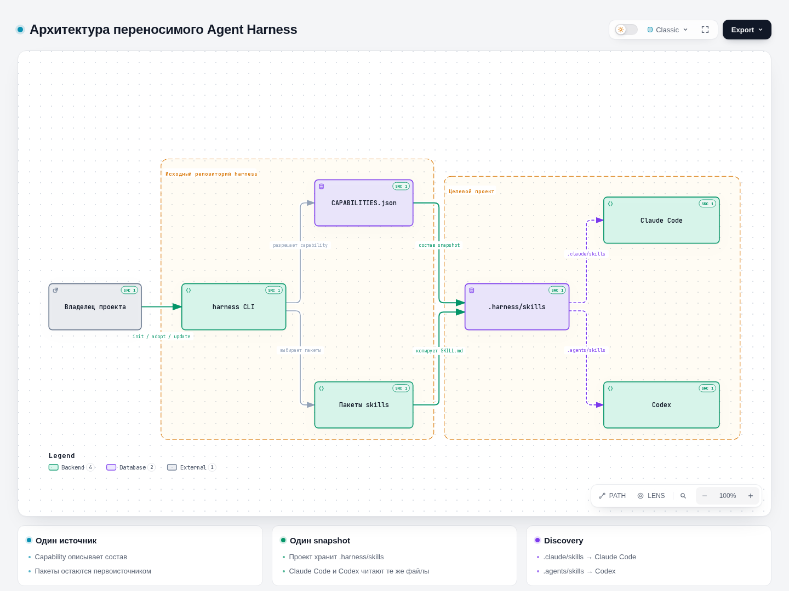
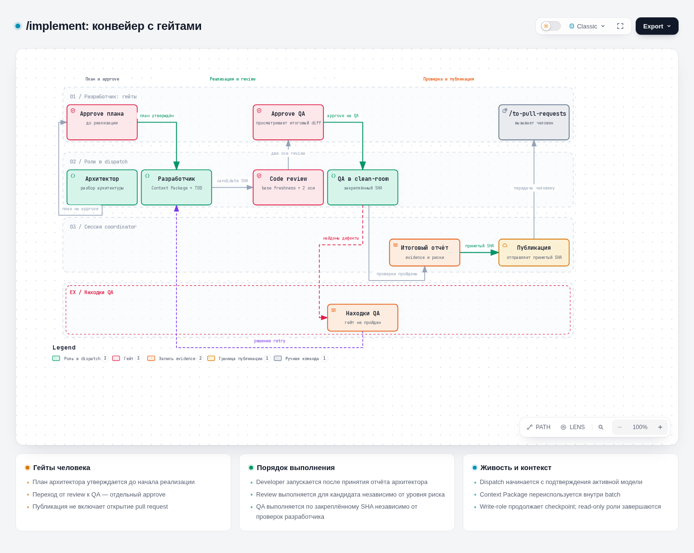
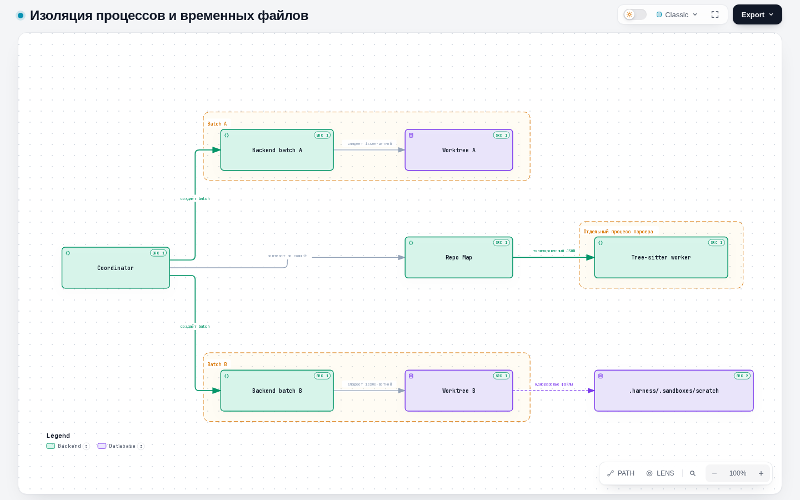

<p align="center">
  
</p>

<p align="center">
  <a href="https://github.com/PVMalove/claude-agent-harness/releases"></a>
  
  
  <a href="https://github.com/PVMalove/claude-agent-harness/actions/workflows/verify.yml"></a>
  <a href="./LICENSE"></a>
</p>

# Agent Harness

## Портативный фреймворк для оркестрации ИИ-агентов (Claude Code, Codex).

Harness - это единый набор скиллов, системных правил, хуков и контекстных документов, который разворачивается в любой целевой проект одной командой. Он устанавливает проверяемый, независимый снапшот (capability), который работает через нативные механизмы агентов и живет в проекте автономно, без привязки к исходному репозиторию.

Совместимость и стабильность полностью проверены для `Claude Code` и `Codex`.

### Доступные сборки (Capabilities)
При инициализации вы можете выбрать один из готовых профилей поведения агента:

 - project-foundation (По умолчанию) — лёгкая доменно-нейтральная база из 5 ключевых скиллов для старта.
 - mattpocock-suite — полная upstream-сборка (25 скиллов от Matt Pocock / aihero.dev), жестко привязанная к проверенному коммиту.
 - pvmalove-suite — продвинутый инженерный workflow. Добавляет нативную привязку эпиков и тикетов, изолированную (namespaced) таксономию для триажа задач, двухосевое ревью, генерацию PR через /to-pull-requests, настраиваемый язык вывода и строгий контроль качества через qa-gate.
 - backend-orchestration — специализированная сборка для распределенных систем. Работает через систему специализированных ролей (Архитектор, Разработчик, QA и др.), которые оркестрируются для совместного проектирования микросервисов, DDD, CQRS и сложных паттернов взаимодействия (Sagas через MassTransit, Outbox/Inbox).

Архитектурные термины определены в CONTEXT.md, а полное руководство по интеграции доступно в docs/.

## Архитектура

`harness/CAPABILITIES.json` задаёт capability `project-foundation`, `mattpocock-suite`,
`pvmalove-suite` и опциональную `backend-orchestration`. `harness init` разрешает выбранные skills
из закреплённых каталогов `skills/vendor/` и `skills/first-party/`, копирует их вместе с ресурсами в
`.harness/` проекта и записывает lock. Корневой `docs/` и внутренние документы относятся к исходному
репозиторию и установщиком не переносятся. Проектные руководства, hooks, агенты и конфигурация
устанавливаются из отдельных шаблонов `harness/project/`.

В `pvmalove-suite` переопределены в `skills/first-party/pvmalove/`: `to-spec`, `to-tickets`, `implement`, `ask-matt`, `code-review`, `grilling`, `grill-me`, `grill-with-docs`, `triage`, `wayfinder`; доп. скиллы: `qa-gate`, `to-guide`, `setup-labels`, `to-pull-requests`, `fast-implement`, `delivery-stats`.

[](./docs/diagrams/harness-topology.architecture.html)

`/implement` проводит один тикет через этапы architect, developer, независимое review, clean-room QA
и publish. Coordinator фиксирует Context Package и candidate SHA, проверяет актуальность базы и
привязывает approval к digest конкретного перехода. PR требует отдельного подтверждения; merge
выполняет разработчик. После проверки `/to-pull-requests` готовит отдельный PR по правилам целевого
проекта.

[](./docs/diagrams/implement-pipeline.workflow.html)

Backend batches выполняются в отдельных worktrees; роли обмениваются неизменяемыми briefs и
reports. Tree-sitter parser запускается в отдельном worker-процессе, временные файлы размещаются в
`.harness/.sandboxes/`: inbox ролей — в `scratch/`, тела PR и комментарии — в `pr_body/`.

[](./docs/diagrams/process-isolation.architecture.html)

Действующие контракты описаны в [ADR](./docs/adr/), операционные процедуры — в
[справочнике](./harness/docs/harness-guide.md) и [правилах Git](./docs/agents/git-workflow.md).

## Скиллы

Скиллы вызываются в сессии агента командой `/имя` (Claude Code) или по имени (Codex). Состав
определяется capability:

- `project-foundation` — базовые `grilling`, `handoff`, `writing-for-agents`, `research`,
  `domain-modeling`;
- `mattpocock-suite` — полный закреплённый upstream-набор;
- `pvmalove-suite` — upstream-набор с переопределениями и дополнениями, перечисленными ниже;
- `backend-orchestration` — `pvmalove-suite`, дополненный coordinator и ролями.

Подробные описания на русском языке приведены в [docs/skills/](./docs/skills/README.md).

### Собственные скиллы `pvmalove-suite`

| Скилл | Назначение |
|---|---|
| [`ask-matt`](./docs/skills/ask-matt.md) | Определяет скилл или сценарий, соответствующий ситуации; маршрутизатор по установленным скиллам. |
| [`grilling`](./docs/skills/grilling.md) | Базовый механизм интервью: последовательно уточняет план, решение или идею до выявления пробелов. |
| [`grill-me`](./docs/skills/grill-me.md) | Интервью для уточнения плана или дизайна. |
| [`grill-with-docs`](./docs/skills/grill-with-docs.md) | Интервью с ведением ADR и глоссария по ходу обсуждения. |
| [`wayfinder`](./docs/skills/wayfinder.md) | Планирует работу, превышающую объём одной сессии, в виде карты тикетов-решений в трекере и обрабатывает их по одному. |
| [`triage`](./docs/skills/triage.md) | Проводит issues и внешние PR по машине состояний триажа: классификация, проверка, подготовка брифов для агентов. |
| [`to-spec`](./docs/skills/to-spec.md) | Формирует спецификацию по итогам обсуждения и публикует её в трекер без повторного интервью. |
| [`to-tickets`](./docs/skills/to-tickets.md) | Декомпозирует план или спецификацию на вертикальные тикеты с блокирующими связями и публикует их. |
| [`to-guide`](./docs/skills/to-guide.md) | Готовит по `hitl`-тикету пошаговое руководство с промптами для AI IDE, если реализацию выполняет разработчик. |
| [`implement`](./docs/skills/implement.md) | Проводит тикет через этапы architect, developer, review, clean-room QA и publish с подтверждениями разработчика. |
| [`fast-implement`](./docs/skills/fast-implement.md) | Выполняет реализацию в одной сессии, без гейтов подтверждения конвейера coordinator. |
| [`code-review`](./docs/skills/code-review.md) | Проверяет изменения от фиксированной точки по двум осям: стандарты репозитория и соответствие спецификации. |
| [`qa-gate`](./docs/skills/qa-gate.md) | Запускает полный локальный гейт качества из `.harness/project.json` и сообщает результат pass/fail. |
| [`to-pull-requests`](./docs/skills/to-pull-requests.md) | Готовит и открывает PR для опубликованной issue-ветки по правилам проекта. |
| [`setup-labels`](./docs/skills/setup-labels.md) | Создаёт или обновляет метки репозитория по `docs/agents/triage-labels.md`; выполняется однократно. |
| [`delivery-stats`](./docs/skills/delivery-stats.md) | Собирает статистику завершённого эпика: токены по моделям, использование кэша, стоимость, окно подписки, объём кода. |

### Закреплённые upstream-скиллы `mattpocock-suite`

Скиллы, отмеченные знаком *, в `pvmalove-suite` заменены собственными версиями из таблицы выше.

| Скилл | Назначение |
|---|---|
| [`ask-matt`](./docs/skills/vendor/ask-matt.md)* | Маршрутизатор: определяет скилл или сценарий, соответствующий ситуации. |
| [`code-review`](./docs/skills/vendor/code-review.md)* | Двухосевая проверка изменений: стандарты и соответствие спецификации. |
| [`codebase-design`](./docs/skills/vendor/codebase-design.md) | Общий словарь для проектирования «глубоких» модулей, швов и тестируемых интерфейсов. |
| [`diagnosing-bugs`](./docs/skills/vendor/diagnosing-bugs.md) | Цикл диагностики сложных дефектов и регрессий производительности. |
| [`domain-modeling`](./docs/skills/vendor/domain-modeling.md) | Формирует и уточняет доменную модель: терминологию и архитектурные решения. |
| [`grill-me`](./docs/skills/vendor/grill-me.md)* | Интервью для уточнения плана или дизайна. |
| [`grill-with-docs`](./docs/skills/vendor/grill-with-docs.md)* | Интервью с параллельным ведением ADR и глоссария. |
| [`grilling`](./docs/skills/vendor/grilling.md)* | Последовательное уточнение плана, решения или идеи. |
| [`handoff`](./docs/skills/vendor/handoff.md) | Сводит текущее обсуждение в документ передачи для другого агента. |
| [`implement`](./docs/skills/vendor/implement.md)* | Выполняет реализацию по спецификации или набору тикетов. |
| [`improve-codebase-architecture`](./docs/skills/vendor/improve-codebase-architecture.md) | Выявляет возможности углубления модулей, формирует HTML-отчёт и прорабатывает выбранный вариант. |
| [`prototype`](./docs/skills/vendor/prototype.md) | Создаёт временный прототип для ответа на вопрос дизайна: модель состояний, логика, UI. |
| [`research`](./docs/skills/vendor/research.md) | Исследует вопрос по первоисточникам и сохраняет выводы Markdown-файлом в репозитории. |
| [`resolving-merge-conflicts`](./docs/skills/vendor/resolving-merge-conflicts.md) | Разрешает конфликты незавершённого merge или rebase. |
| [`setup-matt-pocock-skills`](./docs/skills/vendor/setup-matt-pocock-skills.md) | Однократно настраивает репозиторий для инженерных скиллов: трекер, метки, структуру доменных документов. |
| [`tdd`](./docs/skills/vendor/tdd.md) | Разработка через тестирование: red-green-refactor и интеграционные тесты. |
| [`teach`](./docs/skills/vendor/teach.md) | Объясняет пользователю новый навык или понятие в рамках рабочего пространства. |
| [`to-questionnaire`](./docs/skills/vendor/to-questionnaire.md) | Преобразует вопрос, требующий внешнего ответа, в опросник для другого участника. |
| [`to-spec`](./docs/skills/vendor/to-spec.md)* | Формирует спецификацию по итогам обсуждения и публикует её в трекер. |
| [`to-tickets`](./docs/skills/vendor/to-tickets.md)* | Декомпозирует план на тикеты с блокирующими связями. |
| [`triage`](./docs/skills/vendor/triage.md)* | Машина состояний триажа issues и внешних PR. |
| [`wait-what`](./docs/skills/vendor/wait-what.md) | Повторно излагает последний ответ агента в другой формулировке. |
| [`wayfinder`](./docs/skills/vendor/wayfinder.md)* | Карта тикетов-решений для работы, превышающей объём одной сессии. |
| [`wizard`](./docs/skills/vendor/wizard.md) | Генерирует интерактивный bash-мастер для шагов, которые выполняет только человек. |
| [`writing-for-agents`](./docs/skills/vendor/writing-for-agents.md) | Правила подготовки документов для агентов: скиллов, `AGENTS.md`, `CLAUDE.md`. |

### Глобальные скиллы

Устанавливаются однократно для машины командой `bin/install-global.py` (см. ниже).

| Скилл | Назначение |
|---|---|
| [`start-project`](./docs/skills/start-project.md) | Формирует проект на основе идеи, определяет необходимость репозитория, создаёт, проверяет или обновляет его харнесс. |
| [`integrate-project`](./docs/skills/integrate-project.md) | Проводит аудит существующей кодовой базы и встраивает в неё харнесс с сохранением действующих соглашений и CI. |

## Быстрый старт и установка

Требуются Python 3.12 или новее и Git. Глобальный слой устанавливается однократно для выбранных
runtime; параметр `--runtime` допускает повторение:

```bash
python3 bin/install-global.py --target-home "$HOME" --runtime codex --runtime claude
```

В PowerShell:

```powershell
python bin\install-global.py --target-home $HOME --runtime codex --runtime claude
```

Далее `start-project` используется для создания нового проекта, а `integrate-project` — для
подключения харнесса к существующему. Прямая установка в Git-репозиторий:

```bash
python3 harness/bin/harness.py init /path/to/repository --capability pvmalove-suite \
  --project-type software --stack python --base-branch main --language ru \
  --qa-gate-command "make test"
python3 harness/bin/harness.py health /path/to/repository
```

В PowerShell путь и команды задаются аналогично:

```powershell
python harness\bin\harness.py init C:\path\to\repository --capability pvmalove-suite `
  --project-type software --stack python --base-branch main --language ru `
  --qa-gate-command "python -m pytest"
python harness\bin\harness.py health C:\path\to\repository
```

Без `--capability` устанавливается доменно-нейтральная `project-foundation`. Полный закреплённый
upstream-набор предоставляет `mattpocock-suite`; `backend-orchestration` добавляет coordinator и
роли поверх `pvmalove-suite`. `harness diff` показывает изменения управляемого снимка,
`harness update` обновляет его с сохранением локальных правок. Команды и параметры описаны в
[справочнике](./harness/docs/harness-guide.md).

В целевой проект переносятся только выбранные ресурсы `harness/`, skills и шаблоны
`harness/project/`; корневой `docs/` содержит документацию исходного репозитория.
Шаблоны проектных руководств при `pvmalove-suite` и `backend-orchestration` разворачиваются
из `harness/project/docs-agents/` как `docs/agents/{artifacts,git-workflow,issue-tracker,triage-labels,worktrees}.md`.
Справочник харнесса и руководство по backend-оркестрации входят в управляемый снимок: `harness/docs/`
устанавливается в `.harness/docs/{harness-guide,backend-orchestration}.md` и обновляется командой
`harness update`.

## Проверка состояния проекта: `harness health`

`health` проверяет установку харнесса в репозитории и без флагов не вносит изменений. Команду
рекомендуется выполнять после `init`/`update`, после клонирования проекта, а также в случаях, когда
агент не обнаруживает скиллы.

```bash
python3 harness/bin/harness.py health /path/to/repository            # локальные проверки
python3 harness/bin/harness.py health /path/to/repository --fix      # восстановление заготовок .harness
python3 harness/bin/harness.py health /path/to/repository --online   # дополнительно проверки трекера
python3 harness/bin/harness.py health /path/to/repository --json     # машиночитаемый отчёт
```

Отчёт сгруппирован; каждая строка имеет маркер `✅` ok, `⚠️` warn, `❌` fail или `-` skipped:

| Группа | Проверяемые объекты |
|---|---|
| `files` | `harness.lock`, `AGENTS.md`, discovery-ссылки `.agents/skills` и `.claude/skills`, `.harness/project.json`, overlay-локи, интеграции, конфигурация оркестрации. |
| `directories` | Каталоги `.harness/` и `.harness/.sandboxes/*`; отсутствующий каталог, который может быть создан, считается `ok`. |
| `repo_map` | Уровень Repo Map (`full` или `minimal`) и причина снижения уровня. |
| `environment` | ОС, Git и `user.name`/`user.email`, `.gitattributes` и переводы строк, Python ≥ 3.12, `uv`, кодировка вывода; на Windows — длинные пути, symlink и `bash` для hooks. |
| `orchestration` | Только при `backend-orchestration`: леджер, незавершённые и заблокированные batch, dispatch без активности, неучтённые worktree, объём временных данных. |
| `tracker` | Только с `--online`: авторизация `gh`/`glab`, доступность origin, права и метки. |

Интерпретация результата:

- Код выхода `1` означает наличие хотя бы одной проверки со статусом `fail`; `warn` и `skipped` на
  код выхода не влияют.
- Под строкой с проблемой выводится `-> Как исправить:` и, при наличии, команда с абсолютными путями;
  её можно выполнить из любого каталога.
- `--fix` создаёт недостающие каталоги `.harness` и пересобирает `.harness/skills/REGISTRY.md`.
  Системные настройки, git config, права доступа и worktree этим флагом не изменяются — для них в
  отчёте приводится команда.
- `--online --fix` дополнительно создаёт отсутствующие метки трекера; цвет существующих меток не
  изменяется.
- `--json` возвращает контракт `schema_version: 1` со стабильными `checks[].id` (например,
  `files.lock`).

Полное описание проверок приведено в [справочнике](./harness/docs/harness-guide.md#шаг-2--команды-cli).

## Пульт управления: `harness console`

`console` — интерактивный терминальный пульт (TUI) для диагностики, команд харнесса, оркестрации,
отчётов и Repo Map.

```bash
python3 harness/bin/harness.py console /path/to/repository
```

Требуется [`uv`](https://docs.astral.sh/uv/) в `PATH`: пульт запускается через
`uv run --no-project --with textual==<pin>` и не изменяет зависимости целевого проекта. При первом
запуске загружается `textual`, поэтому требуется доступ к сети. При отсутствии `uv` или сети пульт
выводит причину и текстовый отчёт `harness health`.

Оформление пульта: терракотовые и янтарные акценты на графитовом фоне, тонкие скруглённые рамки.
Главный экран содержит знак харнесса и сведения об установке: версию, capability, путь репозитория и
ветку. Ниже расположен дашборд: счётчики проверок, число открытых batch оркестрации, уровень
Repo Map, версия харнесса и состояние дрейфа снимка. Действие «Online checks» пересчитывает счётчики
с `--online`. Разделы меню:

| Раздел | Содержание |
|---|---|
| `Diagnostics` | Полный отчёт `health`, действия «online checks» и «apply fixes» (`health --fix`, требует повторного нажатия). |
| `Harness` | Состояние установки (версия, capability, скиллы, управляемые файлы, дата lock) и сводка использования пайплайна; команды CLI: init, update (в том числе `--force-managed-files` и `--force-seed-files`), diff, adopt, очистка `.harness` soft/hard (план и применение), registry, lock-project-skills, list, health, Repo Map, ledger и удаление worktree. |
| `Orchestration` | Статистика пайплайна (запуски, тикеты, состояния, диспатчи по ролям, итоги отчётов, QA) и история batch с фильтром по состоянию — выбор batch открывает хронологию; команды coordinator: batch, dispatch, qa status, risk assess, context-package, ledger status. |
| `Reports` | Отчёты ролей из леджера с фильтрами по тикету, роли, outcome и дате, хронология batch и QA-логи. |
| `Repo Map` | Карта репозитория для HEAD: сводка, дерево файлов с сигнатурами, поиск символов, связи, хабы. |
| `Help` | Справка по разделам, клавишам и правилам безопасности пульта. |

Клавиши: `Esc` — возврат или отмена, `e` — экспорт в Markdown, `j` — экспорт Repo Map в JSON,
`b` — хронология batch в отчёте или построение карты в `Repo Map`, `F3` — QA-логи в `Reports`,
`F1` — справка с любого экрана, `Ctrl+P` — палитра команд, `Ctrl+Q` — выход.

Для каждой команды пульт отображает CLI-эквивалент и запускает тот же CLI-процесс. Команды из
«Как исправить» отображаются, но не выполняются. Перед необратимыми действиями пульт запрашивает
подтверждение; для `ledger reset` и hard cleanup требуется ввод `RESET` или `HARD`. Экспорты
сохраняются в `docs/tasks/<папка тикета>/artifacts/` или `docs/tasks/console-exports/`; существующие
файлы не перезаписываются.

## Релизная политика

Версии соответствуют SemVer. Новая версия задаётся в `harness/VERSION`, `pyproject.toml` и секции
`CHANGELOG.md` в обычном PR. После merge в `master` [GitHub CD](./.github/workflows/release.yml)
проверяет, существует ли тег `vMAJOR.MINOR.PATCH` для этой версии; если тега нет, выполняются проверки
`verify.yml`, создаются архив установки и SHA-256, затем тег на проверенном коммите и GitHub Release.
Push в `master` без смены версии Release не создаёт; ручная публикация тега остаётся поддерживаемой.
Release Notes
формируются из секции версии в [CHANGELOG.md](./CHANGELOG.md); при отсутствии секции выпуск
прерывается. Архив и контрольная сумма доступны в
[GitHub Releases](https://github.com/PVMalove/claude-agent-harness/releases). Проверка после
загрузки: `sha256sum --check claude-agent-harness-vX.Y.Z.tar.gz.sha256`.

Дополнительный parser bundle прикладывается к Release того же коммита вручную запускаемым workflow
[`release-parser-bundle.yml`](./.github/workflows/release-parser-bundle.yml). Полная процедура
описана в [releases.md](./docs/agents/releases.md). В целевых проектах GitLab поддерживается через
`glab` в процессах работы с тикетами и merge requests; релизный CD этого репозитория работает на
GitHub.

## Структура проекта

| Путь | Назначение |
|---|---|
| `harness/` | CLI, каталог capability, runtime-модули и шаблоны целевого проекта |
| `skills/` | Закреплённый vendor-снимок и собственные skills |
| `global/`, `global-skills/`, `bin/` | Глобальный профиль, стартовые skills и установщик |
| `scripts/` | Сборка, проверка и clean-room сценарии исходного репозитория |
| `docs/` | ADR, руководства, описания на русском языке и диаграммы Archify исходного репозитория |
| `third_party/` | Provenance, lock и лицензии upstream |
| `.github/` | CI, CD и проверки upstream |

Проект распространяется по лицензии [MIT](./LICENSE). Лицензия закреплённого upstream-снимка
находится в [`third_party/mattpocock-skills/LICENSE`](./third_party/mattpocock-skills/LICENSE).
