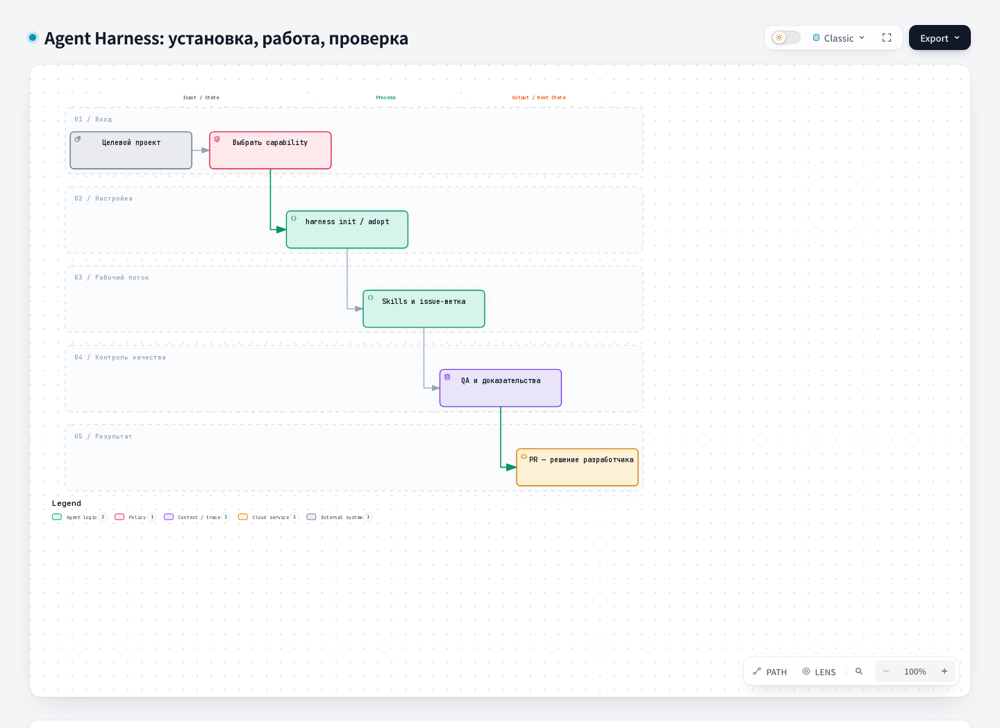
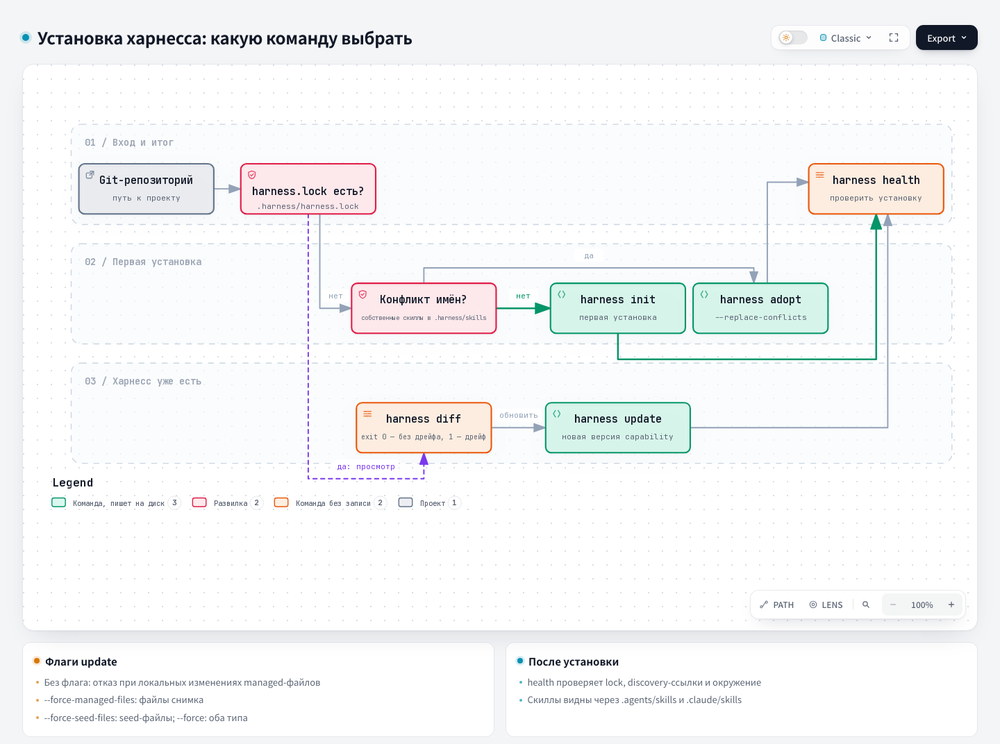
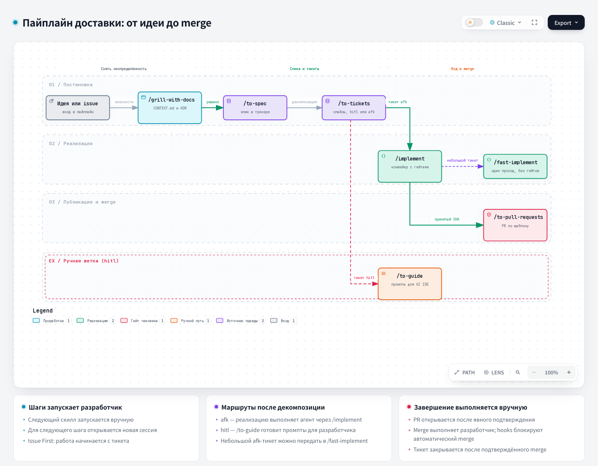
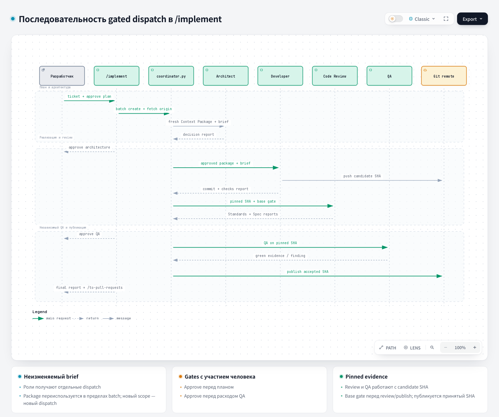
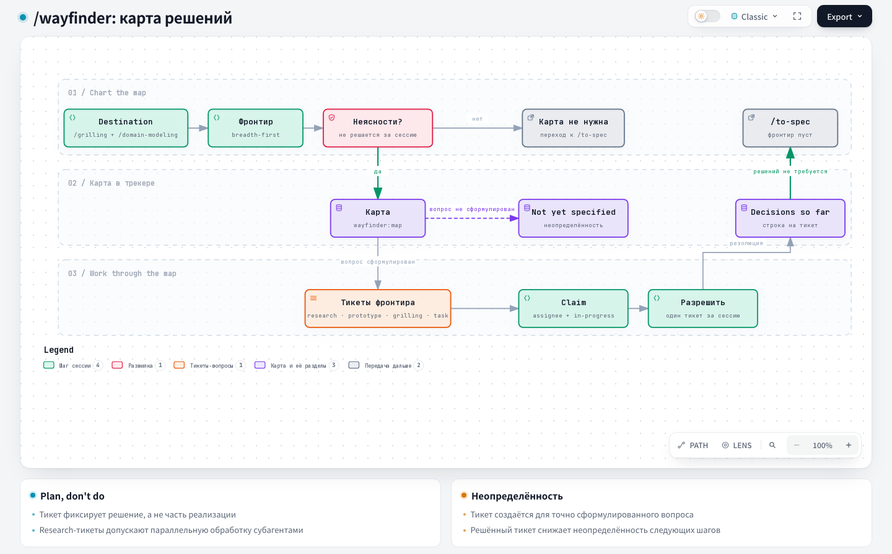
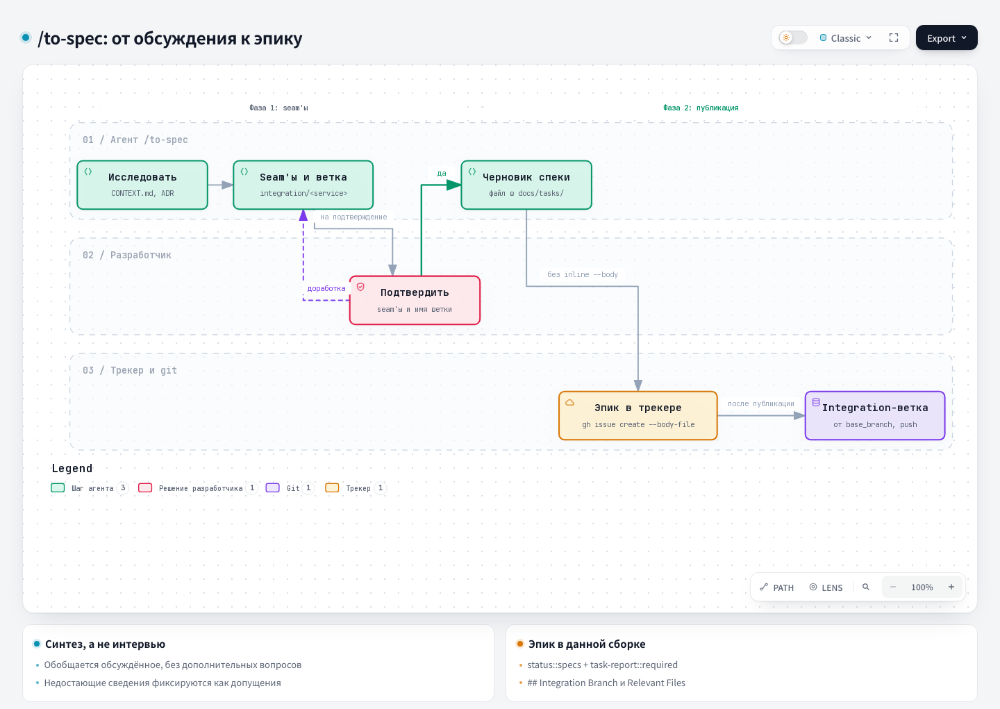
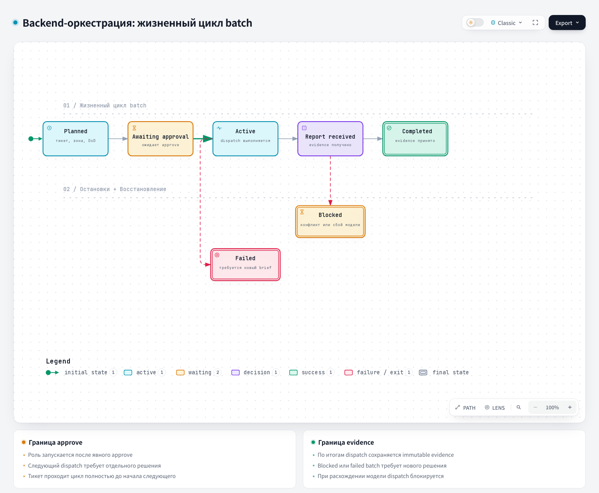
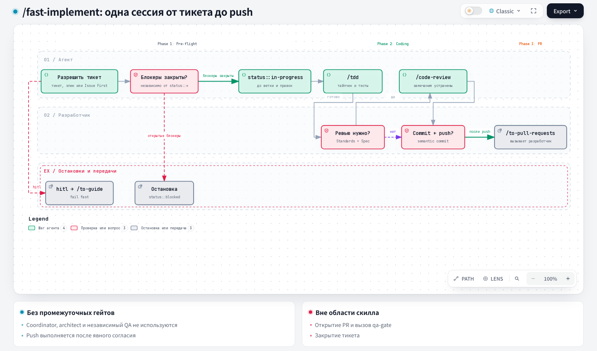
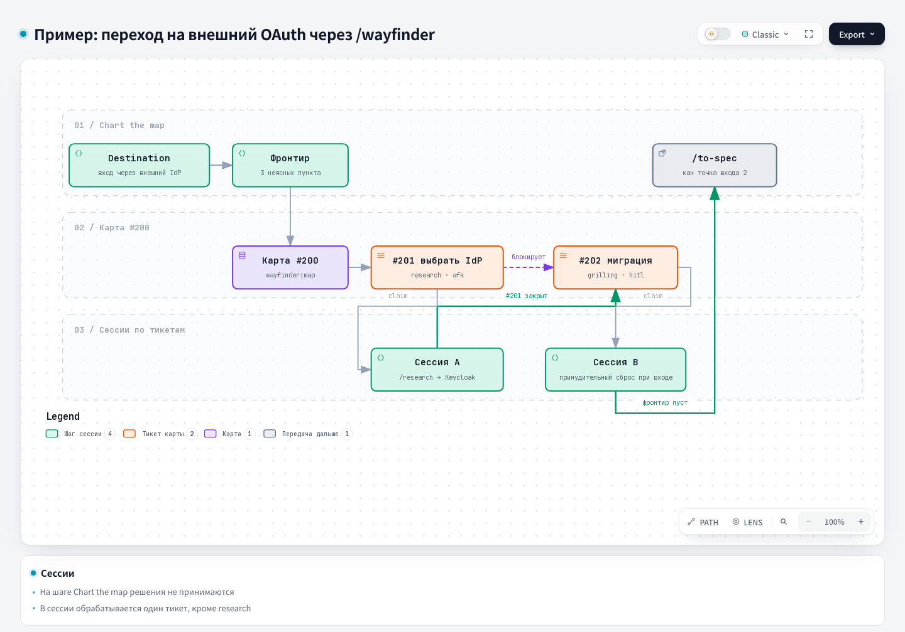

# Справочник Agent Harness

Agent Harness — переносимый набор скиллов, правил, hooks и документов для Claude Code и Codex. Одна
команда разворачивает его в проект ([раздел 0](#0-установка-и-подключение)). Дальше он живёт там
независимо от исходного репозитория
[PVMalove/claude-agent-harness](https://github.com/PVMalove/claude-agent-harness).

Харнесс разбивает работу с AI-агентами на строгие фазы: устранение неопределённости → спецификация →
тикеты → TDD-реализация вертикальных слайсов → независимое ревью → PR, который мержит человек.

> **Этот файл — справочник установки, команд и скиллов.** Архитектуру backend-оркестрации,
> lifecycle coordinator, роли, clean-room QA и локальный state целиком описывает
> [backend-orchestration.md](./backend-orchestration.md).



Редактируемая спецификация и интерактивная версия схемы:
[Archify JSON](https://github.com/PVMalove/claude-agent-harness/blob/master/docs/diagrams/harness-guide-navigation.workflow.json)
и [HTML](https://github.com/PVMalove/claude-agent-harness/blob/master/docs/diagrams/harness-guide-navigation.workflow.html).

Любая стандартная установка ставит обязательный общий контракт
[Technical English](../harness/docs/technical-english.md). Он описывает английскую координацию агентов,
языковые исключения и проверку при review: сохранились ли условия и точные токены. Новые AGENTS.md и
CLAUDE.md ведут к этому источнику, а в существующий AGENTS.md проекта установка ссылку не добавляет,
потому что не перезаписывает его, — её вносят вручную.

## Навигация по разделам

| Задача | Раздел |
|---|---|
| Установка и обновление харнесса | [0. Установка и подключение](#0-установка-и-подключение) |
| Выбор начального скилла для задачи | [Общая схема пайплайна](#общая-схема-пайплайна) и [точки входа](#точки-входа) |
| Проработка требований и устранение неопределённости | [1. Grilling](#1-этап-проектирования-и-устранения-неопределённости-grilling) |
| Подготовка спецификации и декомпозиция на тикеты | [2. Спецификация](#2-фиксация-требований-и-спецификация-specification), [3. Тикеты](#3-декомпозиция-задач-ticketing) |
| Реализация тикета | [4. Разработка](#4-разработка-implementation) |
| Контроль качества и подготовка PR | [5. Контроль качества](#5-автоматизированный-контроль-качества-model-invoked-skills), [6. Надстройки](#6-проектные-надстройки-поверх-апстрима) |
| Причины блокировки команд hooks | [9. Hooks](#9-детерминированные-hooks-claudesettingslocaljson) |
| Сквозные примеры | [14. Примеры целиком](#14-примеры-целиком-по-точкам-входа) |

---

## 0. Установка и подключение

Как правило, установку выполняет агент. Для этого передайте ему запрос:

```text
Используй start-project, чтобы помочь мне сформировать и начать этот проект.
```

Для репозитория, в котором уже есть код и собственные соглашения, но харнесс не установлен:

```text
Используй integrate-project, чтобы интегрировать харнесс в этот существующий проект.
```

Скилл проводит аудит репозитория, выбирает capability и вызывает нужную команду `harness`. Ниже
описаны шаги скилла и их эквивалент через CLI.

### Шаг 1 — клонирование харнесса

Харнесс не является зависимостью целевого проекта: его CLI работает **над** целевым репозиторием по
пути и копирует в него нужные файлы. Клонируйте инструмент в любой каталог:

```bash
git clone https://github.com/PVMalove/claude-agent-harness.git
cd claude-agent-harness
```

После установки клон можно удалить, потому что в проекте остаётся независимый снимок `.harness/`.
Обновления харнесс не применяет автоматически — их ставит отдельная команда `update`.

### Шаг 2 — команды CLI

Все команды имеют вид `harness/bin/harness.py <command> <repo> [флаги]`, где `<repo>` — путь к
целевому проекту (необязательно текущий каталог). CLI поддерживает такие подкоманды:

| Команда | Что делает | Пишет на диск |
|---|---|---|
| `init` | Первая установка в проект без харнесса | да |
| `adopt` | Установка поверх проекта, где уже есть свои скиллы с теми же именами | да |
| `diff` | Сверяет проект с залоченным снимком | нет |
| `update` | Подтягивает новую версию capability | да |
| `registry` | Пересобирает `.harness/skills/REGISTRY.md` | да |
| `lock-project-skills` | Фиксирует хэши скиллов, которыми владеет сам проект | да |
| `memory build/search/rebuild` | Локальный FTS5-кэш и указатели на разрешённые источники | build/rebuild — да; search — нет |
| `health` | Диагностика установки и окружения | только с `--fix` |
| `list` | Список установленных скиллов | нет |
| `cleanup` | Предпросмотр и удаление одноразовых данных `.harness` | только с `--apply` |
| `uninstall` | Предпросмотр и полное удаление харнесса из проекта | только с `--apply` |
| `console` | Интерактивный TUI-пульт | через выбранные команды |

#### Какую команду выбрать

[](https://github.com/PVMalove/claude-agent-harness/blob/master/docs/diagrams/harness-install-choice.workflow.html)

| | `init` | `adopt` |
|---|---|---|
| Когда | Репозиторий без харнесса вообще | Под именами выбранной capability уже лежат свои скиллы |
| Требование | Падает, если `.harness/harness.lock` уже есть | Не требует пустоты — сохраняет project-owned скиллы вне capability |
| Конфликт с `.agents/skills`/`.claude/skills` | Падает без обходного флага — чинить вручную или через `adopt` | `--replace-conflicts` заменяет только конфликтующие имена; проверьте их заранее |

| | `diff` | `update` |
|---|---|---|
| Пишет на диск | Нет — только отчёт | Да |
| Код выхода | `0` чисто, `1` — есть дрейф | `0` при успехе, иначе ошибка |
| Локальные правки managed-файлов | Показывает как `local_changed`/`conflict`, не трогает | Без флага отказывается; `--force-managed-files` перезаписывает snapshot, `--force` — snapshot и seed |
| Когда | Быстрая проверка перед чем угодно | Когда решили реально подтянуть новую версию |

#### Какую capability выбрать

| | `project-foundation` | `mattpocock-suite` | `pvmalove-suite` | `backend-orchestration` |
|---|---|---|---|---|
| Скиллов | 5 | 25 | 32 | 32 + роли |
| Домен | Любой: software, content, research, operations, personal | Инженерный pipeline как в апстриме | Инженерный pipeline с доработками ([раздел 7](#7-локальные-кастомизации-11-изменённых-скиллов)) | Согласованная backend-работа несколькими ролями |
| Даёт | `grilling`, `handoff`, `writing-for-agents`, `research`, `domain-modeling` | Все upstream-скиллы | Спека → тикеты → implement → commit + push (разделы 1–5) | Coordinator, role manifests, playbook, clean-room QA |
| Проектные файлы | Нет | Нет | `.harness/project.json`, hooks, `docs/agents/*.md` | То же + `.harness/orchestration.json` |

Без `--capability` CLI ставит `project-foundation`. `backend-orchestration` расширяет
`pvmalove-suite`, поэтому её выбирают одной capability (`--capability backend-orchestration`), а не
вместе с `pvmalove-suite`. Она добавляет role manifests, `.harness/orchestration.json` и playbook,
но без явно одобренного dispatch воркеры не запускает. Полный порядок действий, пример конфигурации
и immutable brief описаны в [отдельном руководстве](./backend-orchestration.md).

Это строго opt-in маршрут: он включается только при выбранной capability, а файл
`.harness/orchestration.json` не обязателен. Без него потолок записи — весь репозиторий (границу
задаёт `--allowed-path` batch), а роль берёт `model`/`effort` из вызывающей сессии. Без capability
`/implement` отправляет на `/fast-implement`. Один batch хранит ticket, issue-ветку, worktree и
history evidence, а каждый его dispatch получает собственный immutable brief, terminal report и
новое явное человеческое approval. Developer создаёт candidate commit; coordinator детерминированно
оценивает риск по DoD, diff и developer trigger, при необходимости назначает независимые оси
Standards и Spec и затем обязательно запускает полный clean-room QA для того же SHA. Report
остаётся `reported` до решения человека, принятый SHA публикует только developer, после чего
`/to-pull-requests` вручную ведёт PR workflow. Adapter лишь транспортирует уже утверждённый
dispatch: он не принимает report, не запускает следующий шаг и не создаёт и не мержит PR.

| | `mattpocock-suite` как есть | Своя capability по образцу `pvmalove-suite` |
|---|---|---|
| Когда | Апстримный pipeline устраивает без изменений | Нужны свои правки: лейблы, язык, доп. скиллы |
| Механизм | `--capability mattpocock-suite` | `extends`/`overrides`/`additions` в `harness/CAPABILITIES.json`, полные first-party файлы и проверяемый snapshot ([ADR 0001](https://github.com/PVMalove/claude-agent-harness/blob/master/docs/adr/0001-portable-capability-delivery.md)) |
| Обновление апстрима | `harness update` устанавливает изменения без правок | Унаследованное обновляет тот же `update`; за переопределёнными скиллами следите через `scripts/check_upstream_drift` в репозитории харнесса |

#### Политика памяти проекта

[project-memory.md](../harness/docs/project-memory.md) описывает интерактивных потребителей и
трактовку указателей. Без внешнего CLI установленный проект запускает тот же поиск командой
`python -B .harness/memory/search_cli.py . "<запрос>"`.

Память включает только `memory: {"enabled": true}` в `.harness/project.json`. Отдельный
`memory_policy` содержит все шесть полей: `source_types` (список из `adr`, `glossary`,
`task_archive`, `qa_finding`, `ledger`, `completion_report`), `allow_paths` (явные относительные
POSIX glob-пути), `redact_rules` (regex), `min_similarity` (конечное число 0..1), `top_k` и
`max_tokens` (целые >=1). Если политики нет или любой allowlist пуст, ни один источник не
разрешён; старые конфиги без памяти остаются валидными, а шаблон выключает память и задаёт пустые
списки. Харнесс отклоняет неизвестные поля, абсолютные и Windows-пути, `..`, неверные regex и bool
вместо числа.

Regex имеют длину 1..512 символов, и лучше использовать простые шаблоны: ограничения длины regex и
размера источника снижают риск, но не ограничивают время исполнения произвольного project-owned
regex. Совпадения харнесс заменяет на `[REDACTED]` до сохранения заголовка, статуса и текста.
`min_similarity` сохраняется, но пока не фильтрует FTS5 — cosine-порог появится в следующем
векторном срезе ADR 0010. `top_k` и `max_tokens` ограничивают окончательный список указателей, а
токены харнесс оценивает консервативно по UTF-8, без привязки к tokenizer модели.

Источник — только UTF-8 файл до 1 MiB; обход ограничен 1000 кандидатов и 10 000 посещённых entries,
пропускает symlink и dependency/cache/log пространства. ADR и glossary допускают обычный Markdown.
`task_archive` разрешает только `docs/tasks/issue-*/issue-*.md`, `tickets/*.md` и `artifacts/*.md`
внутри этого каталога, а attachments и transcripts исключает. `qa_finding` читает только
`reports/*.json` с `role=qa` выбранной generation ledger v3: короткие outcome/output/risks/blockers и
result/evidence проверок. В индекс не попадают commands, unknown keys, полные логи и абсолютные
artifact paths. `ledger` читает только scalar ID/ticket/role/state и явные даты из `batches`,
`dispatches`, `dispatch-status` той же generation. Selector память проверяет read-only: она не
мигрирует ledger и не требует backend-orchestration.

`completion_report` разрешает только `lessons` из `reports/*.json` выбранной generation: список
непустых строк, не больше первых 20 и до 2048 символов каждая, общий projection до 16 KiB. Статус
такого указателя — «не подтверждено человеком», даже если отчёт объявляет `accepted`; явно
superseded отчёты в индекс не входят. Поиск использует обычный FTS ranking без повышенного веса.
`used_memory` — опциональный список идентификаторов использованных хитов; это только слабый сигнал,
а не гейт coordinator-а, не поисковый текст и не причина увеличивать вес хита. Старые отчёты без
новых полей остаются валидными. Если разрешены оба источника, `qa_finding` и `completion_report`,
QA evidence остаётся поисковым, но наличие lessons делает весь указатель непроверенной историей;
без `completion_report` существующий QA projection не меняется.

Оба allowlist обязательны. QA и ledger проходят baseline secret sanitization и project regex, а все
сохраняемые текстовые поля — project redaction до SQL. Если sanitization изменила relative path,
refresh отказывает целиком и сохраняет предыдущий кэш.

Заголовок Markdown — первый H1, а без него `untitled`. Харнесс принимает явные `Status:`/`Статус:`,
`Date:`/`Дата:` и `Superseded-by:`/`Заменён на:` как строковые поля (включая простой front matter)
и первую строку одноимённой H2-секции; поле приоритетнее секции. Если status или date нет, значение
`unknown`, если нет superseded_by — пустая строка. Для JSON харнесс берёт status из явного status,
иначе из QA outcome или ledger state, а дату — из date, иначе из created_at, иначе из updated_at.
Дата QA без явного поля остаётся unknown, потому что mtime харнесс не использует. Явные
`superseded`, `superseded by ADR-NNNN`, `заменён`, `заменен` исключают источник до кэширования.
Остальные pointers всегда имеют `history_to_verify: true`, а непустой superseded_by актуальность
источника не подтверждает.

Команды: `harness memory build <repo>`, `harness memory search <repo> "запрос"` и
`harness memory rebuild <repo>` (через `python harness/bin/harness.py`). Общий кэш лежит в
`.harness/.sandboxes/cache/memory/index.sqlite3` главного checkout. **CLI search в main лениво
обновляет производный кэш перед read-only query**: изменения определяет hash исходных bytes,
неизменённые источники повторно не проходят project/FTS-index, а удалённые и отозванные CLI удаляет.
Смена policy пересанитизирует корпус, смена schema вызывает verified atomic replacement.

Raw API `harness.memory.search` и CLI/facade в linked worktree всегда read-only: они используют
конфиг и источники main и не создают отсутствующий index. `search_with_refresh` — отдельный facade.
JSON `status`/`pointers` содержит только title/status/date/superseded_by/path/source_hash/
history_to_verify, без body и snippet. BM25 ранжирование использует path для tie-break, лимиты
действуют на полные pointers, а query — это литеральные Unicode-слова без операторов FTS. Перед
выдачей поиск перепроверяет allowlists и hash. Disabled, invalid или empty main search ничего не
создаёт; при ошибке refresh поиск возвращает пустые pointers с явной диагностикой и сохраняет прежний
кэш. Corrupt cache харнесс автоматически не ремонтирует, поэтому нужен явный rebuild, а raw query
не ремонтирует missing, incompatible или corrupt cache.

SQLite должна поддерживать FTS5. Writer-lock SQLite с таймаутом 2 секунды сериализует
build/refresh/rebuild, и после busy команду можно повторить. Публикация corpus, metadata и hash
manifest атомарна (rollback journal без WAL). Rebuild проверяет соседнюю базу и атомарно заменяет
индекс; при ошибке прежний кэш сохраняется.

#### `init` — первая установка

Команда требует, чтобы `<repo>` уже был git-репозиторием; если `.harness/harness.lock` существует,
она завершается ошибкой «already exists; use update».

```bash
python3 harness/bin/harness.py init /path/to/repository \
  --project-type software \
  --stack python \
  --capability pvmalove-suite \
  --base-branch main \
  --language ru \
  --qa-gate-command "make check" \
  --qa-gate-command "make test"
```

В Windows PowerShell схема та же для всех команд: `python` вместо `python3`, обратная кавычка
`` ` `` вместо `\` для переноса строк и путь вида `C:\path\to\repository`:

```powershell
python harness\bin\harness.py init C:\path\to\repository `
  --project-type software `
  --stack python `
  --capability pvmalove-suite `
  --base-branch main `
  --language ru `
  --qa-gate-command "make check" `
  --qa-gate-command "make test"
```

| Флаг | Смысл |
|---|---|
| `--project-type`, `--stack` | Информационные, попадают в `AGENTS.md`, на поведение CLI не влияют; `--stack` повторяем |
| `--capability` | Повторяем; взаимно пересекающиеся capability CLI указать не даст |
| `--base-branch` | Базовая ветка репозитория, по умолчанию `main` |
| `--language` | `ru` или `en`, язык отчётов и документов агента |
| `--pr-base-branch` | Ветка, от которой создаются integration-ветки эпиков (по умолчанию `--base-branch`) |
| `--branch-pattern` | Регулярное выражение для имён issue-веток |
| `--qa-gate-command` | Команда полного гейта качества; повторяем, порядок сохраняется ([раздел 6](#qa-gate-skill-context-fork)) |
| `--tracker-type`, `--tracker-host`, `--tracker-project` | Поле `tracker`: тип (`github`, `gitlab`, `local`), веб-хост с необязательным портом и полный путь проекта с подгруппами (см. ниже) |

Флаги от `--language` до `--tracker-project` читает только `pvmalove-suite`, и CLI пишет их в
`.harness/project.json`. Их можно опустить — тогда `init` спросит интерактивно.

**Поле `tracker`** в `.harness/project.json` явно задаёт трекер проекта
([ADR 0011](https://github.com/PVMalove/claude-agent-harness/blob/master/docs/adr/0011-explicit-project-tracker.md)).
Это объект из трёх ключей: `type` — `github`, `gitlab` (включая self-hosted) или `local`; `host` —
веб-хост с необязательным портом, без схемы, пути и userinfo; `project` — полный путь проекта с
подгруппами. Для `github` и `gitlab` `host` и `project` обязательны, а другие ключи внутри
`tracker` харнесс отклоняет:

```json
"tracker": {"type": "gitlab", "host": "gitlab.example.test:4443", "project": "group/sub/project"}
```

- Создавая `project.json` (`init`, а также `adopt`/`update`, если файла ещё нет), харнесс заполняет
  поле так. Флаги `--tracker-*` важнее всего. В терминале харнесс спрашивает остальное с дефолтами
  из `origin`: тип, хост с портом и проект с подгруппами. Без распознанного `origin` он предлагает
  `local`. Хост и проект `origin` другого типа (GitHub ↔ GitLab) дефолтом не становятся. Харнесс
  записывает подтверждённый ответ или флаг, в том числе `local`. Без терминала и флагов он
  записывает только GitHub или GitLab с полностью разобранными хостом и путём. Для локального
  трекера, хоста без `gitlab.` в имени и репозитория без `origin` харнесс поле не пишет.
  Некорректный `--tracker-host` или `--tracker-project` харнесс отклоняет до записи файлов. Неполное
  поле (например, `gitlab` без хоста) он не пишет, и `init` сообщает об этом в stderr. Существующий
  `project.json` — seed-файл проекта. Его не переписывают ни `init`, ни `adopt`/`update`, даже с
  флагами `--tracker-*`.
- Без поля харнесс определяет трекер по `origin` с учётом схемы, userinfo, порта и подгрупп. `harness
  health` выдаёт warn с готовым сниппетом (см. `tracker.project` в разделе health). Хост без `gitlab.`
  в имени без поля считается локальным трекером. Для self-hosted GitLab поле нужно задать.
- При SSH-`origin` порт SSH ничего не говорит о веб-интерфейсе: нестандартный веб-порт допишите в
  `host` вручную.
- Сертификаты, прокси и учётные данные харнесс в поле не пишет — они остаются в личной конфигурации
  `gh`/`glab`.
- `.harness/project.schema.json` в установленном проекте — тоже seed: после обновления харнесса
  старая копия схемы может не знать о поле `tracker`. Авторитетен валидатор `harness health`.

**Поле `ci_required_checks`** (необязательное) — список уникальных непустых имён CI-проверок,
которые должны пройти на комбинированном результате pull request. В этом случае
`integration collect-ci` принимает CI-доказательство вместо повторного полного локального QA.
Пустой список или отсутствие поля означает «не настроено», и действует запасной путь с локальным QA.

Команда `integration collect-ci --record <id> --pull-request <n>` (backend-оркестрация, ADR 0016)
принимает CI только для трекера `github`. Кроме того, все проверки из `ci_required_checks` должны
пройти на комбинированном результате PR (merge commit с родителями candidate и target). Иначе
команда ничего не записывает и возвращает `local_qa_required: true`. Тогда выполняется полный
локальный QA (запасной путь, команда `integration local-qa`). Результат несёт подсказку `next`
(`wait` для ещё идущей проверки, иначе `local-qa` с `ci_condition`). Read-only команда
`integration next --ticket <T> --branch <B> [--pull-request <n>]` (ADR 0017) называет следующий шаг
продолжения PR: refresh, resolver, маршрут провала проверки, подтверждение, проверку или handoff для
ручного merge. Подробности — в [руководстве по backend-оркестрации](./backend-orchestration.md).

При выборе `pvmalove-suite` или `backend-orchestration` `init` дополнительно разворачивает в проект: `docs/agents/{artifacts,git-workflow,issue-tracker,triage-labels,worktrees}.md`, `.claude/hooks/*.sh` + их проводку в `.claude/settings.local.json` (заодно команда пишет её в `.harness/integrations.json`), `.claude/rules/karpathy-guidelines.md`, `.claude/agents/pr-composer.md` и само `.harness/project.json`. Каждый файл он пишет один раз, при отсутствии файла — как `AGENTS.md`/`CLAUDE.md`.

- Этот справочник и руководство по backend-оркестрации — документация для разработчика: они лежат
  в `docs/` исходного репозитория и в целевой проект **не** попадают. Контракт интерактивного поиска
  памяти — агентский документ, а не seed-файл. Он входит в управляемый снимок `pvmalove-suite` как
  `.harness/docs/project-memory.md`, и каждый `update` его обновляет.
- Только `backend-orchestration` создаёт `.harness/orchestration/` и управляемый пример
  `.harness/orchestration.example.json` (входит в снимок, обновляется при каждом
  `init`/`adopt`/`update`). Ещё она один раз, если файла ещё нет, создаёт `.harness/orchestration.json`
  как копию этого примера.

#### `adopt` — установка поверх своих скиллов

Не требует пустого `.harness/` и сохраняет все проектные скиллы вне выбранной capability. Если имя
из capability совпадает с уже существующим скиллом, команда завершается ошибкой со списком
конфликтов. С `--replace-conflicts` команда заменяет конфликтующие каталоги без backup и не трогает
остальное. Флаги `--capability` и pvmalove-флаги — как у `init`.

```bash
python3 harness/bin/harness.py adopt /path/to/repository --capability pvmalove-suite --replace-conflicts
```

#### `diff` — сверить с залоченным снимком

```bash
python3 harness/bin/harness.py diff /path/to/repository          # человекочитаемый отчёт
python3 harness/bin/harness.py diff /path/to/repository --json   # машиночитаемый
```

Код выхода `0` — чисто, `1` — есть дрейф (локальные правки в managed-файлах, конфликты).

#### `update` — подтянуть новую версию

```bash
python3 harness/bin/harness.py update /path/to/repository --capability pvmalove-suite
python3 harness/bin/harness.py update /path/to/repository --force-managed-files   # перезаписать snapshot
python3 harness/bin/harness.py update /path/to/repository --force-seed-files      # перезаписать seed-файлы
```

- Без флага `update` отказывается перезаписывать локально изменённые managed files: он показывает их
  (как `diff`) и останавливается.
- `--force-managed-files` перезаписывает только managed snapshot и заодно удаляет файлы, которых
  больше нет в текущей версии capability.
- Seed-файлы (`docs/agents/`, hooks, rules, agents, `.harness/project.schema.json`,
  `.harness/orchestration.json`) команда сохраняет; `--force-seed-files` разрешает их перезапись, а
  `--force` объединяет оба действия и может потерять project-owned настройки. Существующий
  `.harness/project.json` сохраняется даже с force-флагами, поэтому новые поля в него добавляют
  вручную.
- `update` не проверяет и не трогает `.harness/overlays/project-local.lock` и
  `.harness/integrations.json` — это отдельная подсистема.

Общий контракт `.harness/docs/technical-english.md` входит в managed snapshot всех capability,
включая установки без `backend-orchestration`. Стандартный `update` доставляет текущую версию
контракта отдельно от адаптации проектных инструкций.

`diff` и `update` показывают предложения для `AGENTS.md`, `CLAUDE.md` и уже установленных
agent seeds из `.claude/agents/`: короткий обязательный абзац с относительной ссылкой на контракт.
Предложение оформлено отдельным unified diff, содержимое самих файлов CLI не меняет. `diff --json`
возвращает предложения в `seed_link_proposals` с полями `path`, `reason`, `diff`; состояние и код
выхода managed diff от них не зависят. Уже подключённые прямые ссылки и переходы между известными
входами, например `@AGENTS.md`, второй ссылки не требуют. Если существующая ссылка не содержит
распознанного обязательства, вывод объясняет, что нужно согласовать обязательный абзац без
дублирования ссылки.

Просмотрите diff и явно согласуйте нужные добавления. Затем человек или уполномоченный агент
применяет только согласованные добавления обычным редактированием или patch. Полная замена seed
через `--force-seed-files` для этого не нужна. После применения подключённый вход требует читать
общий контракт до первого English handoff. Повторные `update` и `diff` сохраняют пользовательские
инструкции и не предлагают уже подключённые пути. Действующие язык ответов, русский язык
completion reports и правила полномочий проекта остаются прежними.

#### Обновление существующего проекта и включение памяти

Сначала обновите checkout исходного харнесса до нужного релиза и запускайте следующие команды из
него. `/path/to/repository` — основной checkout целевого проекта, а не linked worktree:

```bash
git pull --ff-only
python3 harness/bin/harness.py diff /path/to/repository
python3 harness/bin/harness.py update /path/to/repository
```

`diff` показывает локальный дрейф установленного snapshot относительно его lock, а не список
изменений нового релиза. При дрейфе сначала сохраните и перенесите локальные изменения и только
после этого используйте `--force-managed-files`. Обычный `update` обновляет managed skills, memory
payload и агентские контракты в `.harness/docs/`, но не переносит новые поля в существующий
`project.json` и не заменяет существующую seed-схему. Поэтому `--force-seed-files` не стоит
использовать ради одного поля памяти.

Сравните `.harness/project.schema.json` целевого проекта с `harness/project/project.schema.json`
исходного харнесса. Перенесите новые свойства `memory` и `memory_policy` и сохраните локальные
расширения схемы. Если расширений нет, замените только этот файл актуальной схемой.
Добавьте в существующий `.harness/project.json` два поля верхнего уровня ниже. Язык, ветки,
QA-команды и остальные настройки сохраните:

```json
{
  "memory": {"enabled": true},
  "memory_policy": {
    "source_types": ["adr", "glossary"],
    "allow_paths": ["docs/adr/*.md", "CONTEXT.md"],
    "redact_rules": [],
    "min_similarity": 0,
    "top_k": 5,
    "max_tokens": 1000
  }
}
```

Это фрагмент для объединения, а не замена всего конфига: укажите только существующие и разрешённые
пути своего проекта. Для первого запуска достаточно локальных ADR и глоссария, а tracker snapshot и
lessons требуют отдельных grants, которые описывает
[project-memory.md](../harness/docs/project-memory.md). Пустой allowlist не разрешает источники, в
FTS5 `min_similarity` слабые совпадения не отсекает, а векторный слой в поставку не входит.

```bash
python3 harness/bin/harness.py health /path/to/repository
python3 harness/bin/harness.py memory build /path/to/repository
python3 harness/bin/harness.py memory search /path/to/repository "решение архитектуры"
```

После правок схема и `health` должны принимать конфиг. Проверьте статус и пути поиска на своих
источниках. Без packager CLI поиск доступен из целевого проекта через
`python -B .harness/memory/search_cli.py . "решение архитектуры"`: в основном checkout он лениво
обновляет локальный кэш, а в worktree читает общий индекс без записи. Tracker sync запускают только
явно. Чтобы отключить память, установите `memory.enabled: false` — источники при этом остаются на
месте.

#### `registry` и `lock-project-skills` — скиллы проекта

```bash
python3 harness/bin/harness.py registry /path/to/repository
python3 harness/bin/harness.py lock-project-skills /path/to/repository
```

- `registry` перегенерирует `.harness/skills/REGISTRY.md` без полного `update`. `init`, `adopt` и
  `update` пишут этот файл сами, поэтому отдельная команда нужна, например, сразу после
  `lock-project-skills`. Таблицу команда строит сканированием `.harness/skills/*/SKILL.md` с
  диска, так что в неё попадают и capability-скиллы, и project-owned.
- `lock-project-skills` обходит каталоги под `.harness/skills` вне выбранных capability и для
  каждого пересчитывает sha256 всех git-видимых файлов (`git ls-files --cached --others
  --exclude-standard`, поэтому gitignore'нутые артефакты вроде `node_modules` в лок не попадают).
  Затем он целиком переписывает `.harness/overlays/project-local.lock` — это полная регенерация, а
  не merge — и заодно обновляет `REGISTRY.md`.
- Если скилл под `.harness/skills` не подтверждён ни capability, ни этим локом, `harness health`
  выдаёт ошибку `project skills missing provenance lock`.

#### `health` — диагностика

`health` проверяет установку и без флагов не вносит изменений. Команду стоит запускать после
`init`/`update`, после клонирования проекта и когда агент не находит скиллы.

```bash
python3 harness/bin/harness.py health /path/to/repository            # локальные проверки
python3 harness/bin/harness.py health /path/to/repository --fix      # починить заготовки .harness
python3 harness/bin/harness.py health /path/to/repository --online   # плюс проверки трекера
python3 harness/bin/harness.py health /path/to/repository --json     # машиночитаемый отчёт
```

Пример вывода:

```text
== Файлы харнесса ==
✅ harness.lock присутствует
❌ в снэпшоте скиллов есть расхождения
-> Как исправить: посмотрите расхождения через harness diff, затем восстановите снэпшот
   /usr/bin/python3 /opt/claude-agent-harness/harness/bin/harness.py update /work/app
== Окружение ==
⚠️ в git не заданы: user.email
-> Как исправить: задайте автора коммитов
   git config --global user.email "you@example.com"
```

Команда выполняет все проверки без раннего выхода, так что сломанная проверка не скрывает остальные.
Код возврата `1` означает, что хотя бы одна проверка имеет статус `fail`; `warn` и `skipped` на код
не влияют. Маркеры — `✅`/`⚠️`/`❌`, а если stdout не может закодировать эмодзи, действует
ASCII-фолбэк `[OK]`/`[WARN]`/`[FAIL]`; у `skipped` маркер `-`. Строка `-> Как исправить` в
health-отчёте содержит команды с абсолютными путями репозитория и интерпретатора, которые можно
запускать из любого каталога.

| Группа | Что проверяет |
|---|---|
| `files` | Lock, `AGENTS.md`, discovery-ссылки, `project.json`, overlay-локи, интеграции, конфиг оркестрации, маршрутизация verification. Нечитаемый lock — `fail` проверки `files.lock`, а зависящие от него проверки — `skipped` со ссылкой на повреждённый lock |
| `directories` | `.harness`, `.harness/.sandboxes` и категории `cache`/`logs`/`scratch`/`pr_body`/`runs`/`reports`/`worktrees`, при оркестрации — `.harness/orchestration/state`. Отсутствующий каталог с записываемым родителем — `ok` «будет создан»; незаписываемый — `fail` |
| `repo_map` | Уровень Repo Map (`full`/`minimal`) с причиной деградации и ремедиа |
| `environment` | ОС, git и `user.name`/`user.email`, `.gitattributes` и расхождения переводов строк, Python ≥ 3.12, uv, `glab` ≥ 1.117.0 только для GitLab-трекера проекта (старше — `fail` с подсказкой обновления, нет `glab` — `warn`, иначе — `skipped`), синхронность `.harness/.venv` с `uv.lock` (только в репозитории харнесса), кодировка вывода, пользовательские настройки песочниц Codex и Claude Code, длина пути (warn только на Windows при запасе < 160 символов) |
| `environment` на Windows | `LongPathsEnabled`, владелец и запись `%TEMP%\pytest-of-<user>`, пробный symlink (Developer Mode), `bash` для hooks (`fail`, если это заглушка WSL `System32\bash.exe`) |
| `orchestration` | Только при `backend-orchestration`, все проверки read-only — см. ниже |
| `tracker` | `tracker.project` — локально, остальные проверки только с `--online` — см. ниже |

**Песочницы агентов.** `environment.codex_sandbox` читает `$CODEX_HOME/config.toml` или
`~/.codex/config.toml` и проверяет:

```toml
sandbox_mode = "workspace-write"

[sandbox_workspace_write]
network_access = true
```

`environment.claude_sandbox` читает `$CLAUDE_CONFIG_DIR/settings.json` или
`~/.claude/settings.json` и проверяет:

```json
{
  "sandbox": {
    "enabled": true,
    "network": { "allowAllUnixSockets": true }
  }
}
```

Если у Claude задано `sandbox.filesystem.disabled`, оно должно быть `false`. Эти настройки
разрешают локальные сокеты. Они нужны в том числе для пробуждения event loop Python asyncio.
У Codex `network_access = true` разрешает также внешнюю сеть. У Claude `allowAllUnixSockets`
разрешает все Unix-сокеты и сохраняет правила внешних доменов. Параметры описаны в
[документации Codex](https://developers.openai.com/codex/config-reference) и
[документации Claude Code](https://code.claude.com/docs/en/settings-reference#sandbox-network-allowallunixsockets).

Отсутствующие, неверные, повреждённые или нечитаемые настройки дают `warn` с путём и фрагментом
конфига. Измените нужные поля и сохраните остальные. Затем начните новую сессию агента и повторите
`harness health`. Если нет ни CLI агента, ни его конфига, проверка даёт `skipped`. Проверки не
запускают агента и не обращаются к сети: `ok` подтверждает только пользовательский конфиг.
Настройки проекта, профиля, аргументы запуска и управляемые политики могут его переопределить.
`health --fix` не изменяет эти глобальные файлы и не печатает их содержимое.

**Кеш `uv` в песочнице.** `environment.codex_uv_cache` и `environment.claude_uv_cache` проверяют в тех
же пользовательских конфигах, что песочница разрешает запись в каталог кеша `uv`. Без этого
`uv sync` (в том числе в `make verify`) падает с `Read-only file system`. Проверка берёт каталог из
`UV_CACHE_DIR`, иначе из `$XDG_CACHE_HOME/uv`, иначе из `~/.cache/uv`. Ведущий `~` в путях конфига
она раскрывает в домашний каталог пользователя.

- Codex при `sandbox_mode = "workspace-write"`: каталог должен лежать в
  `[sandbox_workspace_write] writable_roots` или под одним из его путей. Другой `sandbox_mode`
  запись этой проверкой не ограничивает.
- Claude Code при `sandbox.enabled = true`: каталог должен лежать в `sandbox.filesystem.allowWrite`
  или под одним из его абсолютных путей. `sandbox.filesystem.disabled = true` или выключенная
  песочница ограничений записи не создают.

Недостающий путь, повреждённый или нечитаемый конфиг дают `warn` с готовым фрагментом. Если нет ни
CLI агента, ни конфига, проверка даёт `skipped`. Проверки статические: они не запускают `uv` и
агента и не пишут на диск. `health --fix` конфиги не меняет.

**Какой вариант выбрать.** Песочница агента по умолчанию разрешает запись в рабочий каталог проекта.
Поэтому кеш внутри проекта не требует ни правки пользовательских настроек, ни разрешения записи
во весь `~/.cache/uv`. Такое разрешение действует на все команды песочницы, а не только на `uv`.

- В репозитории харнесса `pyproject.toml` задаёт `[tool.uv] cache-dir = ".harness/.sandboxes/cache/uv"`
  (путь в `.gitignore`). Поэтому `make bootstrap`, `make verify` и прямой `uv` из корня проекта
  работают в песочнице без дополнительных настроек. Переменная окружения `UV_CACHE_DIR` перекрывает
  эту настройку. `uv` считает относительный путь от текущего каталога. Поэтому запуск `uv` из
  подкаталога создаст там отдельный кеш: запускайте `uv` из корня.
- У каждого worktree свой кеш (около 100 МБ). Песочница не разрешает запись общего кеша вне рабочего
  каталога. Поэтому для общего кеша на несколько worktree задайте `UV_CACHE_DIR` с абсолютным путём.
  Затем добавьте этот путь в `sandbox.filesystem.allowWrite` (Claude Code) или `writable_roots`
  (Codex).
- Если кеш `uv` нужен вне проекта (например, общий `~/.cache/uv` между проектами), добавьте его в
  `sandbox.filesystem.allowWrite` или `writable_roots`, как описано выше.
- В CI `verify.yml` в трёх job с `make bootstrap` явно задаёт `cache-local-path` для `setup-uv` и
  `UV_CACHE_DIR`. Оба значения указывают на один каталог во временном каталоге раннера. Так CI
  использует кеш `setup-uv`, а не настройку проекта.

Если `UV_CACHE_DIR` лежит внутри проекта или `[tool.uv] cache-dir` проекта указывает внутрь него,
проверки дают `ok` без чтения настроек песочницы.

**Группа `orchestration`.** Без capability все шесть проверок сразу `skipped` («backend-orchestration
capability не выбрана»). Проверки читают леджер и `git worktree list --porcelain` и строят только
dry-run план очистки. Они не вызывают `ledger migrate`/`reset`, `git worktree remove`/`prune` и
`apply_cleanup`.

| Проверка | Результат |
|---|---|
| `orchestration.ledger_summary` | `ok` с `generation`, `schema_version` и числом batch по состояниям; нужна миграция схемы — `warn` с командой `ledger migrate`; нечитаемый леджер — `fail` |
| `orchestration.unfinished_batches` | Информация: каждый незавершённый batch с ticket, веткой, worktree, возрастом и состоянием |
| `orchestration.blocked_batches` | `warn` со списком `batch_id` в состоянии `blocked` и подсказкой `coordinator.py batch decide` |
| `orchestration.stale_dispatches` | `warn`, если активный dispatch молчит дольше `attention_policy.stale_dispatch_seconds` (по умолчанию 3600 с) |
| `orchestration.orphaned_worktrees` | `warn` для каталогов worktree, которых нет ни в леджере, ни в `git worktree list`; подсказка — `git worktree prune`, затем предпросмотр `harness cleanup <repo> --mode hard` |
| `orchestration.disposable_data` | Информация: размер того, что удалил бы `harness cleanup --mode hard`; ошибка построения плана — `fail` |

**`--fix`** чинит только локальные заготовки `.harness`: создаёт отсутствующие каталоги группы
`directories`, пересобирает отсутствующий или устаревший `REGISTRY.md` и затем перепроверяет
исправленное. Каждое действие попадает в `fixes_applied` (в тексте — блок
`== Исправлено (--fix) ==`). Реестр Windows, Developer Mode, глобальный git config, права доступа и
worktree `--fix` не трогает: для них отчёт даёт только команду.

**`--online`** включает онлайн-проверки группы `tracker`. По умолчанию они выключены, чтобы обычный
`health` оставался локальным. Без флага каждая проверка `tracker.*`, кроме `tracker.project`, — `skipped` «офлайн».

| Проверка | Как работает |
|---|---|
| Определение трекера | Единый резолвер трекера проекта: корректное поле `tracker` из `.harness/project.json` побеждает. Без него резолвер разбирает `origin` из `git remote -v` — `https://`, `ssh://`, SCP-форма, userinfo, порт, подгруппы и точка в имени. `github.com` — GitHub, хост с `gitlab.` в имени — GitLab, иначе локальный трекер: онлайн-проверки для него — `skipped` |
| `tracker.project` | Работает без `--online` и без сети, никогда не `skipped`: показывает тип, хост, проект и источник (`поле tracker`, `origin` или `нет origin`). Нет поля в существующем `.harness/project.json` — `warn` с готовым к вставке сниппетом `"tracker": {...}` в подсказке. Поле расходится с `origin` по типу, хосту или проекту — `warn`, проверка использует поле. Некорректное поле — `warn` «поле tracker не применено» вместе с `fail` у `files.project_json`. Без `.harness/project.json` — `ok` |
| `tracker.auth` | `gh auth status --hostname <host>` / `glab auth status --hostname <host>` для хоста трекера проекта. Проверка использует только код возврата — токены health не читает и не печатает |
| `tracker.permissions` | `gh api --hostname <host> repos/{owner}/{repo}` (`push` → PR и комментарии, `triage` и выше → метки) или `GITLAB_HOST=<host> glab api projects/:id/members/all/:user_id` — эффективный `access_level` с учётом членств, унаследованных от родительских групп и приглашённых групп (≥ 30 ≈ push, ≥ 20 — метки) |
| `tracker.reachability` | `git ls-remote origin` с `LC_ALL=C`. Проверка классифицирует сбой по stderr: нет учётных данных или они отклонены (`could not read Username`, `terminal prompts disabled`, `Authentication failed`, HTTP 401/403) — подсказка настроить credential helper или SSH-доступ к `origin`; TLS (`SSL certificate problem` в сборках git с OpenSSL, `server certificate verification failed` в сборках с GnuTLS) — подсказка задать `http.sslCAInfo` для хоста `origin`; прокси или сеть (`CONNECT tunnel failed`, `Could not resolve host`, `Connection refused`) — подсказка проверить `HTTPS_PROXY`/`NO_PROXY` в окружении неинтерактивных процессов. Иной сбой — прежнее общее сообщение и совет выполнить `git ls-remote origin` вручную. Stderr, URL `origin`, userinfo и токены в вывод не попадают |
| `tracker.labels` | Сравнивает метки с таблицами из `docs/agents/triage-labels.md`; отсутствующая метка или другой цвет — `warn`. Проверка никогда не перекрашивает цвет |
| `tracker.git_base` | Проверка смотрит открытые тикеты со `status::ready` и `status::in-progress` (`gh api --hostname <host> repos/{owner}/{repo}/issues` / `GITLAB_HOST=<host> glab api projects/:id/issues`, pull request и merge request не учитываются). Их секция `## Git base` должна называть integration-ветку из секции `## Integration Branch`. У тикета без неё там должна стоять `base_branch` из `.harness/project.json`. Расхождение и отсутствие секции — `warn` со списком тикетов. Тела тикетов в вывод не попадают, и проверка не меняет тикеты. `/to-tickets` и `/fast-implement` берут базу ветки из секции `## Integration Branch`. Проверка следит, чтобы `## Git base` ей не противоречила |

Каждый внешний вызов ограничен 10 секундами. Отсутствующий `gh`/`glab` — `warn`, а не `fail` всего
прогона. Каждый вызов `gh`/`glab` адресует проект явно: `gh api --hostname <host>`, `GITLAB_HOST=<host> glab api` с
URL-кодированным путём проекта (порт в `glab api --hostname` `glab` отклоняет), `-R <host>/<owner>/<repo>` для `gh` и `-R https://<host>/<project>`
для `glab`. `--online --fix` дополнительно создаёт отсутствующие метки с каноническими цветами (`gh label
create`/`glab label create` с `-R`, без `--force`) и никогда не пишет `.harness/project.json`, в том
числе поле `tracker`.

**`--json`** печатает контракт `schema_version: 1`:

```json
{
  "schema_version": 1,
  "repo": "/work/app",
  "online": false,
  "summary": {"ok": 34, "warn": 2, "fail": 0, "skipped": 8},
  "checks": [
    {"id": "files.lock", "group": "files", "status": "ok", "message": "harness.lock присутствует", "fix": null}
  ],
  "fixes_applied": []
}
```

`checks[].id` стабилен и входит в контракт. Clean-room-сценарии и тесты ключуются по нему и по
`status`, а не по тексту сообщения.

#### `list` и `cleanup`

```bash
python3 harness/bin/harness.py list /path/to/repository                        # скиллы по алфавиту
python3 harness/bin/harness.py cleanup /path/to/repository                     # предпросмотр soft-очистки
python3 harness/bin/harness.py cleanup /path/to/repository --mode hard         # предпросмотр hard-очистки
python3 harness/bin/harness.py cleanup /path/to/repository --mode hard --apply --confirm HARD
```

`cleanup` выводит план в формате JSON и без `--apply` ничего не удаляет. `--min-age-hours` (по
умолчанию 24) задаёт минимальный возраст удаляемых данных, а hard-очистка требует `--confirm HARD`.

#### `uninstall` — полное удаление харнесса

```bash
python3 harness/bin/harness.py uninstall /path/to/repository                            # план в JSON
python3 harness/bin/harness.py uninstall /path/to/repository --apply --confirm UNINSTALL
```

Команда удаляет всё, что устанавливают `init` и `adopt`: каталог `.harness/`, discovery-ссылки
`.agents/skills` и `.claude/skills`, seed-файлы (`docs/agents/*`, `.claude/hooks/*`,
`.claude/rules/*`, `.claude/agents/*`, `.claude/settings.local.json`, `AGENTS.md`, `CLAUDE.md`) и строки
харнесса в корневом `.gitignore`, а затем убирает опустевшие каталоги. Перед удалением она копирует в
`.harness-uninstall-backup/<время>/` seed-файлы, отличающиеся от шаблона, и проектные данные внутри
`.harness/` (`project.json`, `orchestration.json`, `integrations.json`, собственные скиллы, состояние
ledger). Каталог или посторонняя ссылка на месте discovery-пути остаётся без изменений и попадает в
`skipped`. При активных batch оркестрации команда отказывает в удалении, а после удаления выполняет
`git worktree prune`. Применение сверяет свежий план с показанным и при расхождении требует
повторного предпросмотра.

#### `console` — интерактивный пульт

```bash
python3 harness/bin/harness.py console /path/to/repository
```

Пульт перезапускает себя через `uv run --no-project --with textual==<pin>`. Pin версии textual живёт
в `harness/console/pin.py`. `--no-project` гарантирует, что пульт не трогает зависимости и lock
целевого проекта (`dependencies` харнесса остаются `[]`). Пульт строит одноразовое окружение на том
же интерпретаторе, что прошёл проверку Python ≥ 3.12. Если `uv` не найден или textual не установился
(нет сети), пульт выводит причину и текстовый отчёт `harness health`: диагностика не зависит от
textual. При аварийном завершении TUI пульт сообщает код выхода.

**Оформление** — тема textual `harness-warm`: терракотовые и янтарные акценты на графитовом фоне,
тонкие скруглённые рамки. Палитра и знак — в stdlib-модуле `harness/console/brand.py`. Главный экран
начинается со знака харнесса с описанием установки (версия, capability из `harness.lock`, путь,
ветка). Под ним — дашборд: offline-счётчики `ok`/`warn`/`fail`/`skipped`, число открытых batch
оркестрации или «не подключено», tier Repo Map, версия харнесса и статус дрейфа. Действие «Online
checks» пересчитывает счётчики с `--online` и показывает CLI-эквивалент.

| Раздел | Что внутри |
|---|---|
| `Diagnostics` | Полный отчёт `health`, «online checks» и «apply fixes» (`health --fix`, после online checks — `--online --fix`; требует повторного нажатия). Health работает в фоновом потоке, отчёт экспортируется в Markdown |
| `Harness` | Панель «Состояние»: установленная версия (и версия пакета, если они расходятся), capability, число скиллов и управляемых файлов, время обновления lock, подключена ли оркестрация и сводка использования пайплайна (`harness/console/stats.py`). Ниже — команды из `harness/console/catalog.py`: init, update (в том числе `--force-managed-files` и `--force-seed-files`), diff, adopt, очистка soft/hard (план и применение), удаление харнесса (план и применение), registry, lock-project-skills, list, health, Repo Map, parser bundle, verify, ledger migrate/clean/reset, удаление worktree |
| `Orchestration` | Статистика пайплайна (запуски и тикеты, состояния, диспатчи по ролям, итоги отчётов, QA, период) и история: слева все состояния batch с числом, справа batch выбранного состояния, Enter открывает хронологию. Ниже — команды coordinator из `harness/console/coordinator_catalog.py` |
| `Reports` | Completion reports из леджера с фильтрами по тикету, роли, outcome и дате; хронология batch; QA-логи |
| `Repo Map` | Карта для HEAD из кэша или построение: сводка, дерево файлов с сигнатурами, поиск символа, связи, топ-10 хабов, диагностика |
| `Help` | Справка по разделам, клавишам и правилам безопасности (`harness/console/help_text.py`) |

| Клавиша | Действие |
|---|---|
| `↑` `↓` `Enter` | Выбор пункта |
| `Tab` | Следующий элемент экрана |
| `Esc` | Назад или отмена |
| `e` / `j` | Экспорт в Markdown / экспорт Repo Map в JSON |
| `b` | Хронология batch в Reports, построение карты в Repo Map |
| `F3` | QA-логи в Reports |
| `F1` | Справка с любого экрана |
| `Ctrl+P` / `Ctrl+Q` | Палитра команд / выход |

Правила безопасности пульта:

- Пульт показывает CLI-эквивалент рядом с каждой командой и запускает тот же CLI-процесс, не
  повторяя его логику и инварианты coordinator (approvals, idempotency keys).
- Команды из «Как исправить» пульт отображает, но не выполняет.
- Обратимые команды пульт выполняет сразу, а перед необратимыми запрашивает подтверждение.
  Необратимые — это удаление данных, терминальные решения coordinator (`batch approve/abandon/decide`,
  `batch attention resolve`, `dispatch create/cancel`), внешние изменения (`dispatch send`) и
  перезапись управляемых файлов; при отмене команда не выполняется. `ledger reset`, hard cleanup и
  удаление харнесса требуют ввести `RESET` / `HARD` / `UNINSTALL`.
- Поля форм Orchestration пульт получает обходом реального `coordinator.parser()`, поэтому новый
  обязательный аргумент или `choices` отражается без ручной правки каталога (дрейф-тест).
- Если скрипта команды в проекте нет, пульт не показывает её в меню (verify и сборка parser bundle
  есть только в репозитории харнесса). `verify` он запускает интерпретатором `.harness/.venv`.
- Отчёт или хронологию пульт экспортирует в `docs/tasks/<папка тикета>/artifacts/` (каталог
  `issue-<N>-*`, каталог эпика или новый `issue-<N>-console-export/`), а без тикета — в
  `docs/tasks/console-exports/`. Имя файла содержит дату, существующие файлы не перезаписываются.
- Reports и Orchestration только читают леджер (lenient-чтение) и пропускают повреждённую запись;
  если леджера нет, они показывают «не найден или не инициализирован».
- Repo Map открывает карту для HEAD, если в `.harness/.sandboxes/cache/repo_map/results` есть
  проверенная запись. Иначе «Построить карту» (`b`) после предупреждения запускает
  `python -B .harness/repo_map/repo_map.py --repo <repo> --commit <HEAD>`. Раздел читает только поля
  схемы v1 и принимает карту лишь после `harness.repo_map.contract.validation_error`.

Код разложен по шву stdlib/textual. Модули `harness/console/{pin,runner,launcher,data,catalog,coordinator_catalog,reports,export,repo_map,json_fields,brand,help_text,stats}.py`
не импортируют `textual`, и тесты проверяют их без него. `harness/console/app.py` и
`harness/console/screens/*.py` импортируют его только внутри перезапущенного процесса. Pilot-тесты
(`tests/console/test_console_app.py`, `tests/console/test_console_harness.py`,
`tests/console/test_console_orchestration.py`, `tests/console/test_console_reports_app.py`,
`tests/console/test_console_repo_map_app.py`) пропускаются через `pytest.importorskip`, если textual
не установлен. `textual` — только в `[dependency-groups].dev` `pyproject.toml`, тем же pin'ом, что и
в коде (`tests/console/test_console_pin.py` держит их равными).

#### Глобальный слой — `bin/install-global.py`

Эту отдельную команду запускают один раз для машины и пользователя (`~`), а не для репозитория. Она
устанавливает минимальный instruction-профиль и `start-project`. MCP, модели, плагины, credentials и
permissions она не устанавливает.

```bash
python3 bin/install-global.py --target-home "$HOME" --runtime codex --runtime claude
python3 bin/install-global.py --target-home "$HOME" --runtime claude --check   # только сверить
```

```powershell
python bin\install-global.py --target-home $HOME --runtime codex --runtime claude
```

`--runtime` повторяем. Для проверенных runtime `codex` и `claude` команда ставит профиль из
`global/AGENTS.md` и symlink на `global-skills/start-project` в discovery-корень. В CLI есть маршруты
для других runtime, но совместимость v1.0.0 для них не заявлена.

| Runtime | Instruction-файл | Discovery-корень для `start-project` |
|---|---|---|
| `codex` | `~/.codex/AGENTS.md` | `~/.agents/skills/` |
| `claude` | `~/.claude/CLAUDE.md` | `~/.claude/skills/` |

| Флаг | Смысл |
|---|---|
| `--check` | Ничего не пишет, только сверяет: `ok`/`missing`/`conflict` на цель, ненулевой код при расхождении |
| `--replace-conflicts` | Бэкапит занятое место в `~/.agent-harness-backups/<timestamp>/...` и заменяет; без флага конфликт — ошибка без изменений |
| `--skills-only` | Пропускает instruction-файл, ставит только symlink на `start-project` |

Заодно команда снимает entry-скиллы прошлых версий (`project-harness-bootstrap`, `skill-library`),
если по этому имени лежит symlink именно на них; чужой файл с тем же именем считается конфликтом, и
команда его не трогает. Скрипт запускается одинаково на Linux, macOS и Windows (`python3 …`,
`python …` или `py …`) и требует Python 3.12+. На Windows символьные ссылки на каталоги требуют
Developer Mode или терминала от имени администратора, иначе команда завершается ошибкой с подсказкой.

#### Как это подключено

Скиллы физически лежат в `.harness/skills/*/SKILL.md`, а управляет ими `.harness/harness.lock`
(хэши файлов, версия, `source_revision`). Claude Code и Codex находят их через symlink'и в корне проекта:

```text
.agents/skills  -> .harness/skills
.claude/skills  -> .harness/skills
```

Если после клонирования скиллы не видны (`/implement`, `/triage` отсутствуют в списке), значит нет
`AGENTS.md` или сломаны эти symlink'и. Диагностика и починка — `harness health <repo>` и
`harness update`. Не пересоздавайте symlink'и вручную: `health` проверяет, что относительный таргет
резолвится средствами конкретной ОС. Проверенные пути Claude Code и Codex описаны в
[runtime-discovery.md](https://github.com/PVMalove/claude-agent-harness/blob/master/docs/runtime-discovery.md)
репозитория харнесса.

`.harness/skills/REGISTRY.md` — компактный индекс имён, путей и описаний. Схемы этого файла,
`.harness/overlays/project-local.lock` и `.harness/integrations.json` (инвентарь нативных
MCP/plugin/hook/runtime-конфигов) — в
[`CONTEXT.md`](https://github.com/PVMalove/claude-agent-harness/blob/master/CONTEXT.md) репозитория
харнесса.

### Troubleshooting

Таблица перечисляет сообщения CLI, их причины и порядок действий.

| Сообщение | Причина | Что делать |
|---|---|---|
| `[ERROR] harness requires Python 3.12+ (found ...)` (то же для `install-global.py`) | Python старше 3.12 | Обновить Python: на более старой версии CLI не запускается |
| PowerShell: `python: The term 'python' is not recognized...` | В PATH нет `python`/`py` | Проверить `[Environment]::GetEnvironmentVariable('Path','User')`; если Python там есть — открыть новое окно терминала; иначе установить Python или вызвать по полному пути (`& "$env:LOCALAPPDATA\Programs\Python\Python312\python.exe" ...`) |
| `not a Git repository: <path> (run 'git init' there first)` | `init`/`adopt`/`update` на пути без git-репозитория | `git init` в целевом каталоге и повторить |
| `project harness already exists; use 'harness update <repo>'` | `init` там, где `.harness/harness.lock` уже есть | Запустить `harness update` |
| `project harness is missing; use 'harness init <repo>'` | `update` без `.harness/harness.lock` | Запустить `harness init` |
| `selected skill names already exist; inspect them or use --replace-conflicts` | `adopt` — под именами capability уже лежат свои скиллы | Проверить конфликты; если замена ожидаема — повторить с `--replace-conflicts` (без backup) |
| `local skill changes would be overwritten; review them or use --force` | `update` — на диске локальные правки managed-файлов | Изучить diff; для snapshot — `--force-managed-files`, для snapshot и seed — `--force` |
| `discovery path already exists and is not managed: <path> (...)` | На месте `.agents/skills`/`.claude/skills` что-то постороннее | `init` — убрать вручную или использовать `adopt`; `adopt` — `--replace-conflicts`; `update` — `--force` |
| `.harness/project.json has unknown field(s): <name>` | Поле вне строгого контракта | Удалить поле либо реализовать его сразу в `project.schema.json`, шаблоне, валидаторе и потребителе. Допустимы `language`, `base_branch`, `branch_pattern`, `qa_gate_commands`, `$schema`, `story_points`, `shell`, `memory`, `memory_policy`, `tracker`, `ci_required_checks` |
| `.harness/project.json tracker has unknown field(s): <name>` (и другие `... tracker ...`) | Поле `tracker` вне контракта | Внутри `tracker` допустимы только `type` (`github`, `gitlab`, `local`), `host` (хост с необязательным `:порт`, без схемы, пути и userinfo) и `project` (полный путь с подгруппами). Для `github`/`gitlab` обязательны `host` и `project`. Сертификаты, прокси и учётные данные сюда не пишут — они остаются в личной конфигурации `gh`/`glab` |
| `install-global.py`: `[CONFLICT] ... (re-run with --replace-conflicts ...)` | Место профиля или симлинка занято | Повторить с `--replace-conflicts` — сначала будет backup |
| `install-global.py`: `[ERROR] Failed to create symlink: ...` (только Windows) | Нет прав на symlink каталога | Включить Developer Mode (Settings → For developers) или запустить терминал от имени администратора |

---

## Общая схема пайплайна

[](https://github.com/PVMalove/claude-agent-harness/blob/master/docs/diagrams/delivery-pipeline.workflow.html)

Схема показывает путь целиком, для точки входа 3 (самый большой случай). С других точек входа
пайплайн пропускает часть шагов совсем, а не проходит их «без действия».

Шаг 5 в `/implement` — конвейер из пяти ролевых гейтов, а не одна сессия
([раздел 4](#implement-ссылка_или_номер_тикета)):

[](https://github.com/PVMalove/claude-agent-harness/blob/master/docs/diagrams/implement-dispatch.sequence.html)

Поперёк всех гейтов работают две проверки живости. Каждый dispatch первым делом подтверждает
фактически активную модель (model self-report). Coordinator-сессия следит за heartbeat и выносит
молчащий dispatch человеку как блокер (dispatch watchdog).

**Гигиена контекста.** Один шаг может занимать много раундов и часов. Анализ сессий показал: в
большинстве случаев расход токенов определяет именно длительность шага, а не субагенты и объёмные
скиллы. Не стоит накапливать полную историю до конца шага и начинать новую сессию посреди шага.
Лучше выполнять `/compact` на естественных границах шага — после фиксации решений раунда
(CONTEXT.md, ADR, трекер). Команда сжимает историю в резюме, а зафиксированные решения сохраняются.

### Точки входа

| № | Точка входа | Когда | Что происходит |
|---|---|---|---|
| 1 | Отдельный тикет — входящий issue/PR, не требующий декомпозиции | Объём укладывается в одну сессию | `/triage` доводит issue до `status::ready` + `hitl`/`afk` брифа → шаг 5 или `/to-guide`. Шаги 2–4 не выполняются |
| 2 | Задача масштаба эпика — состав работ определён, требуется декомпозиция | Умещается в одну сессию `/to-spec`/`/to-tickets` | `/triage` или непосредственно `/to-spec` → `/to-tickets` → `/implement`/`/to-guide` по каждому тикету. Wayfinder не требуется |
| 3 | Крупный объём с неопределённым путём к цели | Постановка задачи не укладывается в одну сессию | `/wayfinder`. На первом подшаге («Name the destination») Wayfinder вызывает `/grilling`. Разрешив карту, Wayfinder передаёт эстафету на `/to-spec` |

Начальный шаг помогает выбрать `/ask-matt` — роутер по всем скиллам. Он описывает основной путь, его
on-ramps (`/triage` для входящих багов и фича-реквестов, `/diagnosing-bugs` для трудных багов) и
ветки вне этой схемы (архитектура кодовой базы, ручные шаги через `/wizard`). Его вызывают только
вручную.

---

## 1. Этап проектирования и устранения неопределённости (Grilling)

Цель этапа — устранить неопределённость до начала реализации. `/grill-me` и `/grill-with-docs` —
тонкие обёртки над одним примитивом `/grilling`, и обе вызываются только вручную
(`disable-model-invocation: true`).

| Скилл | Когда | Что остаётся после |
|---|---|---|
| `/grill-me` | Проектирование с нуля — план, дизайн, текст без репозитория | Сводка решений |
| `/grill-with-docs` | Работа в существующем репозитории — предпочтительный вариант | Сводка + `CONTEXT.md` и ADR |

### Механика `/grilling` (ядро обоих)

1. **Дерево решений.** Агент моделирует план как дерево: каждое решение может порождать зависимые.
2. **Раунды и фронтир.** *Frontier* — вопросы, чьи предпосылки уже закрыты; их задают сейчас, а
   зависимые вопросы агент не задаёт раньше их предпосылок.
3. **Трекинг состояния.** Каждый раунд начинается с краткой сводки того, что только что устоялось.
4. **Форма вопросов.** Если доступен инструмент `AskUserQuestion`, категориальные вопросы идут через
   него. Формат: один вопрос — одна вкладка, короткий `header`, 2–4 взаимоисключающих варианта
   (рекомендованный первым, с пометкой «(Recommended)») и свободный ответ через «Other»; в одном
   вызове не больше четырёх вопросов. Открытые вопросы (например, про нейминг) задаются обычным
   текстом. Если тула нет, агент один раз предупреждает об этом и продолжает текстом:

   ```text
   🤔 Хранение истории экспорта: храним ли мы, кто и когда выгружал отчёт? Влияет на схему БД
      и на требования аудита; без хранения фича проще, но расследование утечек невозможно.
   🤖 Рекомендация: хранить только факт выгрузки (кто, когда, какой отчёт), без содержимого.
   ```

5. **Пересчёт фронтира.** Закрытые решения раскрывают следующий слой. Если вопрос зависит от другого
   открытого вопроса того же раунда, агент его откладывает.
6. **Факты — работа агента.** Данные из окружения (файлы, API) агент получает сам, через субагента
   или инструменты, и не запрашивает у пользователя сведения, которые можно проверить. Незавершённый
   поиск блокирует только зависящие от него вопросы.
7. **Завершение.** Когда фронтир пуст, агент показывает сводку решений и спрашивает **«Подтверждаешь
   итоговый план?»** с вариантами **«Да, перейти к `/to-spec`»** и **«Нет, нужны правки»**. После
   подтверждения агент сообщает, что следующим шагом пользователь вызывает `/to-spec` вручную.

**Discovery Context (Live Artifact).** Во время раундов агент может собирать кандидатные пути файлов.
В видимый `Live Artifact` он добавляет их только после явного согласия. Новых кандидатов агент
показывает группой с выбором «добавить все / выбрать по одному / пропустить». Default-yes запрещён.
Без публикации артефактов агент ведёт список в Trunk summary. Это не расходует лимит в четыре
вопроса.

`/domain-modeling` (только в `-with-docs`) добавляет поверх цикла: сверку терминов с `CONTEXT.md`,
уточнение размытых понятий («вы говорите "аккаунт" — это Customer или User?»), стресс-тест
сценариями на границах концепций, сверку утверждений с кодом, немедленную запись в `CONTEXT.md` и
предложение ADR в ограниченных случаях. ADR он предлагает, только когда решение одновременно
труднообратимо, неочевидно без контекста и было реальным выбором между альтернативами.
`CONTEXT.md` — чистый глоссарий, без деталей реализации.

**В этом репозитории:** first-party-слой переопределяет `/grilling`, `/grill-me` и `/grill-with-docs`
([раздел 7](#7-локальные-кастомизации-11-изменённых-скиллов)). Так все точки входа завершаются
одинаковым выбором: `/to-spec` или доработка плана.

### `/wayfinder`

Для объёма, который не укладывается в одну сессию `/grilling`: крупный эпик, миграция
унаследованной системы, задачи с неопределённым путём к цели. Wayfinder выносит план в трекер как
карту (*map*) с дочерними тикетами и обрабатывает их по одному, сессия за сессией. Его вызывают
только вручную.

**Plan, don't do.** Каждый тикет фиксирует решение, а не часть реализации. Карта завершена, когда
открытых решений не остаётся, и тогда работа уходит в реализацию; иное поведение нужно явно задать
в `## Notes` карты.

[](https://github.com/PVMalove/claude-agent-harness/blob/master/docs/diagrams/wayfinder-map.workflow.html)

**Устройство карты:**

- Карта — один issue с меткой `wayfinder:map`. Это индекс: решение живёт ровно в своём тикете. Карта
  только кратко пересказывает решение и ссылается на тикет.
- Тело карты: `## Destination` (что значит дойти до конца, 1–2 строки), `## Notes` (домен, скиллы,
  предпочтения), `## Decisions so far` (строка на закрытый тикет), `## Not yet specified` (туман),
  `## Out of scope`.
- Тикеты — дочерние issue с вопросом `## Question` на одну сессию (~100K токенов) и меткой
  `wayfinder:<type>`: **research** (AFK, через `/research`), **prototype** (HITL, через
  `/prototype`), **grilling** (HITL, по умолчанию, `/grilling` + `/domain-modeling`), **task** (HITL
  или AFK — единственный тип, который *делает*, чтобы разблокировать решение).
- Блокировки — нативные зависимости трекера, чтобы фронтир (открытые, разблокированные, незанятые
  тикеты) был виден прямо в UI.
- Claim — сессия назначает тикет на себя до начала работы. Так над ним не работают параллельно
  несколько сессий.

**Неопределённость («туман»).** Вопросы, которые пока нельзя сформулировать точно, агент не
оформляет тикетами заранее. Он фиксирует их в `## Not yet specified`. Критерий — можно ли точно
сформулировать вопрос сейчас, независимо от наличия ответа. **Out of scope** — отдельно от тумана:
это работа за пунктом назначения. Такие тикеты закрывают с одной строкой обоснования.

**Два режима вызова:**

1. **Chart the map** — назвать destination через `/grilling` + `/domain-modeling` → проработать
   фронтир breadth-first (при отсутствии неопределённости карта не требуется, работа завершается) → создать карту → создать
   формулируемые тикеты и вторым проходом связать блокировки → распараллелить research-тикеты
   субагентами → остановиться.
2. **Work through the map** — загрузить карту → взять тикет с фронтира → claim → разрешить →
   записать резолюцию (комментарий, закрыть issue, строка в `Decisions so far`) → добавить новые
   тикеты из тумана. За одну сессию агент обрабатывает один тикет, кроме research-тикетов.

Когда карта расчищена, Wayfinder передаёт эстафету на `/to-spec`, а не переходит к `/implement` сам.

---

## 2. Фиксация требований и спецификация (Specification)

### `/to-spec`

**Назначение:** синтез уже обсуждённого в единый источник правды, в той же сессии после Grilling.
Это **не интервью**: повторных вопросов агент не задаёт. Если данных не хватает, значит, этап
grilling был неполным, и агент синтезирует по известным фактам с явными допущениями. Скилл
вызывают только вручную.

[](https://github.com/PVMalove/claude-agent-harness/blob/master/docs/diagrams/to-spec-flow.workflow.html)

1. **Исследование и seam'ы.** Изучить словарь домена (`CONTEXT.md`) и ADR затрагиваемой области.
   Наметить **seam'ы** — точки, где фича будет тестироваться: существующие лучше новых, уровень —
   самый высокий, идеал — один seam на фичу. Предложить epic-scoped ветку
   `integration/<service-or-team>`. Слаг — только из явно названной области, сервиса или команды.
   **Остановка для подтверждения** — без него фаза 2 не начинается.
2. **Черновик и публикация.** Сначала записать спецификацию по `<spec-template>` файлом в `docs/tasks/`
   (именование — `docs/agents/artifacts.md`) с точным именем integration-ветки. Затем опубликовать:
   на GitHub — `gh issue create --body-file <path>`, на GitLab — `glab issue create -R <project-url>
   --title '<title>' --description-file <path> --yes` (апостроф в `<title>` — `'\''` в POSIX-shell
   или `''` в PowerShell; номер эпика — последний сегмент напечатанного URL). Не передавать тело
   через inline `--body`/`--description`/heredoc: такое квотирование искажает текст
   спецификации.
3. **Integration-ветка после публикации.** Взять `base_branch` из `.harness/project.json`, создать
   `integration/<service-or-team>` от `origin/<base_branch>` и запушить. Текущий worktree не
   переключать. Существующую ветку не сбрасывать, не force-push'ить и не удалять. При частичном сбое
   сообщить точное состояние и не создавать эпик повторно.

**Шаблон спецификации:**

```markdown
## Problem Statement
Пользователи не могут выгрузить отчёт для дальнейшей обработки в таблицах.

## Solution
Кнопка «Экспорт в CSV» на странице отчёта выгружает текущий вид таблицы.

## User Stories
1. As an analyst, I want to export the current report view to CSV, so that I can process it in a spreadsheet.
2. As an analyst, I want numbers formatted by the project locale, so that the spreadsheet parses them.

## Implementation Decisions
Используем существующий сервис форматирования отчёта (seam для PDF-экспорта).

## Testing Decisions
Тесты на уровне сервиса форматирования: числа, даты, экранирование разделителей.

## Out of Scope
Отдельный API endpoint, экспорт всех типов отчётов сразу, Excel-специфичные форматы.

## Further Notes
## Integration Branch
integration/reports

## Relevant Files (Discovery Context)
- services/reports/formatter.py — сервис, уже используемый PDF-экспортом
```

Блок **Out of Scope** ограничивает объём работ: без явного запрета агент может внести избыточные
изменения (дополнительное кэширование, правку инфраструктуры). В Implementation Decisions — модули,
интерфейсы и решения, без путей к файлам и кода (кроме сниппета из прототипа, если он кодирует
решение точно).

**В этом репозитории** ([раздел 7](#7-локальные-кастомизации-11-изменённых-скиллов)): публикуемый
issue — **эпик** с метками `bug`/`enhancement` + `status::specs` (не `status::ready` — декомпозиции
ещё не было) + `task-report::required` и секцией `## Integration Branch`. `/to-spec` создаёт
указанную ветку от `base_branch`, если её нет. `/to-tickets` переносит её в дочерние тикеты.
Лейбл-слаг для эпика не создают ([раздел 8](#8-метки-триажа)). Дочерние тикеты связаны с эпиком
родительской связью трекера: на GitHub — native sub-issues, на GitLab — секция `## Parent: #<N>` и
связь `relates_to`.

В конец спецификации `/to-spec` переносит утверждённый список из `Live Artifact` в секцию
`## Relevant Files (Discovery Context)` с исходными пояснениями; без artifact publishing источником
служит финальная Trunk summary. Заменять список новым blind discovery нельзя.

---

## 3. Декомпозиция задач (Ticketing)

### `/to-tickets`

**Назначение:** преобразовать спецификацию, план или обсуждение в набор **тикетов** — tracer-bullet
вертикальных слайсов с блокирующими рёбрами. До явного одобрения разбивки скилл ничего не
публикует, а вызывают его только вручную.

**Вертикальный слайс, а не слой:**

[](https://github.com/PVMalove/claude-agent-harness/blob/master/docs/diagrams/vertical-slices.workflow.html)

1. **Черновик и ревью.** Собрать контекст (обсуждение или ссылка на спецификацию/issue). При
   необходимости выявить возможности префакторинга («Make the change easy, then make the easy
   change»). Нарезать вертикальные слайсы. Каждый слайс проверяется независимо и помещается в одно
   свежее контекстное окно. Для **каждого** тикета, включая `afk`, дать оценку времени человека как
   сигнал качества. Оценка в неделях значит, что слайс нужно разделить. **Остановка для
   подтверждения** — агент показывает и уточняет разбивку до одобрения:

   ```text
   1. CSV-сервис форматирования     | blocked by: —  | ~4 ч | сервис + тесты locale
   2. Кнопка экспорта на странице   | blocked by: 1  | ~3 ч | UI + e2e-проверка выгрузки
   Гранулярность устраивает? Рёбра блокировок верны? Что-то объединить или раздробить?
   ```

   **Исключение — широкие рефакторы.** Бывает, что одна механическая правка разносится по всей
   кодовой базе и ни один слайс не может остаться зелёным сам. Тогда секвенировать **expand → contract**: добавить
   новую форму рядом со старой → мигрировать call site'ы батчами (каждый батч — тикет, блокированный
   expand'ом) → снести старую форму тикетом, блокированным всеми батчами. Если и батчи не могут быть
   зелёными по одному — держать последовательность через общую интеграционную ветку с финальным
   integrate-and-verify тикетом.
2. **Discovery Context.** Если у эпика есть `## Relevant Files (Discovery Context)`, назначить каждый
   путь поддерживающим тикетам с исходным пояснением и ticket-specific причиной. Ничьи пути показать
   как `unassigned` и спросить пользователя. Построить Path inventory из этих путей, их каталогов,
   `tests/` и `shared/`. Исключить секреты, зависимости, build/dist, cache, generated/minified,
   большие логи, базы, временные данные и несвязанные media. Ровно один cheap-model advisory call на
   batch может добавить точные пути из Path inventory с причиной. Удалять, выдумывать пути и
   расширять scope он не может. Без дешёвого маршрута — стоп с blocker.
3. **Публикация и сводка.**
   - **Локальные файлы:** по файлу на тикет в `.scratch/<feature-slug>/issues/<NN>-<slug>.md` в
     порядке зависимостей; `/implement` идёт по полю `**Workflow:**` сверху вниз.
   - **GitHub / GitLab:** в порядке зависимостей — `gh issue create --body-file <path>` или
     `glab issue create -R <project-url> --title '<title>' --description-file <path> --yes`
     (апостроф в `<title>` — `'\''` в POSIX-shell или `''` в PowerShell; номер тикета — последний
     сегмент напечатанного URL), метки на GitLab — `glab issue update <n> -R <project-url> --label
     '<label>,<label>'`. Лейблы: `bug`/`enhancement`, `status::ready` (или `status::blocked`, если
     тикет ждёт другой тикет того же пакета), `hitl`/`afk`, `task-report::required`.
   - Эпик не закрывать и не переписывать — можно лишь дописать список номеров подзадач.
   - Итоговая таблица (Ticket / What to build / Est. Time / Labels): описания генерирует дешёвая
     модель (`haiku`) одним вызовом на пакет. Язык колонки — из `.harness/project.json`.

**В этом репозитории** ([раздел 7](#7-локальные-кастомизации-11-изменённых-скиллов)): дочерние тикеты
эпика (`status::specs`) линкуются родительской связью трекера (на GitHub — native sub-issues, на
GitLab — секция `## Parent: #<N>` и связь `relates_to`), а не лейблом `epic::<slug>`. Тикет,
заблокированный другим открытым тикетом той же декомпозиции, получает `status::blocked`. Блокер
ставят только за зависимость по результату или известную несовместимость требований (с причиной).
Пересечение файлов — не блокер. Снимает блокер лишь подтверждённый merge и закрытие
предшественника — не push, publish, принятый QA или открытый PR. Фронтир ищут тем же запросом, что
у `wayfinder` (`docs/agents/issue-tracker.md#wayfinding-operations`). `/implement`, вызванный для
эпика, определяет первый тикет фронтира и назначает его на себя.

**Контекст:** когда история правок переполняет контекстное окно, качество работы агента снижается.
После `/to-tickets` рекомендуется `/clear`, при длительной работе над фичей — `/compact`. Каждый
`/implement` запускайте в новой сессии.

---

## 4. Разработка (Implementation)

| | `/implement` | `/fast-implement` |
|---|---|---|
| Кто выполняет реализацию | Dispatched-роли; сессия — coordinator | Текущая сессия |
| Гейты | architect → developer → code-review → qa → publish, approval на каждом | Нет; review и push — по согласию разработчика |
| Требует | Capability `backend-orchestration` | Ничего |
| Когда | Значимый тикет, нужна независимая проверка | Мелкий тикет, направление не обсуждается |
| Итог | Опубликованный принятый SHA | Commit + push issue-ветки |
| PR | Отдельно, `/to-pull-requests` | Отдельно, `/to-pull-requests` |

### `/implement [ссылка_или_номер_тикета]`

Сессия `/implement` становится coordinator-ом: она ведёт `.harness/orchestration/coordinator.py`
(batch / dispatch / report / decide) и останавливается на пяти явных approval-гейтах, а реализацию
пишут dispatched-роли. Скилл запускают в новой чистой сессии и только вручную.

Маршрут требует capability `backend-orchestration`. Проверка выполняется одной командой, которая
заодно показывает, что уже в работе:

```bash
python .harness/orchestration/coordinator.py --repo . dispatch status
```

Exit 0 означает, что маршрут доступен. **Не используйте для этой проверки команду `harness`**:
packager CLI находится в репозитории харнесса, а не в проекте. Если команды нет или она
завершается с ошибкой, агент не восстанавливает и не достраивает opt-in, а направляет пользователя
к `/fast-implement`.

**`.harness/orchestration.json` не обязателен**: без него потолок записи — весь репозиторий (границу
задаёт `--allowed-path` batch), а coordinator берёт `model`/`effort` роли из сессии и передаёт их в
`dispatch create --model/--effort`. Для coordinator и architect рекомендуется `medium` effort;
повысить его можно только по явному решению разработчика.

**Жизненный цикл batch:**

[](https://github.com/PVMalove/claude-agent-harness/blob/master/docs/diagrams/backend-batch.lifecycle.html)

Какая команда переводит batch в какое состояние:

| Команда | Из | В |
|---|---|---|
| `batch create` | — | `planned` |
| `batch approve` | `planned` | `awaiting-approval` |
| `dispatch create` / `dispatch send` | `awaiting-approval` | `active` |
| `report submit`, `dispatch cancel` | `active` | `awaiting-approval` |
| Расхождение model self-report | `active` | `blocked` |
| `batch decide` (accept финального шага) | `awaiting-approval` | `completed` |
| `batch decide` block / fail / abandon | `awaiting-approval` | `blocked` / `failed` / `abandoned` |
| `batch abandon` (batch без возможности продолжения) | любое открытое | `failed` |
| `batch not-required` | открытое | `not-required` |

**Типичная последовательность команд coordinator** (все флаги — в
[backend-orchestration.md](./backend-orchestration.md)):

```bash
# есть ли незакрытое по тикету
python .harness/orchestration/coordinator.py --repo . batch list --open --ticket '#102'
# planned batch, затем отдельное утверждение человеком
python .harness/orchestration/coordinator.py --repo . batch create \
  --ticket '#102' --branch feature/issue-102-csv-service \
  --worktree issue-102-csv-service --allowed-path 'services/csv/**' \
  --definition-of-done 'CSV-сервис форматирует числа по locale проекта' \
  --definition-of-done 'Тесты написаны до реализации (TDD)'
python .harness/orchestration/coordinator.py --repo . batch approve \
  --batch <batch-id> --approved-by 'имя утверждающего' --approved-at 2026-09-09T12:00:00Z
# следить за живостью dispatch
python .harness/orchestration/coordinator.py --repo . dispatch status --batch <batch-id> --stale-after 3600
```

Ключевые свойства конвейера:

- **Порядок жёсткий.** Coordinator отклоняет `dispatch create --role developer`, пока у batch нет
  принятого architect-отчёта. Правило живёт в `coordinator.py`, поэтому ручным вызовом его не обойти.
- **Model self-report.** Первым действием роль подтверждает активную модель
  (`dispatch self-report --dispatch <id> --model <model>`). Если она расходится с `resolved_model`
  brief, dispatch переходит в `blocked`, и coordinator не принимает его report.
- **Dispatch watchdog.** Роль шлёт `dispatch heartbeat`, а coordinator опрашивает
  `dispatch status --batch <id> [--stale-after <sec>]`; `stale` — блокер для разработчика.
- **Транспорт — выбор проекта.** `assignment_plans.<role>.transport` принимает `external` (worker
  через adapter) или `in-process` (субагент текущей сессии в worktree того же batch); без поля
  действует `in-process`. Для `in-process` `dispatch send` лишь фиксирует handoff, а coordinator
  сразу запускает субагента по brief и не читает старые dispatch/report/template.
- **Discovery Context.** Coordinator может зарегистрировать Context Package через
  `context-package register`: без LLM, из pinned commits — diff, стартовые файлы, bounded graph,
  тесты, ADR cards и hashes. Прямые импорты раскрываются на один уровень, а неизвестные форматы
  получают первые 30 строк. Freshness coordinator проверяет перед каждым dispatch в shadow-режиме.
- **Checkpoint/continuation.** Сохранить checkpoint и продолжить тот же dispatch в новой worker
  session могут только write-роли. Checkpoint не заменяет report и не переносит chat history; после
  rate limit resume автоматичен, а плановые причины требуют coordinator decision.
- **Base-commit gate.** `batch create` и каждый review/publish dispatch сверяют base с актуальным
  `origin/<integration_ref>`. Drift требует нового developer/rebase dispatch и повторного risk
  assessment.
- **Один тикет за раз.** Coordinator доводит batch до терминального состояния до старта следующего.
- **Незакрытое — человеку.** Остаток прошлой попытки (`ticket`, `batch_id`, `state`, `stale` в
  `dispatch status`) coordinator не переиспользует, не удаляет и не обходит вторым batch.
- **Тупиковый batch закрывает команда.** Воркер, завершившийся до self-report, отчёт не предоставит.
  `batch abandon` требует approval и причины: команда переводит batch в `failed`, закрывает открытые
  dispatch и **ничего не удаляет**. Инвентарь даёт `batch list --open [--ticket <id>]`.
  `.harness/orchestration/state/` вручную менять нельзя — это аудиторский след.
- **Неверный brief отменяют до запуска.** `dispatch cancel` требует approval и причины, оставляет
  brief в audit trail и возвращает batch в `awaiting-approval`.
- **Уже выполненная задача не имитирует работу.** `batch not-required` требует approval и evidence:
  команда терминально фиксирует, что snapshot уже соответствует DoD, и рекомендует закрыть issue с
  `resolution::wontfix`.
- **Последовательность фиксированная.** Полный путь включает architect, developer, code-review и
  qa; risk assessment решает, когда review *обязателен*, а не когда он *разрешён*. Сокращённый
  путь — `/fast-implement`.
- **PR остаётся за человеком.** После green QA сессия отдаёт отчёт, публикует SHA через
  `dispatch publish` и останавливается.
- **Coordinator передаёт роли требование TDD через DoD.** У dispatched developer нет `/tdd`,
  поэтому coordinator записывает требование TDD из `docs/agents/git-workflow.md` отдельным пунктом
  `--definition-of-done`. Отсутствие тестов в `changed_files` — повод для `decide retry`, а не для
  accept.

### `/fast-implement [ссылка_или_номер_тикета]`

Однопроходный путь без coordinator, architect, независимого QA и approval-гейтов — для тикета, чьё
направление не обсуждается. Скилл принимает `afk`-тикет или ссылку на эпик (первый тикет фронтира
он выбирает автоматически). Его можно вызвать и без аргументов — тогда действует Issue First gate.
Скилл завершается commit + push issue-ветки и предлагает `/to-pull-requests`. Его запускают в новой
сессии, только вручную.

**Базовая версия в апстриме** состоит из пяти шагов: реализация тикета, `/tdd` при необходимости,
регулярный тайпчек и тесты, `/code-review` по готовности, коммит.

**В этом репозитории** first-party override ([раздел 7](#7-локальные-кастомизации-11-изменённых-скиллов))
добавляет три фазы. Ту же Phase 1 выполняет и `/implement` перед `batch create`.

[](https://github.com/PVMalove/claude-agent-harness/blob/master/docs/diagrams/fast-implement.workflow.html)

**Phase 1 — Pre-flight:**

1. **Разрешить тикет.**
   - Если передан конкретный тикет с `hitl`, агент сразу прекращает работу и направляет пользователя
     к `/to-guide`. Если это `afk`-тикет без `pipeline::fast` (метки или поля `**Pipeline:**` нет,
     либо там `pipeline::full`), агент прекращает работу и направляет пользователя к `/implement`.
   - Если передан эпик, агент выбирает тикет автоматически и `hitl`-тикеты не выбирает. На
     GitHub/GitLab он использует тот же frontier-запрос, что и `/wayfinder`, в границах дочерних
     тикетов эпика, отфильтрованный по `pipeline::fast` + `afk`: открытые, неблокированные,
     незанятые, первые по порядку. Первая операция записи — назначение (`gh issue edit <n>
     --add-assignee @me` на GitHub, `glab issue update <n> -R <project-url> --assignee @me` на
     GitLab). На GitLab каждая команда `glab` адресует проект явно через `-R <project-url>`;
     плейсхолдеры определены в `docs/agents/issue-tracker.md` → GitLab → Conventions. При пустом
     фронтире агент останавливает работу с пояснением: остались только `hitl` — назвать их и указать
     на `/to-guide`; остались `afk` без `pipeline::fast` — указать на `/implement`. Локальный трекер
     проходит линейно по `.scratch/<feature>/issues/NN-*.md` с тем же фильтром по
     `**Execution:** afk` и `**Pipeline:** pipeline::fast`.
   - Если тикет не указан и в проекте действует правило Issue First, агент останавливает работу и
     запрашивает тикет либо запуск `/to-spec`/`/to-tickets`.
2. **Проверить блокеры** при любой метке `status::*`: если есть открытый блокер, агент
   останавливает работу, а тикет должен иметь метку `status::blocked`.
3. **Пометить в работе — до ветки и правок:**

   ```bash
   gh issue edit 102 --remove-label status::ready --remove-label status::blocked --add-label status::in-progress
   # GitLab
   glab issue update 102 -R https://gitlab.example.com/group/project --unlabel status::ready,status::blocked --label status::in-progress
   ```

   Проверить, что `status::in-progress` — единственная `status::*`: `gh issue view 102 --json labels`
   или `glab issue view 102 -R https://gitlab.example.com/group/project -F json` (поле `labels`).
   Неудачная запись — стоп.

**Phase 2 — Coding:** `/tdd` на согласованных швах → регулярный тайпчек и тесты, полный набор один
раз в конце → вопрос, проводить ли `/code-review`. При ответе «Да» запускаются две оси, Standards и
Spec, через вручную настроенный механизм субагентов: агент собирает отчёты в основной сессии и
устраняет замечания. При «Нет» агент фиксирует отказ. Затем нужно явное согласие на commit и push;
ветка соответствует `branch_pattern` и не совпадает с `base_branch`/`integration/*`. После этого
агент делает semantic commit и push и сообщает разработчику хеш и результат push.

**Phase 3 — PR & Wrap-up:** после push предложить `/to-pull-requests <тикет>`. Не запускать его
автоматически, не открывать PR, не вызывать `qa-gate`/`pr-composer` и не закрывать тикет.

**Как это сцепляется с соседями.** `/to-pull-requests` запускают вручную: он ведёт PR & Wrap-up по
`docs/agents/git-workflow.md`, а `pr-composer` работает внутри него. В orchestration-проекте скилл
проверяет accepted QA evidence текущего SHA, иначе использует `qa-gate`. `/fast-implement` и
`/implement` оставляют `status::in-progress`; после merge `/to-pull-requests` закрывает тикет и
переводит зависимые тикеты с закрытыми блокерами из `status::blocked` в `status::ready`.

**Субагенты** настраивают вручную в используемой программе. Файлы `.claude/agents/*.md` (в том
числе `pr-composer`) — markdown-спецификации задач.

---

## 5. Автоматизированный контроль качества (Model-Invoked Skills)

Скиллы без `disable-model-invocation`: момент вызова определяет агент.

### `/tdd` (TDD Loop)

[](https://github.com/PVMalove/claude-agent-harness/blob/master/docs/diagrams/tdd-loop.lifecycle.html)

Цикл идёт на заранее согласованных швах. Рефакторинг идёт на шаге Refactor, а не внутри
red → green.

### `/code-review`

Скилл проверяет две независимые оси и не объединяет их отчёты. Код может соответствовать требованиям
одной оси и не соответствовать другой (соответствует стилю, но реализует не то — или наоборот).

| Ось | Агент | Что проверяет |
|---|---|---|
| **Standards** | `code-review-standards` | Задокументированные стандарты репозитория + baseline из 12 code smells Фаулера (Mysterious Name, Duplicated Code, Feature Envy, Data Clumps, Primitive Obsession, Repeated Switches, Shotgun Surgery, Divergent Change, Speculative Generality, Message Chains, Middle Man, Refused Bequest). Smells — суждения, не жёсткие нарушения. То, что ловит линтер, ось пропускает. Стандарт репозитория побеждает baseline |
| **Spec** | `code-review-spec` | Соответствие issue/спецификации: что упущено, что лишнее (scope creep), что реализовано неверно. Спека не найдена — ось явно пропускается |

Пример фрагмента отчёта (иллюстрация формата):

```text
Standards — Warning
- services/reports/csv.py: Primitive Obsession (суждение) — разделитель передаётся строкой в трёх местах.
Spec — Clean
- Все user stories #102 покрыты; лишнего поведения нет.
```

После `Warning` coordinator может создать test-only delta-review (`delta_review_of`) для нового
candidate. Условие: candidate изменил только тестовые файлы и не задел risk triggers. Такой review
повторно проверяет только Warning-ось, а Standards=Clean наследуется. В таком brief любое изменение
production-кода требует полного review. После fix-forward coordinator сам выбирает delta-review или
полный review (`delta_review_scope`). Delta проверяет обе оси на diff исправления. Полный review
coordinator назначает при новом risk trigger, файле вне перенесённых пунктов, нарушенном
`git patch-id`, потерянном коммите или отсутствии новых коммитов.

**В этом репозитории:** язык отчёта — `language` из `.harness/project.json`.

Если назван PR/MR, фиксированная точка — его целевая ветка. Порядок: `gh pr view <n> --json baseRefName,headRefName`
или `glab mr view <iid> -R <project-url> -F json` (поля `target_branch`, `source_branch`), затем
`git fetch origin <target>` и diff от `origin/<target>`. Скилл не переключает checkout. На GitLab
`!N` — merge request, а не issue. Спецификацию скилл берёт из тикета в его footer
`Closes #N`/`Related to #N`.

---

## 6. Проектные надстройки поверх апстрима

Добавлены специально для этой сборки — их нет в `mattpocock/skills`.

### `/qa-gate` (skill, `context: fork`)

- **Назначение:** полный локальный прогон качества — команды `qa_gate_commands` из
  `.harness/project.json` (lint, typecheck, test) по очереди, перед PR.
- **Почему `context: fork`:** скилл работает в изолированном форке, и шум линтеров не засоряет
  основную сессию. Каждую команду оборачивает `test_summary.py`: при успехе — короткий PASS, при
  провале — pytest totals, упавшие node ID, финальные исключения, сообщения линтеров и путь к
  санитизированному логу. Полный stdout агент не получает.

  ```text
  === TEST SUMMARY ===
  Status: FAIL (exit 1)
  Pytest: 200 passed, 1 failed
  Failed tests:
  - tests/test_export.py::test_csv_escapes_separator
  Full log: .harness/.sandboxes/logs/test-run-1790589212-14819.log
  ```

- Поле отсутствует или пусто — скилл останавливается и просит заполнить `qa_gate_commands`, а не
  пропускает проверку.
- **Поле `shell`:** обёртка команды — `bash -lc '<command>'` (по умолчанию) или на native-Windows
  `powershell -NoProfile -NonInteractive -Command '<command>'`. Нужно там, где голый `bash` в PATH
  резолвится в WSL-заглушку из `System32`.

  ```json
  {"qa_gate_commands": ["python -m ruff check .", "python -m pytest"], "shell": "powershell"}
  ```

- Скилл запускают вручную (`/qa-gate`). `/to-pull-requests` вызывает его перед PR вне orchestration.

### `pr-composer` (subagent, `.claude/agents/pr-composer.md`)

- **Назначение:** заполняет PR-шаблон из `docs/agents/git-workflow.md` §3 (язык — из
  `.harness/project.json`) в изолированном контексте. PR не открывает: сохраняет тело только в
  `.harness/.sandboxes/pr_body/pr-body-<issue>-<slug>.md` и возвращает путь. Сессия передаёт путь в
  `gh pr create --body-file` (на GitLab — в `glab mr create --description-file`). После успешной
  публикации сессия удаляет файл.
- **Вход:** номер issue, точная целевая ветка (integration-ветка эпика или `base_branch`), путь к
  файлу и результат последнего `qa-gate`, если он выполнялся. Иначе pr-composer отмечает это в
  разделе рисков.

### `/to-pull-requests` (skill)

Ручной PR & Wrap-up для уже запушенной issue-ветки. Скилл проверяет ветку и push; в
orchestration-проекте проверяет accepted QA evidence ровно для текущего SHA и записывает по нему
QA-маркер через `record-qa-gate-pass.sh`, а вне него запускает `qa-gate`. Затем он готовит тело PR/MR
и получает отдельное согласие на `gh pr create`/`glab mr create`, публикует отчёт `task-report::required` и после
подтверждённого merge закрывает тикет или проверяет его закрытие.

- **Default branch** определяет явная команда: `gh repo view --json defaultBranchRef --jq .defaultBranchRef.name`
  на GitHub, поле `default_branch` из `GITLAB_HOST=<host> glab api projects/<project-id>` на GitLab.
  `Closes #N` ставится только для PR/MR в default branch, иначе `Related to #N`.
- **Целевую ветку задают явно**, иначе оба CLI открывают PR/MR в default branch. Тело передают
  только файлом:

  ```bash
  gh pr create --base integration/reports --title 'CSV-сервис форматирования' --body-file .harness/.sandboxes/pr_body/pr-body-102-csv-service.md
  glab mr create -R https://gitlab.example.com/group/project --target-branch integration/reports --title 'CSV-сервис форматирования' --description-file .harness/.sandboxes/pr_body/pr-body-102-csv-service.md --yes
  ```

  На GitLab каждая команда `glab` получает `-R <project-url>`. `glab api` пишется как
  `GITLAB_HOST=<host> glab api projects/<project-id>/...` (плейсхолдеры — `docs/agents/issue-tracker.md` → GitLab →
  Conventions). MR обозначается `!<iid>` (последний сегмент URL `.../-/merge_requests/<iid>`),
  тикет — `#<iid>`.
- **Closing patterns GitLab.** GitLab закрывает issue по closing pattern (шаблон по умолчанию
  принимает `Closes #N`) только когда MR или коммит попадает в default branch проекта. MR в
  `integration/*` или в другую ветку ничего не закрывает. `Related to #N` — не closing pattern.
  Проект может отключить автозакрытие настройкой «Auto-close referenced issues on default branch».
  Сам шаблон меняет только администратор self-managed инстанса.
- **После подтверждённого merge** скилл сначала проверяет merge в целевую ветку:
  `gh pr view <n> --json state,baseRefName` (`MERGED`, `baseRefName` — целевая ветка) или
  `glab mr view <iid> -R <project-url> -F json` (`state: merged`, `target_branch` — целевая ветка).
  Для `Related to #N` скилл закрывает тикет явно: `gh issue close N --reason completed` или
  `glab issue close N -R <project-url>`. Для `Closes #N` скилл проверяет закрытие: `gh issue view N --json state`
  (`CLOSED`) или `glab issue view N -R <project-url> -F json` (`state: closed`). GitLab закрывает
  асинхронно. Поэтому при `opened` скилл перечитывает тикет один раз и затем закрывает его явно с
  объяснением. Без merge скилл тикет не закрывает.

Пример диалога:

```text
Ветка feature/issue-102-csv-service запушена, QA evidence для a1b2c3d принят.
Открыть PR в integration/reports с "Related to #102"? [да/нет]
```

### `/to-guide` (skill)

Ветвь для `hitl`-тикетов после `/to-tickets`: реализацию выполняет разработчик (Cursor, Copilot
Chat), а `/to-guide` готовит для него пошаговое руководство.

1. **Читает источник** — issue, URL или файл тикета. При `status::blocked` проверяет блокеры, а если
   метка не `status::ready`/`hitl`, предупреждает и просит подтверждения.
2. **Исследует кодовую базу** — определяет конкретные файлы по коду, а не по тексту тикета.
3. **Назначает тикет на себя** (`gh issue edit <n> --add-assignee @me` или
   `glab issue update <n> -R <project-url> --assignee @me`) первой операцией записи.
4. **Ставит `status::in-progress`** вместо текущей `status::*` (`ready`, `blocked` или `specs`) и
   проверяет, что эта метка `status::*` единственная. Неудачная запись — стоп.
5. **Пишет гайд** в `docs/tasks/` (в каталог эпика, если тикет из декомпозиции), целиком на языке из
   `.harness/project.json`.

**Шаблон гайда:** Context & Constraints → File Map (`[Create]`/`[Update]`) → Steps & Prompts (каждый
шаг — самодостаточный промпт для AI IDE с TDD-first текстом) → Verification → **When you're done**
(ручной чек-лист: `/code-review` → commit + push → `/qa-gate` → PR/MR; `Closes #ID` только в default
branch, иначе `Related to #ID`; после merge — явное закрытие тикета или проверка закрытия). В этом
разделе гайд оставляет команды только трекера проекта, с подставленными `<project-url>`, целевой
веткой и номером тикета.

```markdown
### Шаг 1 — тест на чтение TOML
Промпт для AI IDE:
> Сначала напиши тест в tests/config/test_loader.py, что loader.py принимает и .yaml, и .toml.
> Образец структуры теста — tests/config/test_loader_yaml.py. Тест должен упасть.
```

`/to-guide` не запускает `/implement`, `qa-gate` и `pr-composer`, не вызывается повторно для того же
тикета и запускается только вручную.

### `/setup-labels` (skill)

- Разово создаёт или обновляет метки GitHub или GitLab (`status::*`, `hitl`/`afk`, `task-report::required`,
  `out-of-scope`, `wayfinder:*`) по таблицам `docs/agents/triage-labels.md`. Без них на GitHub
  `gh issue edit --add-label` падает на несуществующей метке. GitLab в этом случае молча создаёт её с
  цветом по умолчанию.
- Показывает план и ждёт подтверждения. Скилл идемпотентен: на GitHub — `gh label create --force`, на
  GitLab — сверка со списком `GITLAB_HOST=<host> glab api --paginate projects/<project-id>/labels`,
  затем `glab label create -R <project-url>` для отсутствующей метки и
  `glab label edit -R <project-url> --label-id <id>` для метки с другим цветом.
- Запускать один раз перед первым `triage`/`to-spec`/`to-tickets`/`implement`/`to-guide`/`wayfinder`.

### `/delivery-stats <номер эпика>` (skill)

Скилл показывает, сколько стоил закрытый эпик. Он читает только локальные данные — транскрипты
Claude Code, сессии Codex, историю git и трекер — и пишет автономный HTML-дашборд в
`.harness/.sandboxes/reports/delivery-stats/`, ничего не отправляя наружу.

```bash
python .harness/reporting/delivery_stats.py --repo . --epic 81 \
  --html .harness/.sandboxes/reports/delivery-stats/epic-81.html
# сравнение с прошлым эпиком
python .harness/reporting/delivery_stats.py --repo . --epic 81 \
  --save-baseline .harness/.sandboxes/reports/delivery-stats/epic-81.baseline.json
python .harness/reporting/delivery_stats.py --repo . --epic 95 \
  --baseline .harness/.sandboxes/reports/delivery-stats/epic-81.baseline.json
```

- **Область** — от эпика: sub-issues дают номера, а скилл матчит ветки `feature/issue-<ID>-*` по
  номеру в имени, поэтому отчёт работает и после удаления слитых веток. Объём кода скилл берёт из PR.
- **Точность привязки:** Claude Code — точно (`gitBranch` в каждой записи); Codex — оценочно (только
  `cwd` и время), в дашборде это помечено «оценка».
- **Цен в инструменте нет:** стоимость считается только по `.harness/reporting/rates.json` (шаблон
  `rates.example.json`). Если файла нет, выводится «нет данных», а модель без ставки попадает в
  `unpriced_models`.
- **Отсутствующее не зануляется:** если нет сессий, `quotaLimits` или тарифа, везде показывается
  «нет данных».
- **ADR засчитывается**, только если создавший его коммит входит в PR эпика (при squash-merge
  значение может быть занижено).
- **Каталог транскриптов** скилл ищет по содержимому (непустые `*.jsonl`, записанный `cwd`), а не
  только по имени; найденные пути видны в `claude.sources` при `--json`.
- Для backend-orchestration учитываются cache read/write tokens, worker sessions на dispatch,
  причины compaction/restart, доля review diff вне scope и QA failure rate — только из telemetry и
  ledger.
- `--tickets 7,8` — offline-режим; `--json` — машиночитаемый отчёт; `--claude-projects` повторяем.

---

## 7. Локальные кастомизации (11 изменённых скиллов)

`.harness/harness.lock` фиксирует 11 скиллов с намеренными правками поверх апстрима. В `harness diff`
они видны как `local_changed` — это ожидаемо. `harness update --force` или
`harness adopt --replace-conflicts` их бы стёрли.

| Скилл | Что изменено |
|---|---|
| `triage` | Namespaced-таксономия `status::*` (`specs`/`ready`/`in-progress`/`blocked`) и отдельная ось `hitl`/`afk`. Пара `bug`/`enhancement` без изменений. `wontfix` → `out-of-scope`. См. [ADR 0002](https://github.com/PVMalove/claude-agent-harness/blob/master/docs/adr/0002-controlled-delivery.md). |
| `to-spec` | Ставит `status::specs` на эпик вместо `ready-for-agent` + `epic::<slug>`. Согласует и создаёт `integration/<service-or-team>` от `base_branch`. Пишет спеку файлом в `docs/tasks/` и публикует через `gh issue create --body-file`. |
| `to-tickets` | Линкует дочерние тикеты родительской связью трекера (GitHub — native sub-issues, GitLab — `## Parent: #<N>` и `relates_to`) вместо `epic::<slug>`. Заблокированному тикету ставит `status::blocked`. Не переписывает эпик (кроме списка номеров). |
| `implement` | Проверяет блокеры и ставит `status::in-progress` до `batch create`. Задаёт обязательные `--required-gate review --required-gate qa`. Создаёт issue-ветку от integration-ветки. Ведёт coordinator-конвейер architect → developer → code-review → qa → publish с approval на каждом гейте, model self-report и watchdog. Принимает ранний blocked-отчёт developer без фиктивного коммита с явным recovery route. После publish предлагает `/to-pull-requests`. Однопроходный upstream-флоу переехал в `fast-implement`. |
| `ask-matt` | Отражает выбор разработчика: двухосевое ревью либо переход к commit и push. |
| `code-review` | Выводит отчёт на языке из `.harness/project.json` (`### Communication language`). |
| `diagnosing-bugs` | Перед гипотезами ищет прошлые фиксы через read-only `harness memory search`, если память включена. Воспроизведение остаётся обязательным. |
| `grilling` | При включённой памяти ищет прецеденты до первого раунда проектирования. Указатели не отменяют opt-in Live Artifact. Вопросы фронтира задаёт через `AskUserQuestion` (вкладка на вопрос, варианты или «Other»). Текст — запасной формат для открытых вопросов. |
| `grill-me` | Тонкая обёртка над first-party `/grilling` с единым финальным выбором: `/to-spec` или правки плана. |
| `grill-with-docs` | Тонкая обёртка над `/grilling` с `/domain-modeling`: тот же финальный выбор плюс `CONTEXT.md`/ADR. |
| `wayfinder` | Тикеты карты дополнительно несут `hitl`/`afk` и `status::ready` (апстримный `wayfinder:<type>` сохраняется). Claim ставит `status::in-progress`. |

### `/triage` подробнее

Точка входа в основной конвейер. Скилл обрабатывает issue и PR, пришедшие *извне* (баг-репорты,
фича-реквесты), а не тикеты из `/to-tickets` — те уже agent-ready. Вызывают его только вручную.

**State machine:** непомеченный issue неявно считается «нужен триаж». На триаженном issue должен
стоять ровно один `bug`/`enhancement` и ровно один `status::*`, а пока стоит `status::specs`, ось
`hitl`/`afk` не ставят.

1. **Собрать контекст** — тело, комментарии, лейблы, прошлые триаж-заметки, для PR — diff. Два
   прохода по коду: **redundancy** (уже реализовано? искать по доменному понятию) и **prior
   rejection** (похожее в `.out-of-scope/*.md`).
2. **Рекомендовать** категорию, режим и состояние с обоснованием. Эпик-размерный запрос — сразу
   `status::specs` и указание на `/to-spec`. Дождаться решения мейнтейнера.
3. **Верифицировать** — баг воспроизвести по шагам репортера, PR прогнать тестами. Итог: confirmed (с
   code path), failed или insufficient detail (сигнал на `status::blocked`).
4. **Проработать требования при необходимости** — `/grilling` + `/domain-modeling`.
5. **Применить исход:** `status::ready` + режим — agent-ready бриф (`AGENT-BRIEF.md`);
   `status::specs` — указать на `/to-spec`; `status::blocked` — заметки «что установлено / что нужно
   от репортера»; отклонено — `out-of-scope`, снять `status::*`, закрыть (в `.out-of-scope/`
   пишется только отклонённая фича).

`/triage` **не** переводит `status::blocked` → `status::ready` — это делает `/to-pull-requests`
после закрытия блокеров. Мейнтейнер может переопределить решение напрямую («move #42 to
status::ready»). Тогда скилл пропускает этап grilling. Каждый комментарий `/triage` начинается с
дисклеймера `> *This was generated by AI during triage.*`.

---

## 8. Метки триажа

Источник истины — `docs/agents/triage-labels.md`.

| Ось | Значения | Кто применяет |
|---|---|---|
| Категория | `bug`, `enhancement` | `/triage` |
| Состояние (`status::*`) | `specs`, `ready`, `in-progress`, `blocked` | `/triage`, `/to-spec` (`specs`), `/implement` и `/fast-implement` (`in-progress`), `/to-pull-requests` (`blocked` → `ready` у зависимых) |
| Режим исполнения | `hitl`, `afk` | `/triage`, `/to-tickets` |
| `task-report::required` | — | `/to-spec`, `/to-tickets` по умолчанию: при закрытии обязателен отчёт о завершении |
| `out-of-scope` | — | `/triage`: замена апстримного `wontfix` |

[](https://github.com/PVMalove/claude-agent-harness/blob/master/docs/diagrams/triage-labels.lifecycle.html)

Дочерний тикет связывается с эпиком родительской связью трекера: на GitHub это native sub-issue, на
GitLab — секция `## Parent: #<N>` и связь `relates_to`
(`docs/agents/issue-tracker.md#wayfinding-operations`). Тот же механизм использует `wayfinder` для
своей карты. Цвета и локальный markdown-трекер описаны в `docs/agents/triage-labels.md`, а правила
поставки — в [ADR 0002](https://github.com/PVMalove/claude-agent-harness/blob/master/docs/adr/0002-controlled-delivery.md).

---

## 9. Детерминированные hooks (`.claude/settings.local.json`)

Hooks закрепляют часть правил из `docs/agents/git-workflow.md` и `artifacts.md`. Они физически
блокируют действие (`exit 2`), а не ограничиваются рекомендацией:

| Hook | Событие | Что блокирует |
|---|---|---|
| `block-direct-master.sh` | `PreToolUse(Bash)` | `git commit`/`git push` из `base_branch` или `integration/*` и push в эти рефы. Пропускает только push, создающий `integration/*`, которой ещё нет на remote, и отдельный `git commit` документов прожарки (`CONTEXT.md`, `CONTEXT-MAP.md`, ADR в `docs/adr/`) в такую ветку до её публикации (проверка на `origin`). При недоступном remote блокирует. Ветку hook берёт из checkout самого вызова (`git -C`/`--work-tree`/`--git-dir`, `cd` раньше в простой цепочке без `$`, скобок, `|` и `||`, `cwd` из payload, корень проекта). Упоминание в аргументах других команд, кавычках и heredoc вызовом не считается. Неразобранную команду с commit/push hook блокирует. |
| `block-public-attribution.sh` | `PreToolUse(Bash)` | Запрещённые сведения в commit messages, PR/MR titles/bodies и их файлах; атрибуцию в title/body issue, комментариях и notes, в том числе через `glab api`; push непереданных коммитов с тем же содержимым. |
| `block-pr-merge.sh` | `PreToolUse(Bash)` | `gh pr merge` и `glab mr merge`/`accept` — безусловно, мердж только вручную. Hook блокирует merge-текст в команде (fail closed), если строгий лексер `pr_commands.py` не принял её целиком. То же — если не каждая её simple command инертна по allowlist: `echo`, `printf`, `cat`, `grep`, `head`, `tail`, `wc`, `git commit`, текстовые подкоманды `gh`/`glab`. |
| `check-branch-name.sh` | `PreToolUse(Bash)` | `git checkout -b`/`git switch -c <имя>`, не соответствующее `branch_pattern`. |
| `check-worktree-branch-name.sh` | `PreToolUse(EnterWorktree)` | То же правило имени для нативного worktree-инструмента. |
| `block-scratch-outside-docs-tasks.sh` | `PreToolUse(Write\|Edit)` | Task-артефакты в системных temp-каталогах вместо `docs/tasks/`, PR-тела и комментарии вне `.harness/.sandboxes/pr_body/`. |
| `require-qa-gate.sh` | `PreToolUse(Bash)` | `gh pr create`/`glab mr create`, если `qa-gate` не запускался или провалился для текущего рабочего дерева. Маркер пишет скилл через `record-qa-gate-pass.sh`. `mark-qa-gate-passed.sh` (`PostToolUse(Bash)`) — fallback для прямого запуска команд. Вместо маркера hook принимает accepted QA-evidence координатора для `HEAD` чистого checkout. |
| `require-bounded-check.sh` | `PreToolUse(Bash)` | Полный прогон тестов или одной из `qa_gate_commands` без обёртки `test_summary.py`. Точечный тест (`::` node-id) hook не блокирует. |
| `block-dangerous-git.sh` | `PreToolUse(Bash)` | `git reset --hard`, `git clean -f`/`-fd`, `git branch -D`, `git checkout .`, `git restore .`, когда shell реально запускает `git`. Упоминание в кавычках, в `python -c` или в heredoc для не-оболочки hook не блокирует. В отличие от апстримного `git-guardrails-claude-code` **не** блокирует `git push` целиком — пуш issue-веток нужен. |
| `count-skill-usage.sh` | `PreToolUse(Skill)` | Ничего — считает частоту вызова скиллов в `.claude/.skill-usage.json`. |

Пример блокировки:

```text
$ git commit -m "wip"        # текущая ветка — integration/reports
Zero Direct Commits: коммит/push в защищённую ветку 'integration/reports' запрещён — работай на issue-ветке (docs/agents/git-workflow.md).
```

Файл `.claude/settings.local.json` личный (он в `.gitignore`), поэтому hooks защищают только
локальные сессии. CI-проверку PR/MR харнесс в целевой проект не устанавливает — серверную проверку
до merge проект добавляет сам.

### Атрибуция коммитов

`.claude/settings.local.json` оставляет встроенную атрибуцию пустой, но это лишь дополнительный слой:
сам запрет в целевом проекте обеспечивает `block-public-attribution.sh` до выполнения команды.
`scripts/check_public_metadata.py` проверяет только репозиторий харнесса и в целевой проект не
ставится.

Hook строго разбирает JSON payload и смотрит только `tool_input.command`:

- `git commit` — `-m`/`--message`/`--trailer` и содержимое `-F`/`--file`;
- `gh pr create`/`new`/`edit` — `-t`/`--title`, `-b`/`--body` и содержимое `-F`/`--body-file`;
- `glab mr create`/`new`/`edit`/`update` — `-t`/`--title`, `-d`/`--description` и содержимое
  `--description-file`;
- `gh issue create`/`new`/`edit`/`comment` и `gh pr comment` — те же флаги, что у `gh pr`;
  `glab issue create`/`new`/`update` — те же, что у `glab mr`;
- `glab issue note` и `glab mr note` — `-m`/`--message`;
- `glab api` — `-F`/`--field` и `-f`/`--raw-field` с ключом `body`, `description` или `title`;
  `-F body=@<path>` проверяется по содержимому файла;
- `git push` и PR/MR — ещё и непереданные commit messages, достижимые из `HEAD`.

Hook проверяет короткий флаг только там, где он несёт текст в своём CLI: у gh `-d` — это `--draft`,
у glab `-b` — `--target-branch`, а `-m` вне notes — milestone.

Проверка работает в два уровня. Commit messages и title/body PR/MR hook проверяет полным списком
запрещённых терминов: имена моделей и runtime, атрибуция, session URL. Title/body issue, комментарии
и notes — текст трекера. В нём имена runtime и пути вроде `.claude/` или `CLAUDE.md` — обычный
словарь проекта. Поэтому hook блокирует там только атрибуцию: trailer `Co-Authored-By`, утверждение
"generated/written by <ассистент>", пометку AI-generated и ссылки на сессии ассистента.

Тело heredoc — это stdin, а не слова команды: hook вырезает его до поиска операций и разбора
аргументов. Скрипт `python - <<'EOF'`, который только упоминает `git commit`, проходит. Hook
проверяет тело, когда его оператор стоит внутри проверяемого аргумента, например
`-m "$(cat <<'EOF' ... EOF)"`.

Hook не сканирует путь body-файла как текст PR. Файл `-F`, `--body-file`, `--description-file` или
`body=@<path>` должен быть доступен по **literal-пути**: переменная shell, `-` или `@-` (stdin),
несуществующий путь, некорректный payload или незакрытая кавычка блокируют команду. Поэтому файл
сообщения пишут отдельным шагом, а публикацию — следующей командой:

```bash
git commit -F docs/tasks/issue-102-csv-service/commit-message.txt   # допустимо
git commit -F "$MSG_FILE"                                           # заблокировано
GITLAB_HOST=gitlab.example.com glab api projects/group%2Fproject/issues/102/notes \
  -F body=@.harness/.sandboxes/pr_body/issue-comment-102-csv.md     # допустимо
GITLAB_HOST=gitlab.example.com glab api projects/group%2Fproject/issues/102/notes \
  -F body=@"$NOTE_FILE"                                             # заблокировано
```

При блокировке исправьте метаданные проекта либо передайте доступный literal-файл. Затем повторите
команду.

---

## 10. Параллельная работа: worktrees

Для нескольких фич одновременно предназначены нативные `EnterWorktree`/`ExitWorktree`, но их
используют только по явной просьбе. Имя ветки проверяет `check-worktree-branch-name.sh`, а
подробности описаны в `docs/agents/worktrees.md`.

---

## 11. Управление контекстом

| Команда | Источник | Назначение |
|---|---|---|
| `/compact` | Встроена в Claude Code | Сжимает историю, оставляя ключевые факты; при затягивании тикета |
| `/clear` | Встроена в Claude Code | Полностью очищает сессию перед новым тикетом |
| `/handoff` | mattpocock/skills | Документ передачи контекста во временный каталог ОС с разделом «какие скиллы вызвать дальше» |
| `Context Package` | `context_builder.py` + ledger | Детерминированный пакет diff/файлов/графа/тестов/ADR/hashes для ролей одного batch |

---

## 12. Полный каталог скиллов проекта

Все 25 скиллов апстрима (capability `mattpocock-suite`) + 11 `pvmalove`-переопределений и 7
дополнительных first-party скиллов (`qa-gate`, `to-guide`, `setup-labels`, `to-pull-requests`,
`fast-implement`, `delivery-stats`, `architect`). `pr-composer` поставляется отдельно как subagent.
«Только вручную» = `disable-model-invocation: true` (скилл вызывают только как `/имя`).

### Инженерные

| Скилл | Только вручную? | Описание |
|---|---|---|
| `ask-matt` | да | Роутер: какой скилл или поток подходит под ситуацию. |
| `grill-with-docs` | да | Интервью с учётом существующего кода; параллельно ведёт `CONTEXT.md`/ADR. |
| `triage` | да | Issue/PR через state machine триажа: категоризация, верификация, agent-ready брифы ([раздел 7](#triage-подробнее)). |
| `improve-codebase-architecture` | да | Ищет возможности «углубления» модулей, показывает HTML-отчёт, затем прожарка по выбранной. |
| `setup-matt-pocock-skills` | да | Разовая настройка трекера, таксономии триажа и layout доменных доков. |
| `tdd` | нет | red → green → refactor ([раздел 5](#tdd-tdd-loop)). |
| `to-spec` | да | Синтез диалога в спецификацию и публикация в трекер ([раздел 2](#2-фиксация-требований-и-спецификация-specification)). |
| `to-tickets` | да | Декомпозиция спецификации на вертикальные слайсы с blocking edges ([раздел 3](#3-декомпозиция-задач-ticketing)). |
| `wayfinder` | да | Карта решений для работы, не помещающейся в одну сессию ([раздел 1](#wayfinder)). |
| `implement` | да | Coordinator-конвейер architect → developer → code-review → qa → publish ([раздел 4](#implement-ссылка_или_номер_тикета)). |
| `prototype` | нет | Одноразовый прототип для дизайн-вопроса (модель состояний, вид UI). |
| `research` | нет | Исследование по первоисточникам, результат — Markdown-файл в репозитории. |
| `domain-modeling` | нет | Доменная модель: `CONTEXT.md`, ADR. |
| `codebase-design` | нет | Словарь «глубоких» модулей: интерфейс, seam, adapter, тестируемость. |
| `code-review` | нет | Двухосевое ревью: Standards + Spec ([раздел 5](#code-review)). |
| `resolving-merge-conflicts` | нет | Разрешение конфликта в процессе `git merge`/`rebase`. |
| `wizard` | нет | Интерактивный bash-визард для шагов, которые может выполнить только человек. |
| `diagnosing-bugs` | нет | Цикл диагностики сложных багов и деградаций производительности. |

### Продуктивность

| Скилл | Только вручную? | Описание |
|---|---|---|
| `grill-me` | да | Проработка плана без привязки к коду ([раздел 1](#1-этап-проектирования-и-устранения-неопределённости-grilling)). |
| `grilling` | нет | Стресс-тест плана, решения или идеи. |
| `handoff` | да | Передача контекста другой сессии или модели ([раздел 11](#11-управление-контекстом)). |
| `teach` | да | Объяснить новый концепт в контексте этого workspace. |
| `to-questionnaire` | да | Превратить нерешённый вопрос в анкету для другого человека. |
| `wait-what` | да | Повторное изложение последнего ответа агента в другой формулировке. |
| `writing-for-agents` | нет | Документы для агентов: скиллы, `AGENTS.md`, `CLAUDE.md`. |

### Проектные (first-party, вне апстрима)

| Скилл/агент | Описание |
|---|---|
| `architect` (skill) | Ручное сравнение архитектурных вариантов. При включённой памяти ищет прецеденты через read-only `harness memory search`. Отдельный скилл не расширяет доступ роли оркестрации. |
| `qa-gate` (skill) | `qa_gate_commands` из `.harness/project.json` в изолированном форке перед PR ([раздел 6](#qa-gate-skill-context-fork)). |
| `pr-composer` (subagent) | Заполняет структурированный PR-шаблон и возвращает путь к файлу ([раздел 6](#pr-composer-subagent-claudeagentspr-composermd)). |
| `to-guide` (skill) | `hitl`-аналог `/implement` — гайд с промптами для ручного кодинга ([раздел 6](#to-guide-skill)). |
| `setup-labels` (skill) | Разово создаёт/обновляет метки GitHub или GitLab по `docs/agents/triage-labels.md` перед первым использованием пайплайна ([раздел 6](#setup-labels-skill)). |
| `to-pull-requests` (skill) | Ручной PR & Wrap-up после `/implement` или `/fast-implement` ([раздел 6](#to-pull-requests-skill)). |
| `fast-implement` (skill) | Однопроходный путь без coordinator, architect, QA и approval-гейтов для мелких задач ([раздел 4](#fast-implement-ссылка_или_номер_тикета)). |
| `delivery-stats` (skill) | Токены по моделям, эффективность кеша, стоимость, окно подписки и объём кода по закрытому эпику ([раздел 6](#delivery-stats-номер-эпика-skill)). |

---

## 13. Структура репозитория

```text
<repo>/
├── .git/
├── .harness/            # управляемый снимок, lock, registry и optional overlays
│   ├── docs/            # агентские контракты: technical-english.md и project-memory.md
│   ├── skills/          # скиллы, видимые через .agents/skills и .claude/skills
│   └── project.json     # язык, ветки, qa_gate_commands (pvmalove-suite)
├── .claude/             # rules, agents, hooks и локальные настройки Claude
│   ├── rules/
│   ├── agents/
│   └── hooks/
├── docs/
│   ├── agents/          # git-workflow.md, issue-tracker.md, triage-labels.md,
│   │                    #   artifacts.md, worktrees.md
│   ├── adr/             # Architecture Decision Records
│   └── tasks/           # спецификации и рабочие заметки задач
├── AGENTS.md            # кросс-рантаймовый контракт проекта
├── CLAUDE.md            # точка входа Claude Code
└── CONTEXT.md           # словарь терминов и доменная модель
```

---

## 14. Примеры целиком, по точкам входа

Ниже по одному сквозному примеру на каждую [точку входа](#точки-входа). Эпик про CSV-экспорт (точка
входа 2) показан в двух ветках, `afk` и `hitl`, чтобы можно было сравнить финал `/implement` с
финалом `/to-guide`.

### Точка входа 1 — отдельный тикет через `/triage`

Небольшой входящий баг-репорт: объём укладывается в одну сессию, декомпозиция не требуется.

1. **Issue #150 приходит извне:** «В PDF-отчётах даты на день раньше, чем в интерфейсе».
2. **`/triage #150`** — контекст (лейблов и заметок нет). Затем redundancy-check (форматирование дат
   не задвоено) и prior-rejection (`.out-of-scope/` пусто). Воспроизведение подтверждает: PDF-сервис
   берёт `datetime.utcnow()` вместо таймзоны проекта. Рекомендация: `bug` + `afk` + `status::ready`,
   этап grilling не требуется. Исход — бриф `AGENT-BRIEF.md` и лейблы.
3. **`/fast-implement #150`** — Pre-flight: тикет назван явно, не `hitl`, блокеров нет →
   `status::in-progress`. Coding: `/tdd` — тест «даты в таймзоне проекта» не проходит → исправление → тест
   зелёный → разработчик соглашается на `/code-review`, замечаний по обеим осям нет → согласие на commit и push:

   ```text
   fix: use project timezone in PDF export dates (#150)
   ```

4. **`/to-pull-requests #150`** разработчик вызывает вручную: `qa-gate` → тело PR → согласие → PR.
   `/to-spec` и `/to-tickets` в этой цепочке не вызывались.

Если бы триаж определил `hitl`, шаг 3 стал бы `/to-guide #150`. `/to-spec`/`/to-tickets` не
требуются — тикет уже создал `/triage`. В проекте с `backend-orchestration` вместо `/fast-implement`
можно вызвать `/implement #150` — тогда тот же тикет пройдёт гейты architect → … → qa.

### Точка входа 2 — задача масштаба эпика, ветка `afk` через `/implement`

Фичу прорабатывают за одну сессию grilling, но она требует декомпозиции. Wayfinder здесь не нужен.

[](https://github.com/PVMalove/claude-agent-harness/blob/master/docs/diagrams/example-epic-afk.workflow.html)

1. **`/grill-with-docs`** — требуется экспорт отчётов в CSV. Раунды: какие отчёты (только текущий вид
   таблицы), кто инициирует (кнопка на странице, не API), формат чисел (locale проекта). В
   `CONTEXT.md` появился термин «Экспортируемый отчёт».
2. **`/to-spec`** — seam: сервис форматирования (уже используется PDF-экспортом), ветка
   `integration/reports` → подтверждено. Спека в `docs/tasks/add-csv-export.md` → `gh issue create
   --body-file docs/tasks/add-csv-export.md` (на GitLab — `glab issue create -R
   https://gitlab.example.com/group/project --title 'Экспорт отчётов в CSV' --description-file
   docs/tasks/add-csv-export.md --yes`) → **#101** с `enhancement` + `status::specs` +
   `task-report::required`. Ветка `integration/reports` создана и запушена.
3. **`/to-tickets #101`** — разбивка подтверждена:
   - **#102** «CSV-сервис форматирования» — `status::ready`, `afk`, sub-issue #101;
   - **#103** «Кнопка экспорта на странице отчёта» — `status::blocked` (ждёт #102), `afk`.

   Каждый тикет публикуется `gh issue create --body-file <path>` (на GitLab — `glab issue create -R
   https://gitlab.example.com/group/project --title 'CSV-сервис форматирования' --description-file
   <path> --yes`); на GitLab вместо sub-issue — секция `## Parent: #101` и связь `relates_to` с эпиком.
4. **`/implement #102`** — Pre-flight → `status::in-progress`, issue-ветка от `integration/reports`.
   Coordinator создаёт batch с DoD, включая пункт про TDD. Гейты:
   architect (план seam'а) → approve → developer (тест locale → сервис → candidate `a1b2c3d`) → risk
   assess → code-review (замечаний по Standards и Spec нет) → approve QA → clean-room qa на `a1b2c3d` (green) →
   `dispatch publish`. Сессия останавливается с итоговым отчётом.
5. **`/to-pull-requests #102`** — QA evidence для `a1b2c3d` уже принят, повторный gate не нужен. PR
   в `integration/reports` с `Related to #102`. После подтверждённого merge #102 закрыт, а #103
   переходит из `status::blocked` в `status::ready`.
6. **`/implement #101`** (для эпика) определяет #103 по фронтиру, назначает его на себя и повторяет
   шаги 4–5.
7. Оба тикета закрыты → эпик #101 остаётся открытым со списком «Sub-issues: #102, #103».

### Точка входа 2 — задача масштаба эпика, ветка `hitl` через `/to-guide`

Разработчик выполняет миграцию конфигурации экспорта с YAML на TOML самостоятельно в Cursor.

1. **`/grill-with-docs`** — миграцию формата конфигурации нужно выполнить вручную из-за
   особенностей рабочих конфигураций. Решение: `hitl`, без автономного агента.
2. **`/to-spec`** → **#104**, `enhancement` + `status::specs`.
3. **`/to-tickets #104`** → **#105** «Мигрировать конфиг экспорта YAML→TOML»: `hitl`, `status::ready`,
   sub-issue #104.
4. **`/to-guide #105`** — проверяет `hitl` + `status::ready`, находит `config/export.yaml` и парсер.
   Затем назначает тикет на себя, ставит `status::in-progress` и пишет `docs/tasks/issue-105-export-config-toml.md`:
   File Map (`[Create] config/export.toml`, `[Update] src/config/loader.py`), три шага с промптами
   («Сначала напиши тест, что loader.py принимает и .yaml, и .toml…», «Теперь добавь запись нового
   формата…», «Удали чтение YAML, оставь миграционное предупреждение…») и проверку
   `pytest tests/config/`.
5. **Дальше разработчик работает вручную** по чек-листу «When you're done»: кодинг в Cursor → `/code-review` → commit
   `fix: migrate export config to TOML (#105)` и push → `/qa-gate` → PR в `integration/*` с
   `Related to #105` → ревью и merge разработчиком → `gh issue close 105 --reason completed`
   (на GitLab — `glab issue close 105 -R https://gitlab.example.com/group/project`).
6. Эпик #104 остаётся открытым со списком sub-issues.

### Точка входа 3 — крупный неопределённый объём через `/wayfinder`

Задача: перевести авторизацию на внешнего OAuth-провайдера вместо собственных паролей. Затрагиваемые
модули и порядок решений на старте не определены.

[](https://github.com/PVMalove/claude-agent-harness/blob/master/docs/diagrams/example-wayfinder-oauth.workflow.html)

**Chart the map** (одна сессия, решения на этом этапе не принимаются):

1. **Name the destination** — `/grilling` + `/domain-modeling` **внутри** Wayfinder: «Все новые логины
   идут через внешний IdP; локальные пароли для новых аккаунтов отключены».
2. **Map the frontier** — агент выявляет неопределённости: какой IdP (факт), как мигрировать существующих
   пользователей без даунтайма (решение), нужна ли миграция паролей или force-reset (решение).
3. **Создать карту** — **#200**, `wayfinder:map`, три пункта тумана в `## Not yet specified`.
4. **Создать тикеты** — **#201** «Выбрать IdP-провайдера» (`wayfinder:research`, `afk`,
   `status::ready`) и **#202** «Схема миграции существующих пользователей» (`wayfinder:grilling`,
   `hitl`, blocked by #201).
5. **Запустить research-субагента** на #201 и остановиться.

**Work through the map** (по сессии на тикет):

6. **Сессия A, #201** — claim → `status::in-progress` → `/research` сравнивает Auth0, Okta и Keycloak
   по цене и SLA → резолюция → close #201, строка в `## Decisions so far`. #202 разблокирован.
7. **Сессия B, #202** — claim → живой разговор через `/grilling` + `/domain-modeling` → решение
   «force password-reset при первом логине, без bulk-миграции хешей» → close #202.
8. Фронтир пуст → Wayfinder передаёт эстафету на **`/to-spec`**, дальше — как в точке входа 2.
