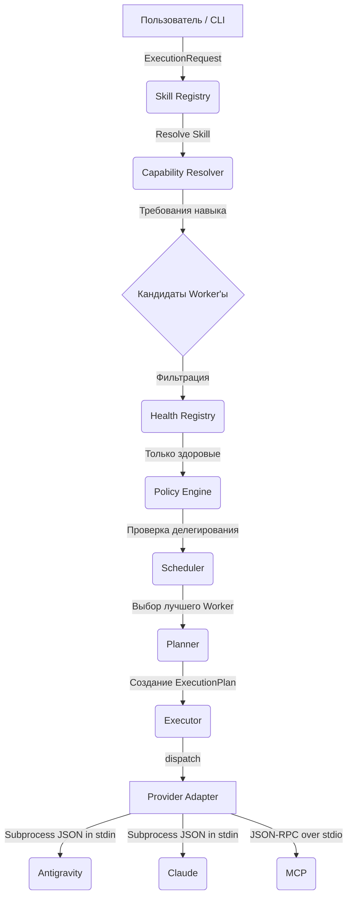

# Declarative Runtime Orchestration: Руководство пользователя

Данный документ описывает полный пайплайн использования **Декларативного оркестратора (Runtime Orchestration)** в `claude-agent-harness`. Оркестратор абстрагирует маршрутизацию навыков от конкретных провайдеров, используя проверку возможностей (capabilities) и политики делегирования.

---

## 1. Пайплайн исполнения

Когда вы запрашиваете запуск навыка (Skill), оркестратор проходит через следующий пайплайн (Dynamic Dispatch Pipeline), чтобы определить исполнителя и запустить процесс.



### Как это работает:
1. Вы запрашиваете навык (например, `implement`).
2. Резолвер определяет, какие возможности (capabilities) требуются для `implement` (например, `code-execution`, `filesystem`, `git`).
3. Из списка всех воркеров выбираются только те, которые обладают всеми нужными capabilities.
4. Проверяется здоровье кандидата (fallback policy) и политики делегирования (может ли текущий воркер вызывать этого воркера).
5. Планировщик формирует план выполнения (`ExecutionPlan`) и передает его абстрактному провайдеру (провайдер не знает о навыках, только о том, как запустить процесс).

---

## 2. Конфигурация (`orchestration.toml`)

Вся настройка осуществляется через файл `.harness/orchestration.toml`. Изменение маршрутизации не требует правки кода.

```toml
version = 1

[runtime]
max_parallel = 8
default_timeout = 600
max_depth = 4
retry = { max_attempts = 2, backoff = "none" }

# 1. Задаем доступных провайдеров
[providers.agy]
type = "cli"
command = "agy"
args = ["--json"]
timeout = 600

[providers.qa]
type = "mcp"
command = "python"
args = ["mcp-server/server.py"]

# 2. Объявляем воркеров и привязываем их к провайдерам с набором capabilities
[workers.coder]
provider = "agy"
capabilities = ["code-execution", "filesystem", "git"]
priority = 10
health = "healthy" # unhealthy workers are excluded before scoring

[workers.qa]
provider = "qa"
capabilities = ["testing", "linting", "type-checking"]

# 3. Описываем навыки и их требования
[skills.implement]
requires = ["code-execution", "filesystem", "git"]

[skills.implement.execution]
preferred = ["coder"] # Предпочтительный воркер, если доступно несколько

# 4. Ограничения и delegation policy для вложенных dispatch-вызовов
[policies.limits]
max_parallel = 8
max_depth = 4

[[policies.delegation.coordinator.allow]]
worker = "coder"
skills = ["implement"]
```

`runtime.max_parallel` (or `policies.limits.max_parallel`) bounds concurrent provider
executions in one runtime process. Retry parameters use `max_attempts` and can be declared
globally under `runtime.retry` or overridden per provider under `providers.<name>.retry`.
`health = "unhealthy"` is useful for a declared maintenance/fallback state; an unhealthy
preferred worker is rejected and the highest-scoring healthy candidate is selected instead.
Delegation rules are checked before health and scheduling. A non-root caller must have an
explicit rule for the requested skill and worker; exceeding `max_depth` returns a structured
`DEPTH_LIMIT_EXCEEDED` routing error.

Workflow steps are sequential by default. An independent workflow may set
`parallel = true`; its dispatches still share the configured `max_parallel` limit.

---

## 3. Словарь терминов (Доменная модель)

| Концепт | Описание | Пример в TOML |
|---|---|---|
| **Skill** | Логическая задача или навык, который требуется выполнить. Не привязан к исполнителю. | `[skills.implement]` |
| **Capability** | Атомарная возможность, необходимая для выполнения задачи (например, доступ к файловой системе). | `requires = ["git"]` |
| **Provider** | Конкретный бэкенд исполнения. Абстрагирует механизм запуска (CLI, MCP, API). | `[providers.claude]` |
| **Worker** | Именованный исполнитель (профиль агента). Связывает Provider с набором Capabilities. | `[workers.coder]` |
| **Policy** | Правила безопасности, описывающие кто кого может вызывать и какие есть ограничения по глубине. | `[[policies.delegation.coder.allow]]` |

---

## 4. Команды CLI

Оркестратор предоставляет унифицированный CLI, который не привязан к синтаксису конкретных агентов. 
Запуск производится через модуль `harness.runtime.cli`.

### Список доступных команд:

| Команда | Описание | Пример вызова |
|---|---|---|
| **`providers`** | Показывает список зарегистрированных провайдеров и их классы. | `python -m harness.runtime.cli providers` |
| **`explain`** | Дебаг-режим. Показывает, как резолвится маршрут навыка до конкретного Worker'а. | `python -m harness.runtime.cli skill explain implement --caller coordinator --depth 1` |
| **`plan`** | Создает и выводит `ExecutionPlan`, не запуская фактическое исполнение. | `python -m harness.runtime.cli plan implement` |
| **`run`** | Выполняет план. JSON-вход передается провайдеру в `stdin`. | `python -m harness.runtime.cli run implement --input '{"file":"main.py"}'` |

> **Внимание:** В примерах выше предполагается, что вы находитесь в корне репозитория (по умолчанию `--repo .`).

---

## 5. Добавление нового провайдера (How-to)

Добавление новой execution-среды (например, `OpenCode`) не требует изменений в маршрутизаторе `Dispatcher`.

**Шаг 1: Добавьте конфигурацию провайдера в `orchestration.toml`**
```toml
[providers.opencode]
type = "cli"
command = "opencode-cli"
```

**Шаг 2: Создайте Worker'а, который использует этого провайдера**
```toml
[workers.opencode_worker]
provider = "opencode"
capabilities = ["code-execution", "filesystem"]
```

**Шаг 3: Класс провайдера (Если нужно специфичное поведение)**
Если провайдер работает по стандарту `JSON-to-stdin`, то тип `cli` автоматически обработает его через встроенный класс `CLIProvider`. 
Если требуется сложная специфика (например, gRPC API), создайте файл в `harness/runtime/infrastructure/providers/opencode.py` и зарегистрируйте его в `cli/main.py`.

---

## 6. Механизм передачи данных (Generic CLI Integration)

CLI-provider запускается с ровно теми `command` и `args`, которые объявлены в TOML, из корня
целевого репозитория. `providers.<name>.timeout` задаёт ограничение в секундах; если оно не
указано, используется `runtime.default_timeout`.

Обмен идёт по JSONL поверх JSON-RPC 2.0. Каждое сообщение содержит versioned envelope
protocol = "harness.provider" и version = 1 в params или result. Стартовый request:

```json
{
  "jsonrpc": "2.0",
  "id": "ab12-cd34-...",
  "method": "execute",
  "params": {
    "protocol": "harness.provider",
    "version": 1,
    "execution_id": "ab12-cd34-...",
    "skill": "implement",
    "input": {"file": "main.py"},
    "capabilities": ["code-execution", "filesystem", "git"]
  }
}
```

Провайдер должен завершить поток terminal result с тем же id:

```json
{
  "jsonrpc": "2.0",
  "id": "ab12-cd34-...",
  "result": {
    "protocol": "harness.provider",
    "version": 1,
    "status": "SUCCESS",
    "output": {"changed": true}
  }
}
```

Malformed JSON, неверная версия/структура, несовпадающий id или закрытие stdout без
terminal result приводят к FAILED; успешный статус никогда не выводится по умолчанию.
Превышение timeout приводит к TIMEOUT, а ненулевой exit code — к FAILED.
---

## 7. Пример сложного воркфлоу: От Идеи до Кода

В этом разделе подробно разобран сквозной сценарий разработки с использованием Декларативного оркестратора. Воркфлоу состоит из последовательных шагов:
grill-with-docs ➔ 	o-spec ➔ 	o-tickets ➔ implement <id> (который внутри себя вызывает TDD, code-review и qa-gate).

---

### Архитектура Воркфлоу

Пайплайн делится на две части: **Явные вызовы** (вы делаете их вручную, передавая контекст) и **Скрытое дерево исполнения** (когда оркестратор сам делегирует задачи).

`mermaid
sequenceDiagram
    autonumber
    actor U as Пользователь (CLI)
    participant D as Dispatcher
    participant C as Claude (Coordinator)
    participant A as Antigravity (Coder)
    participant M as MCP Server (QA)
    
    Note over U,M: Часть 1: Сбор требований и планирование (Явные вызовы)
    U->>D: run grill-with-docs
    D->>C: Execute
    C-->>U: result & context_id
    
    U->>D: run to-spec (context_id)
    D->>C: Execute
    C-->>U: spec_file (markdown)
    
    U->>D: run to-tickets (spec_file)
    D->>C: Execute
    C-->>U: JSON с задачами (TASK-1, TASK-2)

    Note over U,M: Часть 2: Исполнение и Делегирование (Скрытое дерево)
    U->>D: run implement (TASK-1)
    D->>A: Execute implement
    
    A->>D: Request 'tdd'
    D->>A: Execute tdd (в новом контексте)
    A-->>A: Пишет тесты и код
    A-->>D: tdd завершен
    
    A->>D: Request 'code-review'
    D->>M: Execute code-review
    M-->>A: Замечаний нет
    
    A->>D: Request 'qa-gate'
    D->>M: Execute qa-gate (lint, typecheck)
    M-->>A: QA пройден
    
    A-->>D: implement завершен
    D-->>U: SUCCESS (commit_hash, status)
`

---

### Пошаговый запуск в Терминале

Представим, что мы реализуем фичу «Добавление новой базы данных (Redis)».

#### Шаг 1: Инициация сбора требований (Grill)

Вы формулируете базовую идею. Оркестратор запускает навык grill-with-docs на воркере claude-coordinator (так как навык требует 
easoning).

**Ваш ввод:**
``bash
python -m harness.runtime.cli run grill-with-docs --input '{"idea": "Добавить поддержку Redis для StateStore"}'
``

**Вывод терминала:**
``json
Execution Status: SUCCESS
Output: {
  "result": "Гриллинг завершен. Найдены пробелы в требованиях: не указано, как обрабатывать таймауты подключения. Пользователь уточнил, что нужен exponential backoff.",
  "context_id": "grill-492a-b12"
}
``
> *Совет:* В интерактивном режиме оркестратор мог бы запросить у вас ответы в реальном времени, но в CLI режиме он возвращает собранный контекст.

#### Шаг 2: Генерация спецификации (To-Spec)

Вы передаете context_id из предыдущего шага в навык генерации спецификации.

**Ваш ввод:**
``bash
python -m harness.runtime.cli run to-spec --input '{"context_id": "grill-492a-b12"}'
``

**Вывод терминала:**
``json
Execution Status: SUCCESS
Output: {
  "spec_file": "docs/specs/redis_statestore.md",
  "status": "Спецификация успешно создана."
}
``

#### Шаг 3: Декомпозиция на задачи (To-Tickets)

Оркестратор (через Claude) читает Markdown-файл и разбивает его на атомарные задачи.

**Ваш ввод:**
``bash
python -m harness.runtime.cli run to-tickets --input '{"spec_file": "docs/specs/redis_statestore.md"}'
``

**Вывод терминала:**
``json
Execution Status: SUCCESS
Output: {
  "tickets": [
    {"id": "TASK-1", "title": "Реализовать класс RedisStateStore"},
    {"id": "TASK-2", "title": "Покрыть RedisStateStore интеграционными тестами"}
  ]
}
``

#### Шаг 4: Реализация с делегированием (Implement)

Это самый мощный этап. Навык implement имеет право вызывать другие навыки согласно DelegationPolicy. 

**Посмотрим, как оркестратор планирует выполнение задачи:**
``bash
python -m harness.runtime.cli plan implement
``
**Вывод:**
``text
Plan for skill 'implement':
  Worker: coder
  Provider: agy
  Timeout: 600
  Capabilities: code-execution, filesystem, git
``

**Запускаем исполнение TASK-1:**
``bash
python -m harness.runtime.cli run implement --input '{"ticket_id": "TASK-1"}'
``

**Что вы увидите в логах во время исполнения:**
``text
[Dispatcher] Запуск навыка 'implement' на воркере 'coder' (Provider: agy).
[AGY-Coder] Читаю задачу TASK-1...
[AGY-Coder] Делегирование задачи: запрашиваю навык 'tdd' для написания тестов и кода.

[Dispatcher] Проверка политик: 'coder' имеет право вызывать 'tdd'.
[Dispatcher] Запуск навыка 'tdd' на воркере 'coder'.

[AGY-Coder] Тесты написаны и проходят. Возврат управления в implement.
[AGY-Coder] Код готов. Запрашиваю навык 'code-review'.

[Dispatcher] Проверка политик: 'coder' имеет право вызывать 'code-review'.
[Dispatcher] Запуск навыка 'code-review' на воркере 'qa' (Provider: mcp).
[MCP-Server] Код-ревью пройдено. Замечаний нет.

[AGY-Coder] Запрашиваю финальный прогон 'qa-gate'.
[Dispatcher] Запуск навыка 'qa-gate' на воркере 'qa' (Provider: mcp).
[MCP-Server] Выполняю pytest и mypy... Успешно.

Execution Status: SUCCESS
Output: {
  "status": "Task TASK-1 implemented and verified",
  "commit_hash": "a1b2c3d4",
  "review": "approved",
  "qa": "passed"
}
``

### Итоги для пользователя
В этом пайплайне вы, как разработчик, выступаете в роли архитектора системы:
1. Вы **контролируете переходы** между макро-этапами (Сбор требований ➔ Спека ➔ Тикеты).
2. На этапе написания кода (implement) **всю рутину оркестратор берет на себя**: он сам определяет, что code-review и qa-gate должен выполнять MCP Server, а писать код должен Antigravity, прозрачно передавая им контекст. Вы лишь получаете готовый коммит.

---

## 8. Интерактивность (AskUserQuestion) в новом пайплайне

До введения оркестратора навыки (вроде grill-with-docs) напрямую обращались к пользователю, блокируя выполнение. В новой архитектуре, где провайдер работает как изолированный процесс (Subprocess), прямое чтение консоли (input()) невозможно, так как stdin используется для передачи стартового JSON.

### Как интерактивность работает теперь (Через JSON-RPC)

Провайдеры (и MCP, и обновленные CLI-провайдеры) общаются с Диспетчером в режиме **двунаправленного потока (Bidirectional Stream)**, а не просто возвращают результат в конце. 

Когда grill-with-docs (работающий внутри Claude) понимает, что ему нужно задать вопросы, происходит следующее:

1. Провайдер отправляет в stdout специальный RPC-запрос к Диспетчеру:
   ``json
   {
     "jsonrpc": "2.0",
     "id": 101,
     "method": "AskUserQuestion",
     "params": {
       "protocol": "harness.provider",
       "version": 1,
       "questions": [
         {
           "question": "[Удаление] Каскад или soft-delete?",
           "options": ["(Recommended) Soft-delete", "Каскад"]
         }
       ]
     }
   }
   ``
2. Диспетчер перехватывает этот method, приостанавливает ожидание процесса и **рендерит нативный UI в терминале или IDE пользователя**.
3. Вы (пользователь) кликаете вариант "Soft-delete" или вводите его в терминале.
4. Диспетчер отправляет ответ обратно в stdin процесса:
   ``json
   {
     "jsonrpc": "2.0",
     "id": 101,
     "result": {
       "protocol": "harness.provider",
       "version": 1,
       "answers": ["(Recommended) Soft-delete"]
     }
   }
   ``
5. Провайдер возобновляет работу, сохраняет решение в CONTEXT.md и docs/adr/000N-tag-model.md, и в конце возвращает финальный Execution Status: SUCCESS.

### Почему это лучше?
* **Провайдер не знает, где он запущен.** Он отправляет универсальный запрос AskUserQuestion. Если Harness запущен в консоли, выведется текстовое меню. Если в IDE (через Antigravity UI) — появится красивая формочка с радиокнопками. 
* **Единый протокол.** Это стандартная модель MCP (Model Context Protocol), которая теперь унифицирована для всех агентов в системе.
