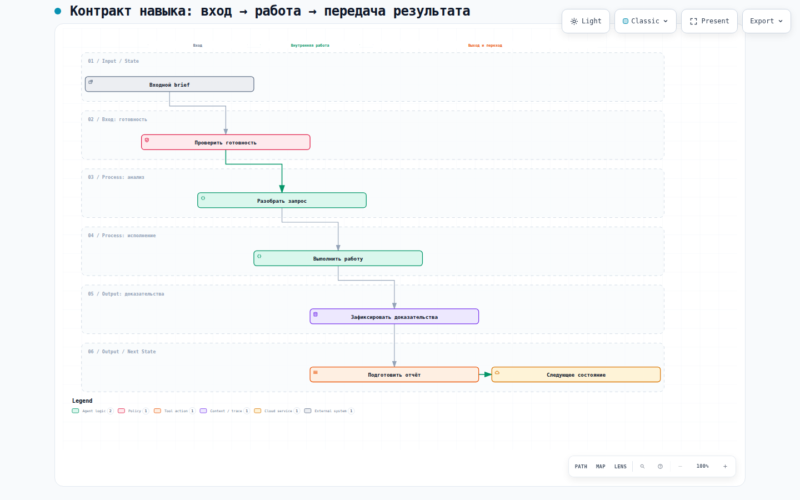

# To Pull Requests — К pull request'ам

## 1. Название и локализация

- **Английское название:** `to-pull-requests`
- **Русский перевод:**

```text
К pull request'ам
```

## 2. Полный перевод текста скила

```text
---
name: to-pull-requests
description: Подготовьте и откройте pull request для уже отправленной issue-ветки. Используйте после предложения `/implement` или когда разработчик явно просит открыть PR.
disable-model-invocation: true
---

# К pull request'ам

Создайте pull request для указанного тикета. Это ручная команда: никогда не запускайте её лишь потому, что завершился `/implement`.

1. Разрешите тикет и его точную целевую ветку PR из раздела тикета `## Integration Branch`, его родительского epic или `base_branch` для тикета без epic. Если это невозможно разрешить, остановитесь и спросите разработчика.
2. Проверьте, что текущая ветка соответствует `branch_pattern`, не является ни `base_branch`, ни `integration/*`, не имеет незакоммиченных изменений и не имеет коммитов, отсутствующих в upstream-ветке. Если ветка не отправлена, остановитесь и попросите разработчика вернуться к `/implement`. Получите её upstream и потребуйте, чтобы `git rev-parse HEAD` был равен SHA upstream-ветки; если они различаются, выполните fast-forward чистой локальной ветки до продолжения.
3. Для действительного opt-in `backend-orchestration` после синхронизации разрешите полный текущий SHA через `git rev-parse HEAD` и проверьте его до любого действия с PR:
   `python .harness/orchestration/coordinator.py --repo . qa evidence --ticket "#<ID>" --branch "<current-issue-branch>" --candidate-commit "<full-current-SHA>"`.
   CLI выбирает единственный batch с принятым QA-доказательством для этого SHA, поэтому abandoned
   history с тем же тикетом и веткой не влияет на результат. Если один SHA принят в нескольких batch,
   остановитесь и повторите команду с явным `--batch <batch-id>`. Остановитесь, если команда отклоняет
   отсутствующие, непринятые или не совпадающие с SHA доказательства. Не запускайте `/qa-gate`
   повторно, когда эта проверка успешна. Если проект не является действительным opt-in, запустите
   `/qa-gate`, если этот репозиторий его предоставляет, и остановитесь при ошибке.
4. Подготовьте тело PR по `docs/agents/git-workflow.md` §3. Храните его только в `.harness/.sandboxes/scratch/tmp/pr-body-<issue>-<slug>.md`, никогда в `docs/tasks/`. Разработчик может вручную запустить `pr-composer` в coding application; иначе заполните шаблон напрямую. Разрешите default branch репозитория и используйте `Closes #<ID>` только для этой цели, иначе `Related to #<ID>`.
5. Попросите разработчика явно подтвердить, что ветка готова стать PR. Остановитесь для его ответа.
6. После одобрения откройте PR/MR через CLI tracker-а с `--body-file <path>`. Удаляйте файл тела `.harness/.sandboxes/scratch/tmp/` только после успеха этой команды; при ошибке сохраните его для повторной попытки. Если тикет несёт `task-report::required`, опубликуйте его completion report в тикете, если разработчик не попросил пропустить это.
7. Верните ссылку на PR/MR в основной сессии и спросите, хочет ли разработчик его проверить. Никогда не выполняйте merge. После того как разработчик подтвердит merge, явно закройте тикет `Related to #<ID>`; для `Closes #<ID>` убедитесь, что tracker закрыл его.
8. **Разблокируйте зависимые — обязательно после каждого закрытия, в той же сессии.** Метку `status::in-progress` закрытого тикета не трогайте: закрытое состояние и есть его терминальный `done`. Затем найдите все открытые тикеты, которые он блокировал, и переведите те, у которых теперь закрыты все блокеры:
   - **GitHub:** перечислите открытые issue со `status::blocked` (`gh issue list --state open --label status::blocked --json number`). Для каждого прочитайте нативные блокеры (`gh api repos/<owner>/<repo>/issues/<n>/dependencies/blocked_by --jq '[.[] | select(.state=="open")] | length'`) и строку `Blocked by:` в теле. Если открытых блокеров нет, выполните `gh issue edit <n> --remove-label status::blocked --add-label status::ready`.
   - **GitLab:** та же проверка через нативные blocking links (`glab api projects/:id/issues/:iid/links`) и строку `Blocked by:`; замена через `glab issue update <n> --unlabel status::blocked --label status::ready`.
   - **Локальный трекер** (`.scratch/<feature>/issues/*.md` или `docs/tasks/*.md`): проверьте `**Blocked by:** #<ID>` и установите `**Workflow:** status::ready`, когда все перечисленные блокеры разрешены.
   - Сообщите, какие тикеты перешли в `status::ready`, а какие остались заблокированы и чем.
```

## 3. Контракты

- **Вход (Input/Brief):** отправленная issue-ветка, тикет и точная целевая ветка PR.
- **Выход (Output/Report):** ссылка на созданный PR/MR либо конкретный blocker.

## 4. Архитектурная схема


