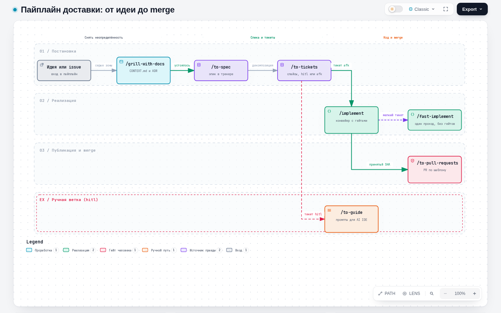
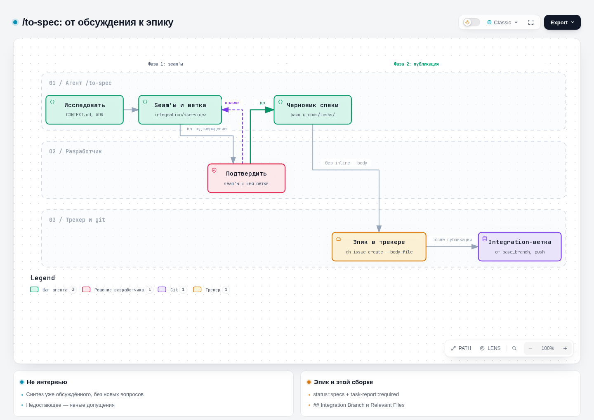
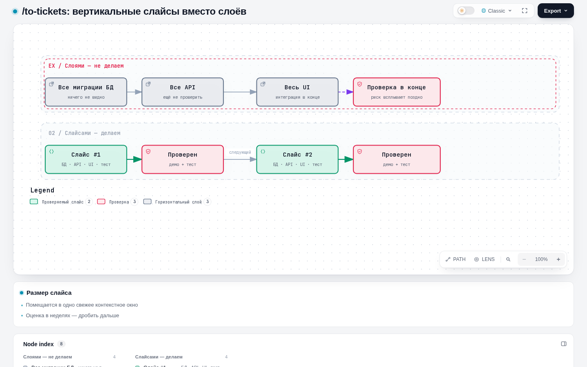
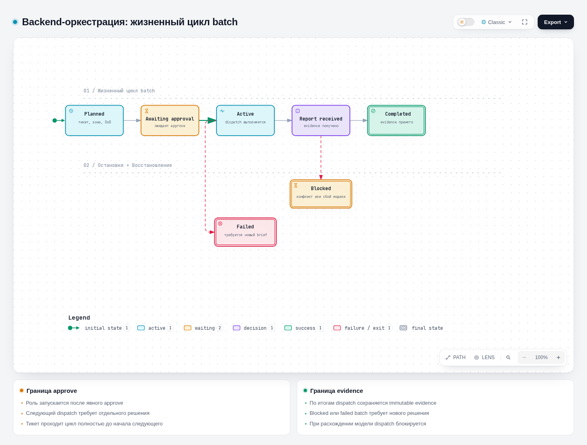
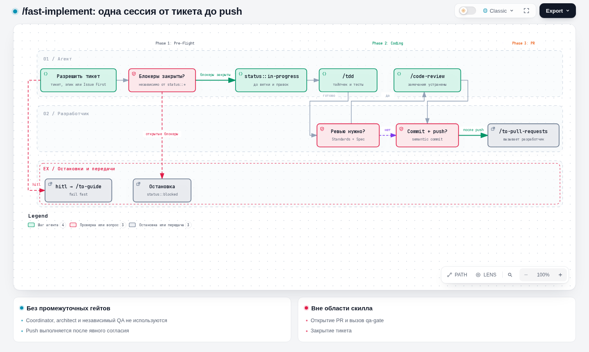
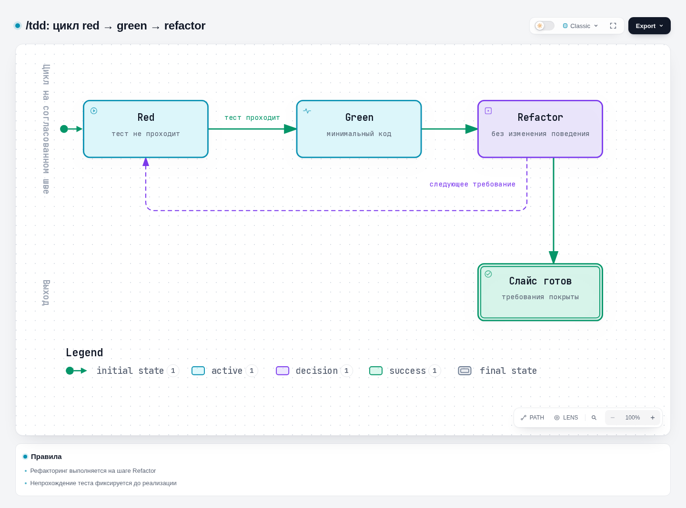
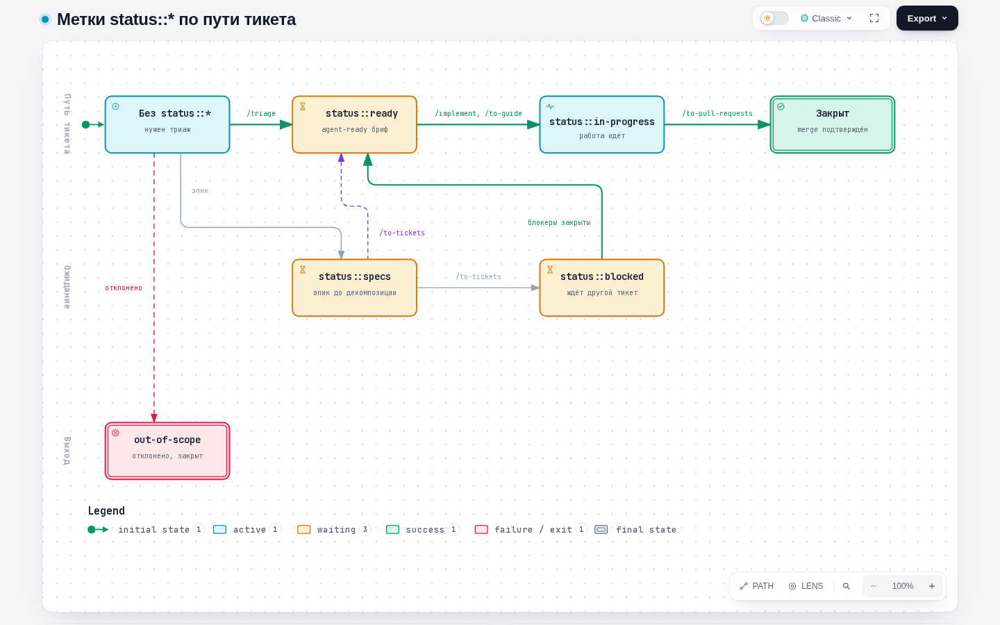
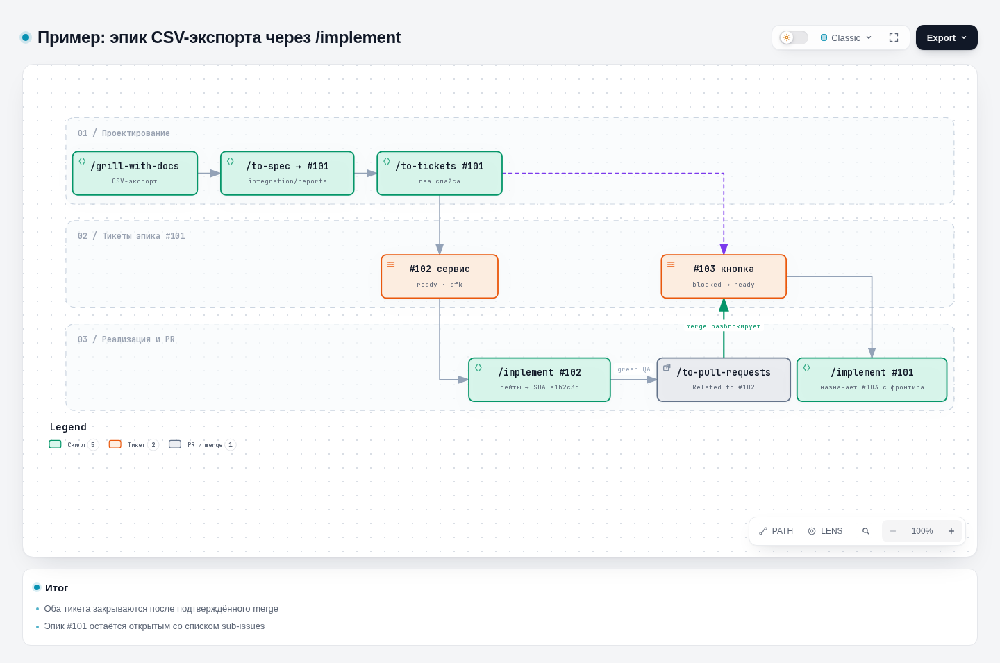

# Справочник Agent Harness

Agent Harness — переносимый набор скиллов, правил, hooks и документов для Claude Code и Codex. Он
одной командой разворачивается в проект ([раздел 0](#0-установка-и-подключение)) и дальше живёт там
независимо от исходного репозитория
[PVMalove/claude-agent-harness](https://github.com/PVMalove/claude-agent-harness).

Харнесс разбивает работу с AI-агентами на строгие фазы: устранение неопределённости → спецификация →
тикеты → TDD-реализация вертикальных слайсов → независимое ревью → PR, который мержит человек.

> **Этот файл — справочник установки, команд и скиллов.** Целостное описание архитектуры
> backend-оркестрации, lifecycle coordinator, ролей, clean-room QA и локального state — в
> [backend-orchestration.md](./backend-orchestration.md).


Редактируемая спецификация и интерактивная версия схемы:
[Archify JSON](https://github.com/PVMalove/claude-agent-harness/blob/master/docs/diagrams/harness-guide-navigation.workflow.json)
и [HTML](https://github.com/PVMalove/claude-agent-harness/blob/master/docs/diagrams/harness-guide-navigation.workflow.html).

## Навигация по разделам

| Задача | Раздел |
|---|---|
| Установка и обновление харнесса | [0. Установка и подключение](#0-установка-и-подключение) |
| Выбор начального скилла для задачи | [Общая схема пайплайна](#общая-схема-пайплайна) и [точки входа](#точки-входа) |
| Проработка требований и устранение неопределённости | [1. Grilling](#1-этап-проектирования-и-устранения-неопределённости-grilling) |
| Подготовка спецификации и декомпозиция на тикеты | [2. Спецификация](#2-фиксация-требований-и-спецификация-specification), [3. Тикеты](#3-декомпозиция-задач-ticketing) |
| Реализация тикета | [4. Разработка](#4-разработка-implementation) |
| Контроль качества и подготовка PR | [5. Контроль качества](#5-автоматизированный-контроль-качества-model-invoked-skills), [6. Надстройки](#6-проектные-надстройки-поверх-апстрима) |
| Причины блокировки команд hooks | [9. Hooks](#9-детерминированные-hooks-claudesettingslocaljson) |
| Сквозные примеры | [14. Примеры целиком](#14-примеры-целиком-по-точкам-входа) |

---

## 0. Установка и подключение

Как правило, установку выполняет агент. Для этого ему передаётся запрос:

```text
Используй start-project, чтобы помочь мне сформировать и начать этот проект.
```

Для репозитория, в котором уже есть код и собственные соглашения, но харнесс не установлен:

```text
Используй integrate-project, чтобы интегрировать харнесс в этот существующий проект.
```

Скилл проводит аудит репозитория, выбирает capability и вызывает соответствующую команду `harness`.
Ниже описаны выполняемые при этом шаги и их эквивалент через CLI.

### Шаг 1 — клонирование харнесса

Харнесс — не зависимость целевого проекта: его CLI работает **над** целевым репозиторием по пути и
копирует в него необходимые файлы. Инструмент клонируется в произвольный каталог:

```bash
git clone https://github.com/PVMalove/claude-agent-harness.git
cd claude-agent-harness
```

После установки клон может быть удалён: в проекте остаётся независимый снимок `.harness/`.
Обновления устанавливаются отдельной командой `update` и автоматически не применяются.

### Шаг 2 — команды CLI

Все команды имеют вид `harness/bin/harness.py <command> <repo> [флаги]`, где `<repo>` — путь к
целевому проекту (не обязательно текущая директория). CLI умеет одиннадцать подкоманд:

| Команда | Что делает | Пишет на диск |
|---|---|---|
| `init` | Первая установка в проект без харнесса | да |
| `adopt` | Установка поверх проекта, где уже есть свои скиллы с теми же именами | да |
| `diff` | Сверяет проект с залоченным снимком | нет |
| `update` | Подтягивает новую версию capability | да |
| `registry` | Пересобирает `.harness/skills/REGISTRY.md` | да |
| `lock-project-skills` | Фиксирует хэши скиллов, которыми владеет сам проект | да |
| `health` | Диагностика установки и окружения | только с `--fix` |
| `list` | Список установленных скиллов | нет |
| `cleanup` | Предпросмотр и удаление одноразовых данных `.harness` | только с `--apply` |
| `uninstall` | Предпросмотр и полное удаление харнесса из проекта | только с `--apply` |
| `console` | Интерактивный TUI-пульт | через выбранные команды |

#### Какую команду выбрать

[](https://github.com/PVMalove/claude-agent-harness/blob/master/docs/diagrams/harness-install-choice.workflow.html)

| | `init` | `adopt` |
|---|---|---|
| Когда | Репозиторий без харнесса вообще | Под именами выбранной capability уже лежат свои скиллы |
| Требование | Падает, если `.harness/harness.lock` уже есть | Не требует пустоты — сохраняет project-owned скиллы вне capability |
| Конфликт с `.agents/skills`/`.claude/skills` | Падает без обходного флага — чинить вручную или через `adopt` | `--replace-conflicts` заменяет только конфликтующие имена; проверьте их заранее |

| | `diff` | `update` |
|---|---|---|
| Пишет на диск | Нет — только отчёт | Да |
| Код выхода | `0` чисто, `1` — есть дрейф | `0` при успехе, иначе ошибка |
| Локальные правки managed-файлов | Показывает как `local_changed`/`conflict`, не трогает | Без флага отказывается; `--force-managed-files` перезаписывает snapshot, `--force` — snapshot и seed |
| Когда | Быстрая проверка перед чем угодно | Когда решили реально подтянуть новую версию |

#### Какую capability выбрать

| | `project-foundation` | `mattpocock-suite` | `pvmalove-suite` | `backend-orchestration` |
|---|---|---|---|---|
| Скиллов | 5 | 25 | 29 | 29 + роли |
| Домен | Любой: software, content, research, operations, personal | Инженерный pipeline как в апстриме | Инженерный pipeline с доработками ([раздел 7](#7-локальные-кастомизации-10-изменённых-скиллов)) | Согласованная backend-работа несколькими ролями |
| Даёт | `grilling`, `handoff`, `writing-for-agents`, `research`, `domain-modeling` | Все upstream-скиллы | Спека → тикеты → implement → commit + push (разделы 1–5) | Coordinator, role manifests, playbook, clean-room QA |
| Проектные файлы | Нет | Нет | `.harness/project.json`, hooks, `docs/agents/*.md` | То же + `.harness/orchestration.json` |

Без `--capability` ставится `project-foundation`. `backend-orchestration` расширяет
`pvmalove-suite`, поэтому выбирается одной capability: `--capability backend-orchestration`, а не
вместе с `pvmalove-suite`. Она добавляет role manifests, `.harness/orchestration.json` и playbook и
не запускает воркеры без явно одобренного dispatch. Полный порядок действий, пример конфигурации и
immutable brief — в [отдельном руководстве](./backend-orchestration.md).

Это строго opt-in маршрут: он включается только при выбранной capability; `.harness/orchestration.json`
не обязателен — без него zone по умолчанию весь репозиторий, а `model`/`effort` роли берутся из
вызывающей сессии. Без capability `/implement` отправляет на `/fast-implement`. Один batch хранит
ticket, issue-ветку, worktree и history evidence, а каждый его dispatch имеет собственный immutable
brief, terminal report и новое явное человеческое approval. Developer создаёт candidate commit;
coordinator детерминированно оценивает риск по DoD, diff и developer trigger, при необходимости
назначает независимые оси Standards и Spec, затем обязательно запускает полный clean-room QA для
того же SHA. Report остаётся `reported` до решения человека. Только developer публикует принятый
SHA; после этого `/to-pull-requests` вручную ведёт PR workflow. Adapter только транспортирует уже
утверждённый dispatch и не принимает report, не запускает следующий шаг и не создаёт либо не мержит
PR.

| | `mattpocock-suite` как есть | Своя capability по образцу `pvmalove-suite` |
|---|---|---|
| Когда | Апстримный pipeline устраивает без изменений | Нужны свои правки: лейблы, язык, доп. скиллы |
| Механизм | `--capability mattpocock-suite` | `extends`/`overrides`/`additions` в `harness/CAPABILITIES.json`, полные first-party файлы и проверяемый snapshot ([ADR 0001](https://github.com/PVMalove/claude-agent-harness/blob/master/docs/adr/0001-portable-capability-delivery.md)) |
| Обновление апстрима | `harness update` устанавливает изменения без правок | Унаследованное обновляет тот же `update`; за переопределёнными скиллами следите через `scripts/check_upstream_drift` в репозитории харнесса |

#### `init` — первая установка

Требует, чтобы `<repo>` уже был git-репозиторием; завершается ошибкой «already exists; use update», если
`.harness/harness.lock` уже есть.

```bash
python3 harness/bin/harness.py init /path/to/repository \
  --project-type software \
  --stack python \
  --capability pvmalove-suite \
  --base-branch main \
  --language ru \
  --qa-gate-command "make check" \
  --qa-gate-command "make test"
```

В Windows PowerShell схема та же для всех команд: `python` вместо `python3`, обратная кавычка
`` ` `` вместо `\` для переноса строк и путь вида `C:\path\to\repository`:

```powershell
python harness\bin\harness.py init C:\path\to\repository `
  --project-type software `
  --stack python `
  --capability pvmalove-suite `
  --base-branch main `
  --language ru `
  --qa-gate-command "make check" `
  --qa-gate-command "make test"
```

| Флаг | Смысл |
|---|---|
| `--project-type`, `--stack` | Информационные, попадают в `AGENTS.md`, на поведение CLI не влияют; `--stack` повторяем |
| `--capability` | Повторяем; взаимно пересекающиеся capability CLI указать не даст |
| `--base-branch` | Базовая ветка репозитория, по умолчанию `main` |
| `--language` | `ru` или `en`, язык отчётов и документов агента |
| `--pr-base-branch` | Ветка, от которой создаются integration-ветки эпиков (по умолчанию `--base-branch`) |
| `--branch-pattern` | Регулярное выражение для имён issue-веток |
| `--qa-gate-command` | Команда полного гейта качества; повторяем, порядок сохраняется ([раздел 6](#qa-gate-skill-context-fork)) |

Последние четыре флага читает только `pvmalove-suite`; они пишутся в `.harness/project.json`. Их
можно опустить — `init` спросит интерактивно.

При выборе `pvmalove-suite` или `backend-orchestration` `init` дополнительно (один раз, при отсутствии файла — как `AGENTS.md`/`CLAUDE.md`) разворачивает в проект: `docs/agents/{artifacts,git-workflow,issue-tracker,triage-labels,worktrees}.md`, `.claude/hooks/*.sh` + их проводку в `.claude/settings.local.json` (заодно записывается в `.harness/integrations.json`), `.claude/rules/karpathy-guidelines.md`, `.claude/agents/pr-composer.md` и само `.harness/project.json`.

- Этот справочник и руководство по backend-оркестрации — **не** seed-файлы: они входят в
  управляемый снимок `pvmalove-suite` как `.harness/docs/{harness-guide,backend-orchestration}.md` и
  обновляются каждым `update`.
- Только `backend-orchestration` создаёт `.harness/orchestration/`, управляемый пример
  `.harness/orchestration.example.json` (входит в снимок, обновляется при каждом
  `init`/`adopt`/`update`) и — один раз, если файла ещё нет, — `.harness/orchestration.json` как
  копию этого примера.

#### `adopt` — установка поверх своих скиллов

Не требует пустого `.harness/` и сохраняет все проектные скиллы вне выбранной capability. Если имя
из capability совпадает с уже существующим скиллом, команда завершается ошибкой со списком конфликтов; с
`--replace-conflicts` конфликтующие каталоги заменяются без backup, остальное не трогается. Флаги
`--capability` и pvmalove-флаги — как у `init`.

```bash
python3 harness/bin/harness.py adopt /path/to/repository --capability pvmalove-suite --replace-conflicts
```

#### `diff` — сверить с залоченным снимком

```bash
python3 harness/bin/harness.py diff /path/to/repository          # человекочитаемый отчёт
python3 harness/bin/harness.py diff /path/to/repository --json   # машиночитаемый
```

Код выхода `0` — чисто, `1` — есть дрейф (локальные правки в managed-файлах, конфликты).

#### `update` — подтянуть новую версию

```bash
python3 harness/bin/harness.py update /path/to/repository --capability pvmalove-suite
python3 harness/bin/harness.py update /path/to/repository --force-managed-files   # перезаписать snapshot
python3 harness/bin/harness.py update /path/to/repository --force-seed-files      # перезаписать seed-файлы
```

- Без флага `update` отказывается перезаписывать локально изменённые managed files: показывает их
  (как `diff`) и останавливается.
- `--force-managed-files` перезаписывает только managed snapshot, включая удаление файлов, которых
  больше нет в текущей версии capability.
- Seed-файлы (`docs/agents/`, hooks, rules, agents, `.harness/project.json`,
  `.harness/orchestration.json`) сохраняются; `--force-seed-files` перезаписывает только их, а
  `--force` объединяет оба действия и может потерять project-owned настройки.
- `.harness/overlays/project-local.lock` и `.harness/integrations.json` `update` не проверяет и не
  трогает — это отдельная подсистема.

#### `registry` и `lock-project-skills` — скиллы проекта

```bash
python3 harness/bin/harness.py registry /path/to/repository
python3 harness/bin/harness.py lock-project-skills /path/to/repository
```

- `registry` перегенерирует `.harness/skills/REGISTRY.md` без полного `update`. `init`/`adopt`/
  `update` пишут этот файл сами; отдельная команда нужна, например, сразу после
  `lock-project-skills`. Таблица строится сканированием `.harness/skills/*/SKILL.md` с диска —
  попадают и capability-скиллы, и project-owned.
- `lock-project-skills` для каждого каталога под `.harness/skills`, не входящего в выбранные
  capability, пересчитывает sha256 всех git-видимых файлов (`git ls-files --cached --others
  --exclude-standard` — gitignore'нутые артефакты вроде `node_modules` в лок не попадают) и
  переписывает `.harness/overlays/project-local.lock` целиком — полная регенерация, не merge. Заодно
  обновляет `REGISTRY.md`.
- Скилл под `.harness/skills`, не подтверждённый ни capability, ни этим локом, приводит к ошибке
  `harness health` с сообщением `project skills missing provenance lock`.

#### `health` — диагностика

`health` проверяет установку и без флагов не вносит изменений. Команду рекомендуется выполнять после
`init`/`update`, после клонирования проекта и в случаях, когда агент не обнаруживает скиллы.

```bash
python3 harness/bin/harness.py health /path/to/repository            # локальные проверки
python3 harness/bin/harness.py health /path/to/repository --fix      # починить заготовки .harness
python3 harness/bin/harness.py health /path/to/repository --online   # плюс проверки трекера
python3 harness/bin/harness.py health /path/to/repository --json     # машиночитаемый отчёт
```

Пример вывода:

```text
== Файлы харнесса ==
✅ harness.lock присутствует
❌ в снэпшоте скиллов есть расхождения
-> Как исправить: посмотрите расхождения через harness diff, затем восстановите снэпшот
   /usr/bin/python3 /opt/claude-agent-harness/harness/bin/harness.py update /work/app
== Окружение ==
⚠️ в git не заданы: user.email
-> Как исправить: задайте автора коммитов
   git config --global user.email "you@example.com"
```

Все проверки выполняются без раннего выхода: сломанная проверка не скрывает остальные. Код возврата
`1`, только если хотя бы одна проверка `fail`; `warn` и `skipped` на код не влияют. Маркеры —
`✅`/`⚠️`/`❌`, ASCII-фолбэк `[OK]`/`[WARN]`/`[FAIL]`, если stdout не может закодировать эмодзи; у
`skipped` используется маркер `-`. Команды в строке `-> Как исправить` печатаются с абсолютными путями
репозитория и интерпретатора — их можно запускать из любого каталога.

| Группа | Что проверяет |
|---|---|
| `files` | Lock, `AGENTS.md`, discovery-ссылки, `project.json`, overlay-локи, интеграции, конфиг оркестрации, маршрутизация verification. Нечитаемый lock — `fail` проверки `files.lock`, а зависящие от него проверки — `skipped` со ссылкой на повреждённый lock |
| `directories` | `.harness`, `.harness/.sandboxes` и категории `cache`/`logs`/`scratch`/`pr_body`/`runs`/`reports`/`worktrees`, при оркестрации — `.harness/orchestration/state`. Отсутствующий каталог с записываемым родителем — `ok` «будет создан»; незаписываемый — `fail` |
| `repo_map` | Уровень Repo Map (`full`/`minimal`) с причиной деградации и ремедиа |
| `environment` | ОС, git и `user.name`/`user.email`, `.gitattributes` и расхождения переводов строк, Python ≥ 3.12, uv, синхронность `.harness/.venv` с `uv.lock` (только в репозитории харнесса), кодировка вывода, длина пути (warn только на Windows при запасе < 160 символов) |
| `environment` на Windows | `LongPathsEnabled`, владелец и запись `%TEMP%\pytest-of-<user>`, пробный symlink (Developer Mode), `bash` для hooks (`fail`, если это заглушка WSL `System32\bash.exe`) |
| `orchestration` | Только при `backend-orchestration`, все проверки read-only — см. ниже |
| `tracker` | Только с `--online` — см. ниже |

**Группа `orchestration`.** Без capability все шесть проверок сразу `skipped` («backend-orchestration
capability не выбрана»). Проверки читают леджер и `git worktree list --porcelain` и строят только
dry-run план очистки; `ledger migrate`/`reset`, `git worktree remove`/`prune` и `apply_cleanup`
не вызываются.

| Проверка | Результат |
|---|---|
| `orchestration.ledger_summary` | `ok` с `generation`, `schema_version` и числом batch по состояниям; нужна миграция схемы — `warn` с командой `ledger migrate`; нечитаемый леджер — `fail` |
| `orchestration.unfinished_batches` | Информация: каждый незавершённый batch с ticket, веткой, worktree, возрастом и состоянием |
| `orchestration.blocked_batches` | `warn` со списком `batch_id` в состоянии `blocked` и подсказкой `coordinator.py batch decide` |
| `orchestration.stale_dispatches` | `warn`, если активный dispatch молчит дольше `attention_policy.stale_dispatch_seconds` (по умолчанию 3600 с) |
| `orchestration.orphaned_worktrees` | `warn` для каталогов worktree, которых нет ни в леджере, ни в `git worktree list`; подсказка — `git worktree prune`, затем предпросмотр `harness cleanup <repo> --mode hard` |
| `orchestration.disposable_data` | Информация: размер того, что удалил бы `harness cleanup --mode hard`; ошибка построения плана — `fail` |

**`--fix`** чинит только локальные заготовки `.harness`: создаёт отсутствующие каталоги группы
`directories` и пересобирает отсутствующий или устаревший `REGISTRY.md`, затем перепроверяет
исправленное. Каждое действие попадает в `fixes_applied` (в тексте — блок `== Исправлено (--fix) ==`).
Реестр Windows, Developer Mode, глобальный git config, права доступа и worktree `--fix` не трогает —
для них в отчёте только команда.

**`--online`** включает группу `tracker`, по умолчанию выключенную, чтобы обычный `health` оставался
локальным. Без флага каждая проверка `tracker.*` — `skipped` «офлайн».

| Проверка | Как работает |
|---|---|
| Определение трекера | По `git remote -v`: GitHub или GitLab по домену origin; локальный трекер — `skipped` |
| `tracker.auth` | `gh auth status` / `glab auth status`; используется только код возврата — токены health не читает и не печатает |
| `tracker.permissions` | `gh api repos/{owner}/{repo}` (`push` → PR и комментарии, `triage` и выше → метки) или `glab api projects/:id` (`access_level` ≥ 30 ≈ push, ≥ 20 — метки) |
| `tracker.reachability` | `git ls-remote origin` |
| `tracker.labels` | Сравнивает метки с таблицами из `docs/agents/triage-labels.md`; отсутствующая метка или другой цвет — `warn`, цвет никогда не перекрашивается |

Каждый внешний вызов ограничен 10 секундами; отсутствующий `gh`/`glab` — `warn`, а не `fail` всего
прогона. `--online --fix` дополнительно создаёт отсутствующие метки с каноническими цветами (`gh label
create`/`glab label create`, без `--force`).

**`--json`** печатает контракт `schema_version: 1`:

```json
{
  "schema_version": 1,
  "repo": "/work/app",
  "online": false,
  "summary": {"ok": 34, "warn": 2, "fail": 0, "skipped": 8},
  "checks": [
    {"id": "files.lock", "group": "files", "status": "ok", "message": "harness.lock присутствует", "fix": null}
  ],
  "fixes_applied": []
}
```

`checks[].id` стабилен и является частью контракта: clean-room-сценарии и тесты ключуются по нему и
по `status`, а не по тексту сообщения.

#### `list` и `cleanup`

```bash
python3 harness/bin/harness.py list /path/to/repository                        # скиллы по алфавиту
python3 harness/bin/harness.py cleanup /path/to/repository                     # предпросмотр soft-очистки
python3 harness/bin/harness.py cleanup /path/to/repository --mode hard         # предпросмотр hard-очистки
python3 harness/bin/harness.py cleanup /path/to/repository --mode hard --apply --confirm HARD
```

`cleanup` выводит план в формате JSON. Без `--apply` данные не удаляются; `--min-age-hours`
(по умолчанию 24) задаёт минимальный возраст удаляемых данных, а hard-очистка требует
`--confirm HARD`.

#### `uninstall` — полное удаление харнесса

```bash
python3 harness/bin/harness.py uninstall /path/to/repository                            # план в JSON
python3 harness/bin/harness.py uninstall /path/to/repository --apply --confirm UNINSTALL
```

Удаляется всё, что устанавливают `init` и `adopt`: каталог `.harness/`, discovery-ссылки
`.agents/skills` и `.claude/skills`, seed-файлы (`docs/agents/*`, `.claude/hooks/*`,
`.claude/rules/*`, `.claude/agents/*`, `.claude/settings.local.json`, `AGENTS.md`, `CLAUDE.md`) и строки
харнесса в корневом `.gitignore`; опустевшие каталоги убираются. Seed-файлы, отличающиеся от
шаблона, и проектные данные внутри `.harness/` (`project.json`, `orchestration.json`,
`integrations.json`, собственные скиллы, состояние ledger) перед удалением копируются в
`.harness-uninstall-backup/<время>/`. Каталог или посторонняя ссылка на месте discovery-пути
остаётся без изменений и попадает в `skipped`. При активных batch оркестрации
удаление отклоняется; после удаления выполняется `git worktree prune`. Применение сверяет свежий
план с показанным и при расхождении требует повторного предпросмотра.

#### `console` — интерактивный пульт

```bash
python3 harness/bin/harness.py console /path/to/repository
```

Пульт перезапускает себя через `uv run --no-project --with textual==<pin>`: pin версии textual живёт
в `harness/console/pin.py`, а `--no-project` гарантирует, что зависимости и lock целевого проекта не
трогаются (`dependencies` харнесса остаются `[]`). Одноразовое окружение строится на том же
интерпретаторе, что прошёл проверку Python ≥ 3.12. Если `uv` не найден или textual не установился
(нет сети), пульт выводит причину и текстовый отчёт `harness health`: диагностика не зависит от
textual. При аварийном завершении TUI пульт сообщает код выхода.

**Оформление** — тема textual `harness-warm`: терракотовые и янтарные акценты на графитовом фоне,
тонкие скруглённые рамки; палитра и знак — в stdlib-модуле `harness/console/brand.py`. Главный экран
открывается знаком харнесса с описанием установки (версия, capability из `harness.lock`, путь,
ветка), под ним — дашборд: offline-счётчики `ok`/`warn`/`fail`/`skipped`, число открытых batch
оркестрации или «не подключено», tier Repo Map, версия харнесса и статус дрейфа. Действие «Online
checks» пересчитывает счётчики с `--online` и показывает CLI-эквивалент.

| Раздел | Что внутри |
|---|---|
| `Diagnostics` | Полный отчёт `health`, «online checks» и «apply fixes» (`health --fix`, после online checks — `--online --fix`; требует повторного нажатия). Health работает в фоновом потоке, отчёт экспортируется в Markdown |
| `Harness` | Панель «Состояние»: установленная версия (и версия пакета, если они расходятся), capability, число скиллов и управляемых файлов, время обновления lock, подключена ли оркестрация и сводка использования пайплайна (`harness/console/stats.py`). Ниже — команды из `harness/console/catalog.py`: init, update (в том числе `--force-managed-files` и `--force-seed-files`), diff, adopt, очистка soft/hard (план и применение), удаление харнесса (план и применение), registry, lock-project-skills, list, health, Repo Map, parser bundle, verify, ledger migrate/clean/reset, удаление worktree |
| `Orchestration` | Статистика пайплайна (запуски и тикеты, состояния, диспатчи по ролям, итоги отчётов, QA, период) и история: слева все состояния batch с числом, справа batch выбранного состояния, Enter открывает хронологию. Ниже — команды coordinator из `harness/console/coordinator_catalog.py` |
| `Reports` | Completion reports из леджера с фильтрами по тикету, роли, outcome и дате; хронология batch; QA-логи |
| `Repo Map` | Карта для HEAD из кэша или построение: сводка, дерево файлов с сигнатурами, поиск символа, связи, топ-10 хабов, диагностика |
| `Help` | Справка по разделам, клавишам и правилам безопасности (`harness/console/help_text.py`) |

| Клавиша | Действие |
|---|---|
| `↑` `↓` `Enter` | Выбор пункта |
| `Tab` | Следующий элемент экрана |
| `Esc` | Назад или отмена |
| `e` / `j` | Экспорт в Markdown / экспорт Repo Map в JSON |
| `b` | Хронология batch в Reports, построение карты в Repo Map |
| `F3` | QA-логи в Reports |
| `F1` | Справка с любого экрана |
| `Ctrl+P` / `Ctrl+Q` | Палитра команд / выход |

Правила безопасности пульта:

- Рядом с каждой командой показан CLI-эквивалент; пульт запускает тот же CLI-процесс и не повторяет
  его логику и инварианты coordinator (approvals, idempotency keys).
- Команды из «Как исправить» пульт отображает, но не выполняет.
- Обратимые команды выполняются сразу. Перед необратимыми — удаление данных, терминальные решения
  coordinator (`batch approve/abandon/decide`, `batch attention resolve`, `dispatch create/cancel`),
  внешние изменения (`dispatch send`), перезапись управляемых файлов — пульт запрашивает подтверждение;
  при отмене команда не выполняется. `ledger reset`, hard cleanup и удаление харнесса требуют ввести `RESET` / `HARD` / `UNINSTALL`.
- Поля форм Orchestration получены обходом реального `coordinator.parser()`, поэтому новый
  обязательный аргумент или `choices` отражается без ручной правки каталога (дрейф-тест).
- Команда, чей скрипт в проекте отсутствует (verify и сборка parser bundle есть только в
  репозитории харнесса), в меню не показывается. `verify` выполняется интерпретатором `.harness/.venv`.
- Экспорт отчёта или хронологии идёт в `docs/tasks/<папка тикета>/artifacts/` (папка `issue-<N>-*`,
  папка эпика или новая `issue-<N>-console-export/`), без тикета — в `docs/tasks/console-exports/`;
  имя файла содержит дату, существующие файлы не перезаписываются.
- Reports и Orchestration только читают леджер (lenient-чтение): повреждённая запись пропускается,
  без леджера показывается «не найден или не инициализирован».
- Repo Map открывает карту для HEAD, если в `.harness/.sandboxes/cache/repo_map/results` есть
  проверенная запись; иначе «Построить карту» (`b`) после предупреждения запускает
  `python -B .harness/repo_map/repo_map.py --repo <repo> --commit <HEAD>`. Раздел читает только поля
  схемы v1 и принимает карту только после `harness.repo_map.contract.validation_error`.

Код разложен по шву stdlib/textual: `harness/console/{pin,runner,launcher,data,catalog,coordinator_catalog,reports,export,repo_map,json_fields,brand,help_text,stats}.py`
не импортируют `textual` и тестируются без него; `harness/console/app.py` и
`harness/console/screens/*.py` импортируют его только внутри перезапущенного процесса. Pilot-тесты
(`tests/console/test_console_app.py`, `tests/console/test_console_harness.py`,
`tests/console/test_console_orchestration.py`, `tests/console/test_console_reports_app.py`,
`tests/console/test_console_repo_map_app.py`) пропускаются через `pytest.importorskip`, если textual
не установлен. `textual` — только в `[dependency-groups].dev` `pyproject.toml`, тем же pin'ом, что и
в коде (`tests/console/test_console_pin.py` держит их равными).

#### Глобальный слой — `bin/install-global.py`

Отдельная команда выполняется один раз для машины и пользователя (`~`), а не для репозитория. Она
устанавливает минимальный instruction-профиль и `start-project`; MCP, модели, плагины, credentials и
permissions не устанавливаются.

```bash
python3 bin/install-global.py --target-home "$HOME" --runtime codex --runtime claude
python3 bin/install-global.py --target-home "$HOME" --runtime claude --check   # только сверить
```

```powershell
python bin\install-global.py --target-home $HOME --runtime codex --runtime claude
```

`--runtime` повторяем. Для проверенных runtime `codex` и `claude` команда ставит профиль из
`global/AGENTS.md` и symlink на `global-skills/start-project` в discovery-корень. В CLI есть маршруты
для других runtime, но совместимость v1.0.0 для них не заявлена.

| Runtime | Instruction-файл | Discovery-корень для `start-project` |
|---|---|---|
| `codex` | `~/.codex/AGENTS.md` | `~/.agents/skills/` |
| `claude` | `~/.claude/CLAUDE.md` | `~/.claude/skills/` |

| Флаг | Смысл |
|---|---|
| `--check` | Ничего не пишет, только сверяет: `ok`/`missing`/`conflict` на цель, ненулевой код при расхождении |
| `--replace-conflicts` | Бэкапит занятое место в `~/.agent-harness-backups/<timestamp>/...` и заменяет; без флага конфликт — ошибка без изменений |
| `--skills-only` | Пропускает instruction-файл, ставит только symlink на `start-project` |

Заодно команда снимает entry-скиллы прошлых версий (`project-harness-bootstrap`, `skill-library`),
если по этому имени лежит symlink именно на них; чужой файл с тем же именем — конфликт, он не
трогается. Скрипт запускается одинаково на Linux, macOS и Windows (`python3 …` или `python …`/`py …`),
требует Python 3.12+. На Windows символьные ссылки на каталоги требуют Developer Mode или терминала
от имени администратора — без этого команда завершается ошибкой с подсказкой.

#### Как это подключено

Скиллы физически лежат в `.harness/skills/*/SKILL.md` и управляются `.harness/harness.lock` (хэши
файлов, версия, `source_revision`). Claude Code и Codex находят их через symlink'и в корне проекта:

```text
.agents/skills  -> .harness/skills
.claude/skills  -> .harness/skills
```

Если после клонирования скиллы не видны (`/implement`, `/triage` отсутствуют в списке), значит нет
`AGENTS.md` или сломаны эти symlink'и. Диагностика и починка — `harness health <repo>` и
`harness update`; не пересоздавайте symlink'и вручную: `health` проверяет, что относительный таргет
резолвится средствами конкретной ОС. Проверенные пути Claude Code и Codex описаны в
[runtime-discovery.md](https://github.com/PVMalove/claude-agent-harness/blob/master/docs/runtime-discovery.md)
репозитория харнесса.

`.harness/skills/REGISTRY.md` — компактный индекс имён, путей и описаний. Схемы этого файла,
`.harness/overlays/project-local.lock` и `.harness/integrations.json` (инвентарь нативных
MCP/plugin/hook/runtime-конфигов) — в
[`CONTEXT.md`](https://github.com/PVMalove/claude-agent-harness/blob/master/CONTEXT.md) репозитория
харнесса.

### Troubleshooting

В таблице приведены сообщения, которые выводит CLI, их причины и порядок действий.

| Сообщение | Причина | Что делать |
|---|---|---|
| `[ERROR] harness requires Python 3.12+ (found ...)` (то же для `install-global.py`) | Python старше 3.12 | Обновить Python: на более старой версии CLI не запускается |
| PowerShell: `python: The term 'python' is not recognized...` | В PATH нет `python`/`py` | Проверить `[Environment]::GetEnvironmentVariable('Path','User')`; если Python там есть — открыть новое окно терминала; иначе установить Python или вызвать по полному пути (`& "$env:LOCALAPPDATA\Programs\Python\Python312\python.exe" ...`) |
| `not a Git repository: <path> (run 'git init' there first)` | `init`/`adopt`/`update` на пути без git-репозитория | `git init` в целевом каталоге и повторить |
| `project harness already exists; use 'harness update <repo>'` | `init` там, где `.harness/harness.lock` уже есть | Запустить `harness update` |
| `project harness is missing; use 'harness init <repo>'` | `update` без `.harness/harness.lock` | Запустить `harness init` |
| `selected skill names already exist; inspect them or use --replace-conflicts` | `adopt` — под именами capability уже лежат свои скиллы | Проверить конфликты; если замена ожидаема — повторить с `--replace-conflicts` (без backup) |
| `local skill changes would be overwritten; review them or use --force` | `update` — на диске локальные правки managed-файлов | Изучить diff; для snapshot — `--force-managed-files`, для snapshot и seed — `--force` |
| `discovery path already exists and is not managed: <path> (...)` | На месте `.agents/skills`/`.claude/skills` что-то постороннее | `init` — убрать вручную или использовать `adopt`; `adopt` — `--replace-conflicts`; `update` — `--force` |
| `.harness/project.json has unknown field(s): <name>` | Поле вне строгого контракта | Удалить поле либо реализовать его сразу в `project.schema.json`, шаблоне, валидаторе и потребителе; допустимы `language`, `base_branch`, `branch_pattern`, `qa_gate_commands`, `$schema`, `story_points`, `shell` |
| `install-global.py`: `[CONFLICT] ... (re-run with --replace-conflicts ...)` | Место профиля или симлинка занято | Повторить с `--replace-conflicts` — сначала будет backup |
| `install-global.py`: `[ERROR] Failed to create symlink: ...` (только Windows) | Нет прав на symlink каталога | Включить Developer Mode (Settings → For developers) или запустить терминал от имени администратора |

---

## Общая схема пайплайна

[](https://github.com/PVMalove/claude-agent-harness/blob/master/docs/diagrams/delivery-pipeline.workflow.html)

Схема показывает путь целиком, для точки входа 3 (самый большой случай). С других точек входа часть
шагов пропускается совсем, а не проходится «без действия».

Шаг 5 в `/implement` — конвейер из пяти ролевых гейтов, а не одна сессия
([раздел 4](#implement-ссылка_или_номер_тикета)):

[](https://github.com/PVMalove/claude-agent-harness/blob/master/docs/diagrams/implement-dispatch.sequence.html)

Поперёк всех гейтов работают две проверки живости: каждый dispatch первым делом подтверждает
фактически активную модель (model self-report), а coordinator-сессия следит за heartbeat и выносит
молчащий dispatch человеку как блокер (dispatch watchdog).

**Гигиена контекста.** Один шаг может занимать много раундов и часов. По результатам анализа сессий
именно длительность шага, а не субагенты и объёмные скиллы, в большинстве случаев определяет расход
токенов. Накапливать полную историю до конца шага и начинать новую сессию посреди шага не
рекомендуется. Рекомендуется выполнять `/compact` на естественных границах шага — после фиксации
решений раунда (CONTEXT.md, ADR, трекер): команда сжимает историю в резюме, зафиксированные решения
сохраняются.

### Точки входа

| № | Точка входа | Когда | Что происходит |
|---|---|---|---|
| 1 | Отдельный тикет — входящий issue/PR, не требующий декомпозиции | Объём укладывается в одну сессию | `/triage` доводит issue до `status::ready` + `hitl`/`afk` брифа → шаг 5 или `/to-guide`. Шаги 2–4 не выполняются |
| 2 | Задача масштаба эпика — состав работ определён, требуется декомпозиция | Умещается в одну сессию `/to-spec`/`/to-tickets` | `/triage` или непосредственно `/to-spec` → `/to-tickets` → `/implement`/`/to-guide` по каждому тикету. Wayfinder не требуется |
| 3 | Крупный объём с неопределённым путём к цели | Постановка задачи не укладывается в одну сессию | `/wayfinder`; на первом подшаге («Name the destination») вызывается `/grilling`. Разрешив карту, Wayfinder передаёт эстафету на `/to-spec` |

Для выбора начального шага предназначен `/ask-matt` — роутер по всем скиллам: описывает основной путь, его
on-ramps (`/triage` для входящих багов и фича-реквестов, `/diagnosing-bugs` для трудных багов) и
ветки вне этой схемы (архитектура кодовой базы, ручные шаги через `/wizard`). Вызывается только
вручную.

---

## 1. Этап проектирования и устранения неопределённости (Grilling)

Цель этапа — устранить неопределённость до начала реализации. `/grill-me` и `/grill-with-docs` — тонкие обёртки
над одним примитивом `/grilling`; обе вызываются только вручную (`disable-model-invocation: true`).

| Скилл | Когда | Что остаётся после |
|---|---|---|
| `/grill-me` | Проектирование с нуля — план, дизайн, текст без репозитория | Сводка решений |
| `/grill-with-docs` | Работа в существующем репозитории — предпочтительный вариант | Сводка + `CONTEXT.md` и ADR |

### Механика `/grilling` (ядро обоих)

1. **Дерево решений.** План моделируется как дерево: каждое решение может порождать зависимые.
2. **Раунды и фронтир.** *Frontier* — вопросы, чьи предпосылки уже закрыты; их задают сейчас.
   Зависимые вопросы не задаются раньше своих предпосылок.
3. **Трекинг состояния.** Каждый раунд начинается с краткой сводки того, что только что устоялось.
4. **Форма вопросов.** Если доступен инструмент `AskUserQuestion` — категориальные вопросы идут через него:
   один вопрос — одна вкладка, короткий `header`, 2–4 взаимоисключающих варианта (рекомендованный
   первым, с пометкой «(Recommended)») и свободный ответ через «Other». В одном вызове не больше
   четырёх вопросов. Открытые вопросы (например, про нейминг) — обычным текстом. Без тула агент
   один раз предупреждает об этом и продолжает текстом:

   ```text
   🤔 Хранение истории экспорта: храним ли мы, кто и когда выгружал отчёт? Влияет на схему БД
      и на требования аудита; без хранения фича проще, но расследование утечек невозможно.
   🤖 Рекомендация: хранить только факт выгрузки (кто, когда, какой отчёт), без содержимого.
   ```

5. **Пересчёт фронтира.** Закрытые решения раскрывают следующий слой; вопрос, зависящий от другого
   открытого вопроса того же раунда, откладывается.
6. **Факты — работа агента.** Данные из окружения (файлы, API) агент получает самостоятельно — через
   субагента или инструменты — и не запрашивает у пользователя сведения, доступные для проверки. Незавершённый поиск блокирует
   только зависящие от него вопросы.
7. **Завершение.** Фронтир пуст — агент показывает сводку решений и спрашивает **«Подтверждаешь
   итоговый план?»** с вариантами **«Да, перейти к `/to-spec`»** и **«Нет, нужны правки»**. При
   подтверждении агент сообщает, что следующим шагом пользователь вызывает `/to-spec` вручную.

**Discovery Context (Live Artifact).** Во время раундов агент может собирать кандидатные пути файлов,
но добавляет их в видимый `Live Artifact` только после явного согласия: новые кандидаты показываются
группой с выбором «добавить все / выбрать по одному / пропустить», default-yes запрещён. Без
публикации артефактов список ведётся в Trunk summary. Это не расходует лимит в четыре вопроса.

`/domain-modeling` (только в `-with-docs`) добавляет поверх цикла: сверку терминов с `CONTEXT.md`,
уточнение размытых понятий («вы говорите "аккаунт" — это Customer или User?»), стресс-тест
сценариями на границах концепций, сверку утверждений с кодом, немедленную запись в `CONTEXT.md` и
предложение ADR в ограниченных случаях — когда решение одновременно труднообратимо, неочевидно без контекста
и было реальным выбором между альтернативами. `CONTEXT.md` — чистый глоссарий, без деталей
реализации.

**В этом репозитории:** `/grilling`, `/grill-me` и `/grill-with-docs` переопределены first-party-слоем
([раздел 7](#7-локальные-кастомизации-10-изменённых-скиллов)), чтобы все точки входа завершались
одинаковым выбором: `/to-spec` или доработка плана.

### `/wayfinder`

Для объёма, который не укладывается в одну сессию `/grilling`: крупный эпик, миграция
унаследованной системы, задачи с неопределённым путём к цели. Wayfinder выносит план в трекер как карту (*map*) с дочерними тикетами и
обрабатывает их по одному, сессия за сессией. Вызывается только вручную.

**Plan, don't do.** Каждый тикет фиксирует решение, а не часть реализации. Карта считается
завершённой, когда открытых решений не остаётся; на этом этапе работа передаётся на реализацию.
Иное поведение задаётся явно в `## Notes` карты.

[](https://github.com/PVMalove/claude-agent-harness/blob/master/docs/diagrams/wayfinder-map.workflow.html)

**Устройство карты:**

- Карта — один issue с меткой `wayfinder:map`. Это индекс: решение живёт ровно в своём тикете, карта
  только кратко пересказывает и ссылается.
- Тело карты: `## Destination` (что значит дойти до конца, 1–2 строки), `## Notes` (домен, скиллы,
  предпочтения), `## Decisions so far` (строка на закрытый тикет), `## Not yet specified` (туман),
  `## Out of scope`.
- Тикеты — дочерние issue с вопросом `## Question` на одну сессию (~100K токенов) и меткой
  `wayfinder:<type>`: **research** (AFK, через `/research`), **prototype** (HITL, через
  `/prototype`), **grilling** (HITL, по умолчанию, `/grilling` + `/domain-modeling`), **task** (HITL
  или AFK — единственный тип, который *делает*, чтобы разблокировать решение).
- Блокировки — нативные зависимости трекера, чтобы фронтир (открытые, разблокированные, незанятые
  тикеты) был виден прямо в UI.
- Claim — сессия назначает тикет на себя до начала работы, чтобы исключить параллельную работу нескольких сессий над ним.

**Неопределённость («туман»).** Вопросы, которые пока нельзя сформулировать точно, не оформляются
тикетами заранее, а фиксируются в `## Not yet specified`. Критерий — возможность точно сформулировать
вопрос в данный момент, независимо от наличия ответа. **Out of scope** — отдельно от тумана: работа за пунктом назначения; такие тикеты
закрываются с одной строкой обоснования.

**Два режима вызова:**

1. **Chart the map** — назвать destination через `/grilling` + `/domain-modeling` → проработать
   фронтир breadth-first (при отсутствии неопределённости карта не требуется, работа завершается) → создать карту → создать
   формулируемые тикеты и вторым проходом связать блокировки → распараллелить research-тикеты
   субагентами → остановиться.
2. **Work through the map** — загрузить карту → взять тикет с фронтира → claim → разрешить →
   записать резолюцию (комментарий, закрыть issue, строка в `Decisions so far`) → добавить новые
   тикеты из тумана. За одну сессию обрабатывается один тикет, за исключением research-тикетов.

Когда карта расчищена, Wayfinder передаёт эстафету на `/to-spec`, а не переходит к `/implement` сам.

---

## 2. Фиксация требований и спецификация (Specification)

### `/to-spec`

**Назначение:** синтез уже обсуждённого в единый источник правды, в той же сессии после Grilling.
Это **не интервью** — повторные вопросы не задаются; недостаток данных означает, что этап grilling был неполным, и
агент синтезирует по известным фактам с явными допущениями. Вызывается только вручную.

[](https://github.com/PVMalove/claude-agent-harness/blob/master/docs/diagrams/to-spec-flow.workflow.html)

1. **Исследование и seam'ы.** Изучить словарь домена (`CONTEXT.md`) и ADR затрагиваемой области,
   наметить **seam'ы** — точки, где фича будет тестироваться: существующие лучше новых, уровень —
   самый высокий, идеал — один seam на фичу. Предложить epic-scoped ветку
   `integration/<service-or-team>`; слаг — только из явно названной области, сервиса или команды.
   **Остановка для подтверждения** — без него фаза 2 не начинается.
2. **Черновик и публикация.** Записать спецификацию по `<spec-template>` сначала файлом в `docs/tasks/`
   (именование — `docs/agents/artifacts.md`) с точным именем integration-ветки, затем опубликовать:
   `gh issue create --body-file <path>`; передача тела через inline `--body`/heredoc не допускается:
   такое квотирование искажает текст спецификации.
3. **Integration-ветка после публикации.** Взять `base_branch` из `.harness/project.json`, создать
   `integration/<service-or-team>` от `origin/<base_branch>` и запушить. Текущий worktree не
   переключать; существующую ветку не сбрасывать, не force-push'ить и не удалять; при частичном сбое
   сообщить точное состояние, не создавая эпик повторно.

**Шаблон спецификации:**

```markdown
## Problem Statement
Пользователи не могут выгрузить отчёт для дальнейшей обработки в таблицах.

## Solution
Кнопка «Экспорт в CSV» на странице отчёта выгружает текущий вид таблицы.

## User Stories
1. As an analyst, I want to export the current report view to CSV, so that I can process it in a spreadsheet.
2. As an analyst, I want numbers formatted by the project locale, so that the spreadsheet parses them.

## Implementation Decisions
Используем существующий сервис форматирования отчёта (seam для PDF-экспорта).

## Testing Decisions
Тесты на уровне сервиса форматирования: числа, даты, экранирование разделителей.

## Out of Scope
Отдельный API endpoint, экспорт всех типов отчётов сразу, Excel-специфичные форматы.

## Further Notes
## Integration Branch
integration/reports

## Relevant Files (Discovery Context)
- services/reports/formatter.py — сервис, уже используемый PDF-экспортом
```

Блок **Out of Scope** ограничивает объём работ: без явного запрета агент может внести избыточные
изменения (дополнительное кэширование, правку инфраструктуры). В Implementation Decisions — модули,
интерфейсы и решения, без путей к файлам и кода (кроме сниппета из прототипа, если он кодирует
решение точно).

**В этом репозитории** ([раздел 7](#7-локальные-кастомизации-10-изменённых-скиллов)): публикуемый
issue — **эпик** с метками `bug`/`enhancement` + `status::specs` (не `status::ready` — декомпозиции
ещё не было) + `task-report::required` и секцией `## Integration Branch`. `/to-spec` создаёт
указанную ветку от `base_branch`, если её нет; `/to-tickets` переносит её в дочерние тикеты. Лейбл-
слаг для эпика не создаётся ([раздел 8](#8-метки-триажа)) — дочерние тикеты связываются с эпиком как
native GitHub sub-issues.

В конец спецификации `/to-spec` переносит утверждённый список из `Live Artifact` в секцию
`## Relevant Files (Discovery Context)` с исходными пояснениями. Без artifact publishing источник —
финальная Trunk summary; заменять список новым blind discovery нельзя.

---

## 3. Декомпозиция задач (Ticketing)

### `/to-tickets`

**Назначение:** преобразовать спецификацию, план или обсуждение в набор **тикетов** — tracer-bullet вертикальных
слайсов с блокирующими рёбрами. До явного одобрения разбивки публикация не выполняется. Вызывается
только вручную.

**Вертикальный слайс, а не слой:**

[](https://github.com/PVMalove/claude-agent-harness/blob/master/docs/diagrams/vertical-slices.workflow.html)

1. **Черновик и ревью.** Собрать контекст (обсуждение или ссылка на спецификацию/issue), при
   необходимости выявить возможности префакторинга («Make the change easy, then make the easy change»). Нарезать вертикальные слайсы —
   каждый проверяется независимо и помещается в одно свежее контекстное окно. Для **каждого** тикета,
   включая `afk`, дать оценку времени человека как сигнал качества: оценка в неделях значит, что
   слайс следует разделить. **Остановка для подтверждения** — разбивка показывается и уточняется до
   одобрения:

   ```text
   1. CSV-сервис форматирования     | blocked by: —  | ~4 ч | сервис + тесты locale
   2. Кнопка экспорта на странице   | blocked by: 1  | ~3 ч | UI + e2e-проверка выгрузки
   Гранулярность устраивает? Рёбра блокировок верны? Что-то объединить или раздробить?
   ```

   **Исключение — широкие рефакторы.** Если одна механическая правка разносится по всей кодовой
   базе и ни один слайс не может остаться зелёным сам, секвенировать **expand → contract**: добавить
   новую форму рядом со старой → мигрировать call site'ы батчами (каждый батч — тикет, блокированный
   expand'ом) → снести старую форму тикетом, блокированным всеми батчами. Если и батчи не могут быть
   зелёными по одному — держать последовательность через общую интеграционную ветку с финальным
   integrate-and-verify тикетом.
2. **Discovery Context.** Если у эпика есть `## Relevant Files (Discovery Context)`, назначить каждый
   путь поддерживающим тикетам с исходным пояснением и ticket-specific причиной; ничьи пути показать
   как `unassigned` и спросить пользователя. Построить Path inventory из этих путей, их каталогов,
   `tests/` и `shared/`, исключив секреты, зависимости, build/dist, cache, generated/minified, большие
   логи, базы, временные данные и несвязанные media. Ровно один cheap-model advisory call на batch
   может добавить точные пути из Path inventory с причиной — не удалить, не выдумать и не расширить
   scope. Без дешёвого маршрута — стоп с blocker.
3. **Публикация и сводка.**
   - **Локальные файлы:** по файлу на тикет в `.scratch/<feature-slug>/issues/<NN>-<slug>.md` в
     порядке зависимостей; `/implement` идёт по полю `**Workflow:**` сверху вниз.
   - **GitHub / реальный трекер:** `gh issue create --body-file <path>` в порядке зависимостей.
     Лейблы: `bug`/`enhancement`, `status::ready` (или `status::blocked`, если тикет ждёт другой
     тикет того же пакета), `hitl`/`afk`, `task-report::required`.
   - Эпик не закрывается и не переписывается — можно лишь дописать список номеров подзадач.
   - Итоговая таблица (Ticket / What to build / Est. Time / Labels): описания генерирует дешёвая
     модель (`haiku`) одним вызовом на пакет; язык колонки — из `.harness/project.json`.

**В этом репозитории** ([раздел 7](#7-локальные-кастомизации-10-изменённых-скиллов)): дочерние тикеты
эпика (`status::specs`) линкуются как native GitHub sub-issues, а не лейблом `epic::<slug>`; тикет,
заблокированный другим открытым тикетом той же декомпозиции, получает `status::blocked`. Фронтир
ищется тем же native-запросом, что у `wayfinder` (`docs/agents/issue-tracker.md#wayfinding-operations`);
`/implement`, вызванный для эпика, определяет первый тикет фронтира и назначает его на себя.

**Контекст:** при переполнении контекстного окна историей правок качество работы агента снижается.
После `/to-tickets` рекомендуется `/clear`, при длительной работе над фичей — `/compact`; каждый
`/implement` запускается в новой сессии.

---

## 4. Разработка (Implementation)

| | `/implement` | `/fast-implement` |
|---|---|---|
| Кто выполняет реализацию | Dispatched-роли; сессия — coordinator | Текущая сессия |
| Гейты | architect → developer → code-review → qa → publish, approval на каждом | Нет; review и push — по согласию разработчика |
| Требует | Capability `backend-orchestration` | Ничего |
| Когда | Значимый тикет, нужна независимая проверка | Мелкий тикет, направление не обсуждается |
| Итог | Опубликованный принятый SHA | Commit + push issue-ветки |
| PR | Отдельно, `/to-pull-requests` | Отдельно, `/to-pull-requests` |

### `/implement [ссылка_или_номер_тикета]`

Сессия `/implement` становится coordinator-ом: ведёт `.harness/orchestration/coordinator.py`
(batch / dispatch / report / decide) и останавливается на пяти явных approval-гейтах. Реализацию
пишут dispatched-роли. Запускается в новой чистой сессии, только вручную.

Маршрут требует capability `backend-orchestration`. Проверка — одна команда, она же показывает, что
уже в работе:

```bash
python .harness/orchestration/coordinator.py --repo . dispatch status
```

Exit 0 — маршрут доступен. **Команда `harness` для этой проверки не используется**: packager CLI
находится в репозитории харнесса, а не в проекте. Если команда отсутствует или завершается с
ошибкой, opt-in не восстанавливается и не достраивается — пользователь направляется к
`/fast-implement`.

**`.harness/orchestration.json` не обязателен**: без него zone — весь репозиторий (`repository`), а
`model`/`effort` роли берутся из сессии и передаются в `dispatch create --model/--effort`. Для
coordinator и architect рекомендуется `medium` effort; повышение допускается только по явному
решению разработчика.

**Жизненный цикл batch:**

[](https://github.com/PVMalove/claude-agent-harness/blob/master/docs/diagrams/backend-batch.lifecycle.html)

Какая команда переводит batch в какое состояние:

| Команда | Из | В |
|---|---|---|
| `batch create` | — | `planned` |
| `batch approve` | `planned` | `awaiting-approval` |
| `dispatch create` / `dispatch send` | `awaiting-approval` | `active` |
| `report submit`, `dispatch cancel` | `active` | `awaiting-approval` |
| Расхождение model self-report | `active` | `blocked` |
| `batch decide` (accept финального шага) | `awaiting-approval` | `completed` |
| `batch decide` block / fail / abandon | `awaiting-approval` | `blocked` / `failed` / `abandoned` |
| `batch abandon` (batch без возможности продолжения) | любое открытое | `failed` |
| `batch not-required` | открытое | `not-required` |

**Типичная последовательность команд coordinator** (все флаги — в
[backend-orchestration.md](./backend-orchestration.md)):

```bash
# есть ли незакрытое по тикету
python .harness/orchestration/coordinator.py --repo . batch list --open --ticket '#102'
# planned batch, затем отдельное утверждение человеком
python .harness/orchestration/coordinator.py --repo . batch create \
  --ticket '#102' --branch feature/issue-102-csv-service \
  --worktree issue-102-csv-service --zone repository \
  --definition-of-done 'CSV-сервис форматирует числа по locale проекта' \
  --definition-of-done 'Тесты написаны до реализации (TDD)'
python .harness/orchestration/coordinator.py --repo . batch approve \
  --batch <batch-id> --approved-by 'имя утверждающего' --approved-at 2026-09-09T12:00:00Z
# следить за живостью dispatch
python .harness/orchestration/coordinator.py --repo . dispatch status --batch <batch-id> --stale-after 3600
```

Ключевые свойства конвейера:

- **Порядок жёсткий.** `dispatch create --role developer` отклоняется, пока у batch нет принятого
  architect-отчёта; правило живёт в `coordinator.py`, его не обойти ручным вызовом.
- **Model self-report.** Роль первым действием подтверждает активную модель
  (`dispatch self-report --dispatch <id> --model <model>`); расхождение с `resolved_model` brief
  переводит dispatch в `blocked`, и его report не принимается.
- **Dispatch watchdog.** Роль шлёт `dispatch heartbeat`, coordinator опрашивает
  `dispatch status --batch <id> [--stale-after <sec>]`; `stale` — блокер для разработчика.
- **Транспорт — выбор проекта.** `assignment_plans.<role>.transport`: `external` (worker через
  adapter) или `in-process` (субагент текущей сессии в worktree того же batch). Без поля —
  `in-process`. Для `in-process` `dispatch send` лишь фиксирует handoff, и coordinator сразу
  запускает субагента по brief, не читая старые dispatch/report/template.
- **Discovery Context.** Coordinator может зарегистрировать Context Package через
  `context-package register`: без LLM, из pinned commits — diff, стартовые файлы, bounded graph,
  тесты, ADR cards и hashes; прямые импорты раскрываются на один уровень, неизвестные форматы
  получают первые 30 строк. Freshness проверяется перед каждым dispatch в shadow-режиме.
- **Checkpoint/continuation.** Только write-роли могут сохранить checkpoint и продолжить тот же
  dispatch в новой worker session; checkpoint не заменяет report и не переносит chat history. После
  rate limit resume автоматичен; плановые причины требуют coordinator decision.
- **Base-commit gate.** `batch create` и каждый review/publish dispatch сверяют base с актуальным
  `origin/<integration_ref>`; drift требует нового developer/rebase dispatch и повторного risk
  assessment.
- **Один тикет за раз.** Batch доводится до терминального состояния до старта следующего.
- **Незакрытое — человеку.** Остаток прошлой попытки (`ticket`, `batch_id`, `state`, `stale` в
  `dispatch status`) не переиспользуется, не удаляется и не обходится вторым batch.
- **Тупиковый batch закрывается командой.** Воркер, завершившийся до self-report, отчёт не предоставит;
  `batch abandon` требует approval и причины, переводит batch в `failed`, закрывает открытые dispatch
  и **ничего не удаляет**. Инвентарь — `batch list --open [--ticket <id>]`. Ручное
  изменение `.harness/orchestration/state/` не допускается — это аудиторский след.
- **Неверный brief отменяется до запуска.** `dispatch cancel` требует approval и причины, оставляет
  brief в audit trail и возвращает batch в `awaiting-approval`.
- **Уже выполненная задача не имитирует работу.** `batch not-required` требует approval и evidence,
  терминально фиксирует, что snapshot уже соответствует DoD, и рекомендует закрыть issue с
  `resolution::wontfix`.
- **Последовательность фиксированная.** Полный путь включает architect, developer,
  code-review и qa; risk assessment решает, когда review *обязателен*, а не когда *разрешён*. Сокращённый
  путь — `/fast-implement`.
- **PR остаётся за человеком.** После green QA сессия отдаёт отчёт, публикует SHA через
  `dispatch publish` и останавливается.
- **Требование TDD передаётся роли через DoD.** Dispatched developer не имеет `/tdd`, поэтому требование TDD из
  `docs/agents/git-workflow.md` coordinator записывает отдельным пунктом `--definition-of-done`;
  отсутствие тестов в `changed_files` — повод для `decide retry`, а не для accept.

### `/fast-implement [ссылка_или_номер_тикета]`

Однопроходный путь без coordinator, architect, независимого QA и approval-гейтов — для тикета, чьё
направление не обсуждается. Принимает `afk`-тикет, ссылку на эпик (первый тикет фронтира
выбирается автоматически) либо вызывается без аргументов — тогда действует Issue First gate. Завершается commit + push issue-ветки и
предлагает `/to-pull-requests`. Запускается в новой сессии, только вручную.

**Базовая версия в апстриме** состоит из пяти шагов: реализация тикета, `/tdd` при необходимости,
регулярный тайпчек и тесты, `/code-review` по готовности, коммит.

**В этом репозитории** first-party override ([раздел 7](#7-локальные-кастомизации-10-изменённых-скиллов))
добавляет три фазы. Ту же Phase 1 выполняет и `/implement` перед `batch create`.

[](https://github.com/PVMalove/claude-agent-harness/blob/master/docs/diagrams/fast-implement.workflow.html)

**Phase 1 — Pre-flight:**

1. **Разрешить тикет.**
   - Передан конкретный тикет с `hitl` — работа прекращается сразу, пользователь направляется к
     `/to-guide`.
   - Передан эпик — тикет выбирается автоматически, `hitl`-тикеты не выбираются. На GitHub/GitLab — тот же
     frontier-запрос, что у `/wayfinder`, в границах sub-issues эпика, отфильтрованный по `afk`:
     открытые, неблокированные, незанятые, первые по порядку; назначение (`--add-assignee @me`) —
     первой операцией записи. При пустом фронтире работа останавливается с пояснением (остались только `hitl` — назвать их и указать на
     `/to-guide`). Локальный трекер — линейный проход по `.scratch/<feature>/issues/NN-*.md`.
   - Тикет не указан, и в проекте действует правило Issue First — работа останавливается:
     запрашивается тикет либо запуск `/to-spec`/`/to-tickets`.
2. **Проверить блокеры** при любой метке `status::*`: при наличии открытого блокера работа
   останавливается, тикет должен иметь метку `status::blocked`.
3. **Пометить в работе — до ветки и правок:**

   ```bash
   gh issue edit 102 --remove-label status::ready --remove-label status::blocked --add-label status::in-progress
   ```

   Проверить, что `status::in-progress` — единственная `status::*`. Неудачная запись — стоп.

**Phase 2 — Coding:** `/tdd` на согласованных швах → регулярный тайпчек и тесты, полный набор один
раз в конце → спросить, проводить ли `/code-review`. «Да» — две оси Standards и Spec через вручную
настроенный механизм субагентов, отчёты агрегируются в основную сессию, замечания устраняются.
«Нет» — отказ фиксируется. Затем — явное согласие на commit и push: ветка соответствует
`branch_pattern` и не является `base_branch`/`integration/*`, semantic commit, push, хеш и результат
push — разработчику.

**Phase 3 — PR & Wrap-up:** после push предложить `/to-pull-requests <тикет>`. Не запускать его
автоматически, не открывать PR, не вызывать `qa-gate`/`pr-composer` и не закрывать тикет.

**Как это сцепляется с соседями.** `/to-pull-requests` запускается вручную и ведёт PR & Wrap-up по
`docs/agents/git-workflow.md`: в orchestration-проекте проверяет accepted QA evidence текущего SHA,
иначе использует `qa-gate`; `pr-composer` работает внутри него. `/fast-implement` и `/implement`
оставляют `status::in-progress`; после merge `/to-pull-requests` закрывает тикет и переводит
зависимые с закрытыми блокерами из `status::blocked` в `status::ready`.

**Субагенты** настраиваются вручную в используемой программе. Файлы `.claude/agents/*.md` (в том
числе `pr-composer`) — markdown-спецификации задач.

---

## 5. Автоматизированный контроль качества (Model-Invoked Skills)

Скиллы без `disable-model-invocation`: момент вызова определяет агент.

### `/tdd` (TDD Loop)

[](https://github.com/PVMalove/claude-agent-harness/blob/master/docs/diagrams/tdd-loop.lifecycle.html)

Цикл идёт на заранее согласованных швах; рефакторинг делается на шаге Refactor, а не внутри
red → green.

### `/code-review`

Две независимые оси, отчёты по которым не объединяются: код может соответствовать требованиям одной оси и не соответствовать
другой (соответствует стилю, но реализует не то — или наоборот).

| Ось | Агент | Что проверяет |
|---|---|---|
| **Standards** | `code-review-standards` | Задокументированные стандарты репозитория + baseline из 12 code smells Фаулера (Mysterious Name, Duplicated Code, Feature Envy, Data Clumps, Primitive Obsession, Repeated Switches, Shotgun Surgery, Divergent Change, Speculative Generality, Message Chains, Middle Man, Refused Bequest). Smells — суждения, не жёсткие нарушения; то, что ловит линтер, пропускается; стандарт репозитория побеждает baseline |
| **Spec** | `code-review-spec` | Соответствие issue/спецификации: что упущено, что лишнее (scope creep), что реализовано неверно. Спека не найдена — ось явно пропускается |

Пример фрагмента отчёта (иллюстрация формата):

```text
Standards — Warning
- services/reports/csv.py: Primitive Obsession (суждение) — разделитель передаётся строкой в трёх местах.
Spec — Clean
- Все user stories #102 покрыты; лишнего поведения нет.
```

После `Warning` coordinator может создать delta-review только для нового candidate, изменившего
исключительно тестовые файлы и не задевшего risk triggers: он повторно проверяет только
Warning-ось, а Standards=Clean наследуется. Любое изменение production-кода требует полного review.

**В этом репозитории:** язык отчёта — `language` из `.harness/project.json`.

---

## 6. Проектные надстройки поверх апстрима

Добавлены специально для этой сборки — их нет в `mattpocock/skills`.

### `/qa-gate` (skill, `context: fork`)

- **Назначение:** полный локальный прогон качества — команды `qa_gate_commands` из
  `.harness/project.json` (lint, typecheck, test) по очереди, перед PR.
- **Почему `context: fork`:** запускается в изолированном форке, шум линтеров не засоряет основную
  сессию. Каждую команду оборачивает `test_summary.py`: при успехе — короткий PASS, при провале —
  pytest totals, упавшие node ID, финальные исключения, сообщения линтеров и путь к санитизированному
  логу. Полный stdout агенту не возвращается.

  ```text
  === TEST SUMMARY ===
  Status: FAIL (exit 1)
  Pytest: 200 passed, 1 failed
  Failed tests:
  - tests/test_export.py::test_csv_escapes_separator
  Full log: .harness/.sandboxes/logs/test-run-1790589212-14819.log
  ```

- Поле отсутствует или пусто — скилл останавливается и просит заполнить `qa_gate_commands`, а не
  пропускает проверку.
- **Поле `shell`:** обёртка команды — `bash -lc '<command>'` (по умолчанию) или на native-Windows
  `powershell -NoProfile -NonInteractive -Command '<command>'`. Нужно там, где голый `bash` в PATH
  резолвится в WSL-заглушку из `System32`.

  ```json
  {"qa_gate_commands": ["python -m ruff check .", "python -m pytest"], "shell": "powershell"}
  ```

- Запускается вручную (`/qa-gate`); `/to-pull-requests` вызывает его перед PR вне orchestration.

### `pr-composer` (subagent, `.claude/agents/pr-composer.md`)

- **Назначение:** заполняет PR-шаблон из `docs/agents/git-workflow.md` §3 (язык — из
  `.harness/project.json`) в изолированном контексте. PR не открывает: сохраняет тело только в
  `.harness/.sandboxes/pr_body/pr-body-<issue>-<slug>.md` и возвращает путь; сессия передаёт его в
  `gh pr create --body-file` и удаляет файл после успешной публикации.
- **Вход:** номер issue, точная целевая ветка (integration-ветка эпика или `base_branch`), путь к
  файлу и результат последнего `qa-gate`, если он выполнялся; в противном случае это указывается в разделе рисков.

### `/to-pull-requests` (skill)

Ручной PR & Wrap-up для уже запушенной issue-ветки: проверяет ветку и push; в orchestration-проекте
проверяет accepted QA evidence ровно для текущего SHA и записывает по нему QA-маркер через
`record-qa-gate-pass.sh`, иначе запускает `qa-gate`; готовит тело PR,
получает отдельное согласие на `gh pr create`/`glab mr create`, публикует отчёт
`task-report::required` и после подтверждённого merge закрывает тикет.

Пример диалога:

```text
Ветка feature/issue-102-csv-service запушена, QA evidence для a1b2c3d принят.
Открыть PR в integration/reports с "Related to #102"? [да/нет]
```

### `/to-guide` (skill)

Ветвь для `hitl`-тикетов после `/to-tickets`: реализацию выполняет разработчик (Cursor, Copilot
Chat), а `/to-guide` подготавливает для него пошаговое руководство.

1. **Читает источник** — issue, URL или файл тикета. `status::blocked` — проверяет блокеры. Не
   `status::ready`/`hitl` — предупреждает и просит подтверждения.
2. **Исследует кодовую базу** — определяет конкретные файлы по коду, а не по тексту тикета.
3. **Назначает тикет на себя** (`--add-assignee @me`) первой операцией записи.
4. **Ставит `status::in-progress`.**
5. **Пишет гайд** в `docs/tasks/` (в папку эпика, если тикет из декомпозиции), целиком на языке из
   `.harness/project.json`.

**Шаблон гайда:** Context & Constraints → File Map (`[Create]`/`[Update]`) → Steps & Prompts (каждый
шаг — самодостаточный промпт для AI IDE с TDD-first текстом) → Verification → **When you're done**
(ручной чек-лист: `/code-review` → commit + push → `/qa-gate` → PR; `Closes #ID` только в default
branch, иначе `Related to #ID`).

```markdown
### Шаг 1 — тест на чтение TOML
Промпт для AI IDE:
> Сначала напиши тест в tests/config/test_loader.py, что loader.py принимает и .yaml, и .toml.
> Образец структуры теста — tests/config/test_loader_yaml.py. Тест должен упасть.
```

`/to-guide` не запускает `/implement`, `qa-gate` и `pr-composer` и не вызывается повторно для того
же тикета. Вызывается только вручную.

### `/setup-labels` (skill)

- Разово создаёт или обновляет GitHub-лейблы (`status::*`, `hitl`/`afk`, `task-report::required`,
  `out-of-scope`, `wayfinder:*`) по таблицам `docs/agents/triage-labels.md` — иначе
  `gh label create`/`gh issue --add-label` падают на несуществующем лейбле.
- Показывает план и ждёт подтверждения; идемпотентен (`gh label create --force`).
- Запускать один раз перед первым `triage`/`to-spec`/`to-tickets`/`implement`/`to-guide`/`wayfinder`.

### `/delivery-stats <номер эпика>` (skill)

Сколько стоил закрытый эпик. Читает только локальные данные — транскрипты Claude Code, сессии Codex,
историю git и трекер — и пишет автономный HTML-дашборд в
`.harness/.sandboxes/reports/delivery-stats/`. Наружу ничего не отправляет.

```bash
python .harness/reporting/delivery_stats.py --repo . --epic 81 \
  --html .harness/.sandboxes/reports/delivery-stats/epic-81.html
# сравнение с прошлым эпиком
python .harness/reporting/delivery_stats.py --repo . --epic 81 \
  --save-baseline .harness/.sandboxes/reports/delivery-stats/epic-81.baseline.json
python .harness/reporting/delivery_stats.py --repo . --epic 95 \
  --baseline .harness/.sandboxes/reports/delivery-stats/epic-81.baseline.json
```

- **Область** — от эпика: sub-issues дают номера, ветки `feature/issue-<ID>-*` матчатся по номеру в
  имени, поэтому отчёт работает и после удаления слитых веток; объём кода берётся из PR.
- **Точность привязки:** Claude Code — точно (`gitBranch` в каждой записи); Codex — оценочно (только
  `cwd` и время), в дашборде помечено «оценка».
- **Цен в инструменте нет:** стоимость — только по `.harness/reporting/rates.json` (шаблон
  `rates.example.json`). Нет файла — «нет данных», модель без ставки — в `unpriced_models`.
- **Отсутствующее не зануляется:** нет сессий, `quotaLimits` или тарифа — везде «нет данных».
- **ADR засчитывается**, только если создавший его коммит входит в PR эпика (при squash-merge
  значение может быть занижено).
- **Каталог транскриптов** ищется по содержимому (непустые `*.jsonl`, записанный `cwd`), а не только
  по имени; найденные пути видны в `claude.sources` при `--json`.
- Для backend-orchestration — cache read/write tokens, worker sessions на dispatch, причины
  compaction/restart, доля review diff вне scope и QA failure rate — только из telemetry и ledger.
- `--tickets 7,8` — offline-режим; `--json` — машиночитаемый отчёт; `--claude-projects` повторяем.

---

## 7. Локальные кастомизации (10 изменённых скиллов)

`.harness/harness.lock` фиксирует 10 скиллов с намеренными правками поверх апстрима. В `harness diff`
они видны как `local_changed` — это ожидаемо; `harness update --force` или
`harness adopt --replace-conflicts` их бы стёрли.

| Скилл | Что изменено |
|---|---|
| `triage` | Namespaced-таксономия `status::*` (`specs`/`ready`/`in-progress`/`blocked`) и отдельная ось `hitl`/`afk`; пара `bug`/`enhancement` без изменений; `wontfix` → `out-of-scope`. См. [ADR 0002](https://github.com/PVMalove/claude-agent-harness/blob/master/docs/adr/0002-controlled-delivery.md). |
| `to-spec` | Ставит `status::specs` на эпик вместо `ready-for-agent` + `epic::<slug>`; согласует и создаёт `integration/<service-or-team>` от `base_branch`; пишет спеку файлом в `docs/tasks/` и публикует через `gh issue create --body-file`. |
| `to-tickets` | Линкует дочерние тикеты как native GitHub sub-issues вместо `epic::<slug>`; заблокированному тикету ставит `status::blocked`; не переписывает эпик (кроме списка номеров). |
| `implement` | Проверяет блокеры и ставит `status::in-progress` до `batch create`; создаёт issue-ветку от integration-ветки; ведёт coordinator-конвейер architect → developer → code-review → qa → publish с approval на каждом гейте, model self-report и watchdog. После publish предлагает `/to-pull-requests`. Однопроходный upstream-флоу переехал в `fast-implement`. |
| `ask-matt` | Отражает выбор разработчика: двухосевое ревью либо переход к commit и push. |
| `code-review` | Отчёт выводится на языке из `.harness/project.json` (`### Communication language`). |
| `grilling` | Вопросы фронтира задаются через `AskUserQuestion` (вкладка на вопрос, варианты или «Other»); текст — запасной формат для открытых вопросов. |
| `grill-me` | Тонкая обёртка над first-party `/grilling` с единым финальным выбором: `/to-spec` или правки плана. |
| `grill-with-docs` | Тонкая обёртка над `/grilling` с `/domain-modeling`: тот же финальный выбор плюс `CONTEXT.md`/ADR. |
| `wayfinder` | Тикеты карты дополнительно несут `hitl`/`afk` и `status::ready` (апстримный `wayfinder:<type>` сохраняется); claim ставит `status::in-progress`. |

### `/triage` подробнее

Точка входа в основной конвейер: обрабатывает issue и PR, пришедшие *извне* (баг-репорты,
фича-реквесты), а не тикеты из `/to-tickets` — те уже agent-ready. Вызывается только вручную.

**State machine:** непомеченный issue неявно «нужен триаж». На триаженном issue — ровно один
`bug`/`enhancement` и ровно один `status::*`; пока `status::specs`, ось `hitl`/`afk` не ставится.

1. **Собрать контекст** — тело, комментарии, лейблы, прошлые триаж-заметки, для PR — diff. Два
   прохода по коду: **redundancy** (уже реализовано? искать по доменному понятию) и **prior
   rejection** (похожее в `.out-of-scope/*.md`).
2. **Рекомендовать** категорию, режим и состояние с обоснованием; эпик-размерный запрос — сразу
   `status::specs` и указание на `/to-spec`. Дождаться решения мейнтейнера.
3. **Верифицировать** — баг воспроизвести по шагам репортера, PR прогнать тестами. Итог: confirmed (с
   code path), failed или insufficient detail (сигнал на `status::blocked`).
4. **Проработать требования при необходимости** — `/grilling` + `/domain-modeling`.
5. **Применить исход:** `status::ready` + режим — agent-ready бриф (`AGENT-BRIEF.md`);
   `status::specs` — указать на `/to-spec`; `status::blocked` — заметки «что установлено / что нужно
   от репортера»; отклонено — `out-of-scope`, снять `status::*`, закрыть (в `.out-of-scope/`
   пишется только отклонённая фича).

`/triage` **не** переводит `status::blocked` → `status::ready` — это выполняет `/to-pull-requests`
после закрытия блокеров. Мейнтейнер может переопределить решение напрямую («move #42 to
status::ready») — в этом случае этап grilling пропускается. Каждый комментарий `/triage` начинается с дисклеймера
`> *This was generated by AI during triage.*`.

---

## 8. Метки триажа

Источник истины — `docs/agents/triage-labels.md`.

| Ось | Значения | Кто применяет |
|---|---|---|
| Категория | `bug`, `enhancement` | `/triage` |
| Состояние (`status::*`) | `specs`, `ready`, `in-progress`, `blocked` | `/triage`, `/to-spec` (`specs`), `/implement` и `/fast-implement` (`in-progress`), `/to-pull-requests` (`blocked` → `ready` у зависимых) |
| Режим исполнения | `hitl`, `afk` | `/triage`, `/to-tickets` |
| `task-report::required` | — | `/to-spec`, `/to-tickets` по умолчанию: при закрытии обязателен отчёт о завершении |
| `out-of-scope` | — | `/triage`: замена апстримного `wontfix` |

[](https://github.com/PVMalove/claude-agent-harness/blob/master/docs/diagrams/triage-labels.lifecycle.html)

Дочерний тикет связывается с эпиком как native GitHub sub-issue
(`docs/agents/issue-tracker.md#wayfinding-operations`); тот же механизм `wayfinder` использует для
своей карты. Цвета и локальный markdown-трекер — в `docs/agents/triage-labels.md`; правила поставки —
в [ADR 0002](https://github.com/PVMalove/claude-agent-harness/blob/master/docs/adr/0002-controlled-delivery.md).

---

## 9. Детерминированные hooks (`.claude/settings.local.json`)

Часть правил из `docs/agents/git-workflow.md` и `artifacts.md` закреплена hooks, которые физически
блокируют действие (`exit 2`), а не ограничиваются рекомендацией:

| Hook | Событие | Что блокирует |
|---|---|---|
| `block-direct-master.sh` | `PreToolUse(Bash)` | `git commit`/`git push` из `base_branch` или `integration/*` и push в эти рефы. |
| `block-public-attribution.sh` | `PreToolUse(Bash)` | Запрещённые сведения в commit messages, PR/MR titles/bodies и их файлах; push непереданных коммитов с тем же содержимым. |
| `block-pr-merge.sh` | `PreToolUse(Bash)` | `gh pr merge` — безусловно, мердж только вручную. |
| `check-branch-name.sh` | `PreToolUse(Bash)` | `git checkout -b`/`git switch -c <имя>`, не соответствующее `branch_pattern`. |
| `check-worktree-branch-name.sh` | `PreToolUse(EnterWorktree)` | То же правило имени для нативного worktree-инструмента. |
| `block-scratch-outside-docs-tasks.sh` | `PreToolUse(Write\|Edit)` | Task-артефакты в системных temp-директориях вместо `docs/tasks/`, PR-тела и комментарии вне `.harness/.sandboxes/pr_body/`. |
| `require-qa-gate.sh` | `PreToolUse(Bash)` | `gh pr create`, если `qa-gate` не запускался или провалился для текущего рабочего дерева. Маркер пишет скилл `qa-gate` или `/to-pull-requests` после accepted QA evidence координатора через `record-qa-gate-pass.sh`; `mark-qa-gate-passed.sh` (`PostToolUse(Bash)`) — fallback для прямого запуска команд, в linked worktree без `.harness/` он берёт `qa_gate_commands` из корня проекта или основного worktree. |
| `require-bounded-check.sh` | `PreToolUse(Bash)` | Полный прогон тестов или одной из `qa_gate_commands` без обёртки `test_summary.py`; точечный тест (`::` node-id) не блокируется. |
| `block-dangerous-git.sh` | `PreToolUse(Bash)` | `git reset --hard`, `git clean -f`/`-fd`, `git branch -D`, `git checkout .`, `git restore .`. В отличие от апстримного `git-guardrails-claude-code` **не** блокирует `git push` целиком — пуш issue-веток нужен. |
| `count-skill-usage.sh` | `PreToolUse(Skill)` | Ничего — считает частоту вызова скиллов в `.claude/.skill-usage.json`. |

Пример блокировки:

```text
$ git commit -m "wip"        # текущая ветка — integration/reports
Zero Direct Commits: коммит/push в защищённую ветку 'integration/reports' запрещён — работай на issue-ветке (docs/agents/git-workflow.md).
```

Файл `.claude/settings.local.json` личный (в `.gitignore`): hooks защищают локальные сессии, CI
защищает PR до merge.

### Атрибуция коммитов

`.claude/settings.local.json` оставляет встроенную атрибуцию пустой. Это дополнительный слой;
фактический запрет обеспечивают `block-public-attribution.sh` до команды и
`scripts/check_public_metadata.py` в CI.

Hook строго разбирает JSON payload и смотрит только `tool_input.command`:

- `git commit` — `-m`/`--message`/`--trailer` и содержимое `-F`/`--file`;
- `gh pr` и `glab mr` `create`/`edit` — `--title`, `--body`/`--description` и содержимое
  `--body-file`/`--description-file`;
- `git push` и PR/MR — ещё и непереданные commit messages.

Путь body-файла не сканируется как текст PR. Файл должен быть доступен по **literal-пути**:
переменная shell, несуществующий путь, некорректный payload или незакрытая кавычка блокируют
команду. Поэтому файл сообщения пишут отдельным шагом, а коммит — следующей командой:

```bash
git commit -F docs/tasks/issue-102-csv-service/commit-message.txt   # допустимо
git commit -F "$MSG_FILE"                                           # заблокировано
```

При блокировке следует исправить метаданные проекта либо передать доступный literal-файл и повторить
команду.

---

## 10. Параллельная работа: worktrees

Для нескольких фич одновременно — нативные `EnterWorktree`/`ExitWorktree`, только по явной просьбе.
Имя ветки проверяет `check-worktree-branch-name.sh`. Подробности — `docs/agents/worktrees.md`.

---

## 11. Управление контекстом

| Команда | Источник | Назначение |
|---|---|---|
| `/compact` | Встроена в Claude Code | Сжимает историю, оставляя ключевые факты; при затягивании тикета |
| `/clear` | Встроена в Claude Code | Полностью очищает сессию перед новым тикетом |
| `/handoff` | mattpocock/skills | Документ передачи контекста во временный каталог ОС с разделом «какие скиллы вызвать дальше» |
| `Context Package` | `context_builder.py` + ledger | Детерминированный пакет diff/файлов/графа/тестов/ADR/hashes для ролей одного batch |

---

## 12. Полный каталог скиллов проекта

Все 25 скиллов апстрима (capability `mattpocock-suite`) + 10 `pvmalove`-переопределений и 6
дополнительных first-party скиллов (`qa-gate`, `to-guide`, `setup-labels`, `to-pull-requests`,
`fast-implement`, `delivery-stats`); `pr-composer` поставляется отдельно как subagent. «Только
вручную» = `disable-model-invocation: true` (вызывается только как `/имя`).

### Инженерные

| Скилл | Только вручную? | Описание |
|---|---|---|
| `ask-matt` | да | Роутер: какой скилл или поток подходит под ситуацию. |
| `grill-with-docs` | да | Интервью с учётом существующего кода; параллельно ведёт `CONTEXT.md`/ADR. |
| `triage` | да | Issue/PR через state machine триажа: категоризация, верификация, agent-ready брифы ([раздел 7](#triage-подробнее)). |
| `improve-codebase-architecture` | да | Ищет возможности «углубления» модулей, показывает HTML-отчёт, затем прожарка по выбранной. |
| `setup-matt-pocock-skills` | да | Разовая настройка трекера, таксономии триажа и layout доменных доков. |
| `tdd` | нет | red → green → refactor ([раздел 5](#tdd-tdd-loop)). |
| `to-spec` | да | Синтез диалога в спецификацию и публикация в трекер ([раздел 2](#2-фиксация-требований-и-спецификация-specification)). |
| `to-tickets` | да | Декомпозиция спецификации на вертикальные слайсы с blocking edges ([раздел 3](#3-декомпозиция-задач-ticketing)). |
| `wayfinder` | да | Карта решений для работы, не помещающейся в одну сессию ([раздел 1](#wayfinder)). |
| `implement` | да | Coordinator-конвейер architect → developer → code-review → qa → publish ([раздел 4](#implement-ссылка_или_номер_тикета)). |
| `prototype` | нет | Одноразовый прототип для дизайн-вопроса (модель состояний, вид UI). |
| `research` | нет | Исследование по первоисточникам, результат — Markdown-файл в репозитории. |
| `domain-modeling` | нет | Доменная модель: `CONTEXT.md`, ADR. |
| `codebase-design` | нет | Словарь «глубоких» модулей: интерфейс, seam, adapter, тестируемость. |
| `code-review` | нет | Двухосевое ревью: Standards + Spec ([раздел 5](#code-review)). |
| `resolving-merge-conflicts` | нет | Разрешение конфликта в процессе `git merge`/`rebase`. |
| `wizard` | нет | Интерактивный bash-визард для шагов, которые может выполнить только человек. |
| `diagnosing-bugs` | нет | Цикл диагностики сложных багов и деградаций производительности. |

### Продуктивность

| Скилл | Только вручную? | Описание |
|---|---|---|
| `grill-me` | да | Проработка плана без привязки к коду ([раздел 1](#1-этап-проектирования-и-устранения-неопределённости-grilling)). |
| `grilling` | нет | Стресс-тест плана, решения или идеи. |
| `handoff` | да | Передача контекста другой сессии или модели ([раздел 11](#11-управление-контекстом)). |
| `teach` | да | Объяснить новый концепт в контексте этого workspace. |
| `to-questionnaire` | да | Превратить нерешённый вопрос в анкету для другого человека. |
| `wait-what` | да | Повторное изложение последнего ответа агента в другой формулировке. |
| `writing-for-agents` | нет | Документы для агентов: скиллы, `AGENTS.md`, `CLAUDE.md`. |

### Проектные (first-party, вне апстрима)

| Скилл/агент | Описание |
|---|---|
| `qa-gate` (skill) | `qa_gate_commands` из `.harness/project.json` в изолированном форке перед PR ([раздел 6](#qa-gate-skill-context-fork)). |
| `pr-composer` (subagent) | Заполняет структурированный PR-шаблон и возвращает путь к файлу ([раздел 6](#pr-composer-subagent-claudeagentspr-composermd)). |
| `to-guide` (skill) | `hitl`-аналог `/implement` — гайд с промптами для ручного кодинга ([раздел 6](#to-guide-skill)). |
| `setup-labels` (skill) | Разово создаёт/обновляет GitHub-лейблы по `docs/agents/triage-labels.md` перед первым использованием пайплайна ([раздел 6](#setup-labels-skill)). |
| `to-pull-requests` (skill) | Ручной PR & Wrap-up после `/implement` или `/fast-implement` ([раздел 6](#to-pull-requests-skill)). |
| `fast-implement` (skill) | Однопроходный путь без coordinator, architect, QA и approval-гейтов для мелких задач ([раздел 4](#fast-implement-ссылка_или_номер_тикета)). |
| `delivery-stats` (skill) | Токены по моделям, эффективность кеша, стоимость, окно подписки и объём кода по закрытому эпику ([раздел 6](#delivery-stats-номер-эпика-skill)). |

---

## 13. Структура репозитория

```text
<repo>/
├── .git/
├── .harness/            # управляемый снимок, lock, registry и optional overlays
│   ├── docs/            # этот файл и backend-orchestration.md
│   ├── skills/          # скиллы, видимые через .agents/skills и .claude/skills
│   └── project.json     # язык, ветки, qa_gate_commands (pvmalove-suite)
├── .claude/             # rules, agents, hooks и локальные настройки Claude
│   ├── rules/
│   ├── agents/
│   └── hooks/
├── docs/
│   ├── agents/          # git-workflow.md, issue-tracker.md, triage-labels.md,
│   │                    #   artifacts.md, worktrees.md
│   ├── adr/             # Architecture Decision Records
│   └── tasks/           # спецификации и рабочие заметки задач
├── AGENTS.md            # кросс-рантаймовый контракт проекта
├── CLAUDE.md            # точка входа Claude Code
└── CONTEXT.md           # словарь терминов и доменная модель
```

---

## 14. Примеры целиком, по точкам входа

По одному сквозному примеру на [точку входа](#точки-входа). Эпик про CSV-экспорт (точка входа 2)
показан в двух ветках — `afk` и `hitl` — чтобы сравнить финал `/implement` с финалом `/to-guide`.

### Точка входа 1 — отдельный тикет через `/triage`

Небольшой входящий баг-репорт: объём укладывается в одну сессию, декомпозиция не требуется.

1. **Issue #150 приходит извне:** «В PDF-отчётах даты на день раньше, чем в интерфейсе».
2. **`/triage #150`** — контекст (лейблов и заметок нет); redundancy-check (форматирование дат не
   задвоено) и prior-rejection (`.out-of-scope/` пусто). Воспроизведение подтверждает: PDF-сервис
   берёт `datetime.utcnow()` вместо таймзоны проекта. Рекомендация: `bug` + `afk` + `status::ready`,
   этап grilling не требуется. Исход — бриф `AGENT-BRIEF.md` и лейблы.
3. **`/fast-implement #150`** — Pre-flight: тикет назван явно, не `hitl`, блокеров нет →
   `status::in-progress`. Coding: `/tdd` — тест «даты в таймзоне проекта» не проходит → исправление → тест
   зелёный → разработчик соглашается на `/code-review`, замечаний по обеим осям нет → согласие на commit и push:

   ```text
   fix: use project timezone in PDF export dates (#150)
   ```

4. **`/to-pull-requests #150`** разработчик вызывает вручную: `qa-gate` → тело PR → согласие → PR.
   `/to-spec` и `/to-tickets` в этой цепочке не вызывались.

Если бы триаж определил `hitl`, шаг 3 стал бы `/to-guide #150`; `/to-spec`/`/to-tickets` не
требуются — тикет уже создан `/triage`. В проекте с `backend-orchestration` вместо `/fast-implement`
можно вызвать `/implement #150` — тогда тот же тикет пройдёт гейты architect → … → qa.

### Точка входа 2 — задача масштаба эпика, ветка `afk` через `/implement`

Фича прорабатывается за одну сессию grilling, но требует декомпозиции; Wayfinder не используется.

[](https://github.com/PVMalove/claude-agent-harness/blob/master/docs/diagrams/example-epic-afk.workflow.html)

1. **`/grill-with-docs`** — требуется экспорт отчётов в CSV. Раунды: какие отчёты (только текущий вид
   таблицы), кто инициирует (кнопка на странице, не API), формат чисел (locale проекта). В
   `CONTEXT.md` появился термин «Экспортируемый отчёт».
2. **`/to-spec`** — seam: сервис форматирования (уже используется PDF-экспортом), ветка
   `integration/reports` → подтверждено. Спека в `docs/tasks/add-csv-export.md` → `gh issue create
   --body-file` → **#101** с `enhancement` + `status::specs` + `task-report::required`; ветка
   `integration/reports` создана и запушена.
3. **`/to-tickets #101`** — разбивка подтверждена:
   - **#102** «CSV-сервис форматирования» — `status::ready`, `afk`, sub-issue #101;
   - **#103** «Кнопка экспорта на странице отчёта» — `status::blocked` (ждёт #102), `afk`.
4. **`/implement #102`** — Pre-flight → `status::in-progress`, issue-ветка от `integration/reports`.
   Coordinator создаёт batch с DoD, включая пункт про TDD. Гейты:
   architect (план seam'а) → approve → developer (тест locale → сервис → candidate `a1b2c3d`) → risk
   assess → code-review (замечаний по Standards и Spec нет) → approve QA → clean-room qa на `a1b2c3d` (green) →
   `dispatch publish`. Сессия останавливается с итоговым отчётом.
5. **`/to-pull-requests #102`** — QA evidence для `a1b2c3d` уже принят, повторный gate не требуется; PR в
   `integration/reports` с `Related to #102`; после подтверждённого merge #102 закрыт, #103 переходит
   из `status::blocked` в `status::ready`.
6. **`/implement #101`** (для эпика) определяет #103 по фронтиру, назначает его на себя и повторяет
   шаги 4–5.
7. Оба тикета закрыты → эпик #101 остаётся открытым со списком «Sub-issues: #102, #103».

### Точка входа 2 — задача масштаба эпика, ветка `hitl` через `/to-guide`

Разработчик выполняет миграцию конфигурации экспорта с YAML на TOML самостоятельно в Cursor.

1. **`/grill-with-docs`** — миграцию формата конфигурации требуется выполнить вручную из-за
   особенностей рабочих конфигураций. Решение: `hitl`, без автономного агента.
2. **`/to-spec`** → **#104**, `enhancement` + `status::specs`.
3. **`/to-tickets #104`** → **#105** «Мигрировать конфиг экспорта YAML→TOML»: `hitl`, `status::ready`,
   sub-issue #104.
4. **`/to-guide #105`** — проверяет `hitl` + `status::ready`, находит `config/export.yaml` и парсер,
   назначает тикет на себя, ставит `status::in-progress` и пишет `docs/tasks/issue-105-export-config-toml.md`:
   File Map (`[Create] config/export.toml`, `[Update] src/config/loader.py`), три шага с промптами
   («Сначала напиши тест, что loader.py принимает и .yaml, и .toml…», «Теперь добавь запись нового
   формата…», «Удали чтение YAML, оставь миграционное предупреждение…») и проверку
   `pytest tests/config/`.
5. **Далее работа выполняется вручную** по чек-листу «When you're done»: кодинг в Cursor → `/code-review` → commit
   `fix: migrate export config to TOML (#105)` и push → `/qa-gate` → PR в `integration/*` с
   `Related to #105` → ревью и merge разработчиком → `gh issue close 105 --reason completed`.
6. Эпик #104 остаётся открытым со списком sub-issues.

### Точка входа 3 — крупный неопределённый объём через `/wayfinder`

Задача: перевести авторизацию на внешнего OAuth-провайдера вместо собственных паролей. Затрагиваемые
модули и порядок решений на старте не определены.

[](https://github.com/PVMalove/claude-agent-harness/blob/master/docs/diagrams/example-wayfinder-oauth.workflow.html)

**Chart the map** (одна сессия, решения на этом этапе не принимаются):

1. **Name the destination** — `/grilling` + `/domain-modeling` **внутри** Wayfinder: «Все новые логины
   идут через внешний IdP; локальные пароли для новых аккаунтов отключены».
2. **Map the frontier** — выявляются неопределённости: какой IdP (факт), как мигрировать существующих
   пользователей без даунтайма (решение), нужна ли миграция паролей или force-reset (решение).
3. **Создать карту** — **#200**, `wayfinder:map`, три пункта тумана в `## Not yet specified`.
4. **Создать тикеты** — **#201** «Выбрать IdP-провайдера» (`wayfinder:research`, `afk`,
   `status::ready`) и **#202** «Схема миграции существующих пользователей» (`wayfinder:grilling`,
   `hitl`, blocked by #201).
5. **Запустить research-субагента** на #201 и остановиться.

**Work through the map** (по сессии на тикет):

6. **Сессия A, #201** — claim → `status::in-progress` → `/research` сравнивает Auth0, Okta и Keycloak
   по цене и SLA → резолюция → close #201, строка в `## Decisions so far`. #202 разблокирован.
7. **Сессия B, #202** — claim → живой разговор через `/grilling` + `/domain-modeling` → решение
   «force password-reset при первом логине, без bulk-миграции хешей» → close #202.
8. Фронтир пуст → Wayfinder передаёт эстафету на **`/to-spec`**, дальше — как в точке входа 2.
