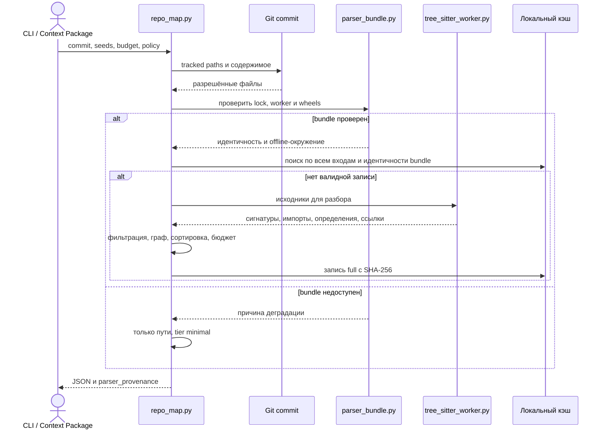
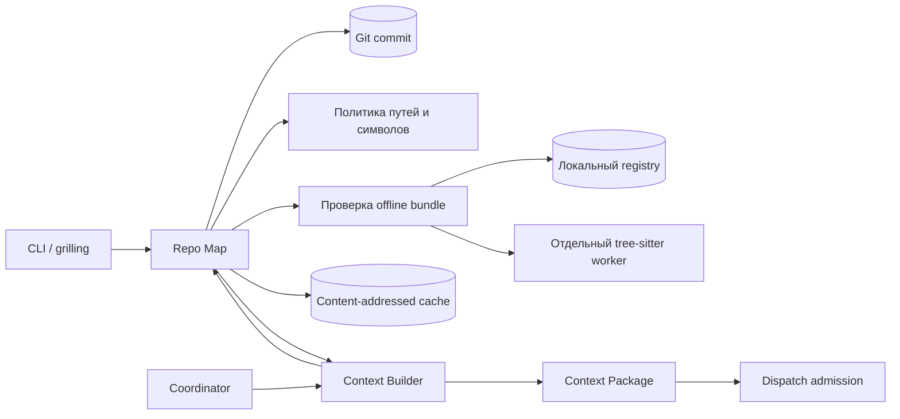

# Repo Map: интерфейс и архитектура

Repo Map строит детерминированную карту отслеживаемых файлов, сигнатур и связей на закреплённом коммите Git. Карта помогает выбрать файлы для чтения и формирует срез Context Package. В ledger хранится только снимок Context Package с идентичностью парсера; кэш карты не является авторитетным источником.

## Запуск и JSON-контракт

```powershell
python .harness/repo_map/repo_map.py --repo . --commit (git rev-parse HEAD)
```

`--repo` задаёт целевой репозиторий; повторяемый `--seed` — приоритетные относительные пути; `--max-tokens` — бюджет; `--policy` — файл политики; `--cache-dir` — временный каталог кэша. Коммит обязателен. Бюджет выбирается в порядке: аргумент CLI, `repo_map_policy.max_tokens`, 4000.

Выход соответствует [схеме версии 1](repo_map.schema.json):

| Поле | Значение |
| --- | --- |
| `commit` | Полный SHA закреплённого коммита. |
| `tier`, `parser`, `degradation_reason` | Уровень `full`/`minimal`, источник `bundle`/`path-only`, причина деградации. |
| `parser_provenance` | Режим, хеш политики и лимиты; в полном режиме — источник bundle, хеши lock и worker, версии, ABI и хеши грамматик. Шаблоны скрытых путей и символов не раскрываются. |
| `files` | Пути; в полном режиме также сигнатуры и `parser_status`. |
| `edges` | Связи `source` → `target`, вид и уверенность. |
| `diagnostics`, `estimated_tokens` | Диагностика и консервативная оценка размера. |

Неверная политика вызывает ошибку CLI с рекомендацией. Отсутствие bundle даёт штатный результат `minimal`. `harness health` показывает доступный уровень и способ восстановить `full`.

## Поток вызовов





## Бизнес-правила карты

Карта читает только tracked-файлы закреплённого коммита. `--seed` оставляет существующие разрешённые пути, удаляет повторы и сортирует их. С seeds файлы ранжируются по расстоянию через связи высокой и средней уверенности; без seeds — по входящей степени таких связей; затем по пути. Применяются бюджет токенов и лимиты политики.

Python, TS/TSX, JS/JSX, Go, Java и C# разбираются только грамматиками tree-sitter из проверенного bundle. Стандартный `ast` и первые строки файла не служат запасным парсером. Worker отдаёт факты без тел функций; символы фильтруются и связи строятся в основном процессе. Типы tree-sitter не пересекают границу процесса. Синтаксическая ошибка сохраняет факты целых узлов; неверный UTF-8 и слишком большой файл получают свой `parser_status`.

`import/high` создаётся для разрешённых импортов Python и относительных статических импортов TS/JS. Для TS/JS ищутся точный tracked-путь, `.ts`, `.tsx`, `.js`, `.jsx` и их `index`-файлы. Bare packages, aliases и динамические импорты не разрешаются. Для Go, Java и C# нет однозначного ребра импорт → файл без анализа конфигурации проекта.

`unique-name-ref/medium` создаётся при единственном определении имени в другом файле; `ambiguous-name-ref/low` — при двух–четырёх. Имена с определениями в пяти и более файлах отбрасываются. Ссылки ограничены одной языковой семьёй. Связи низкой уверенности выводятся, но не влияют на ранжирование.

## Bundle, кэш и деградация

Полный режим ищет `parser_bundle.lock.json` в `.harness/.cache/repo_map/parser_bundle/registry/` и каталогах `parser_bundle_registry_paths`. Проверяются SHA-256 worker и wheels для текущего Python и платформы. Установка выполняется через `uv pip install --offline --no-config --no-index --require-hashes --only-binary :all: --target` в изолированный каталог. Сеть, `pip` и окружение целевого проекта не используются. Подпроцесс ограничен таймаутом и размером вывода.

При отсутствии bundle, `uv` или wheelhouse для платформы, несовпадении хеша либо ошибке worker выдаётся `tier: "minimal"`, `parser: "path-only"`: только разрешённые пути, без сигнатур, статусов, связей и диагностики, с `degradation_reason`. Политика `tier: "minimal"` сразу запрашивает Path inventory. Без `repo_map_policy.min_tier` и `min_tier_by_role` деградация не блокирует dispatch; при заданном минимуме `dispatch propose` и `dispatch create` проверяют уровень для роли.

Кэш результатов находится в `.harness/.cache/repo_map/results` основного checkout; связанные worktree используют общий каталог. Это удаляемые данные вне ledger и отслеживаемого содержимого Git. Ключ включает коммит, нормализованные seeds, бюджет, политику, код парсера, версию оценщика токенов и для полного режима — выбранный lock, worker и wheels. Полезная нагрузка защищена SHA-256; повреждённая запись пересчитывается. Деградировавший запрос полного режима не кэшируется: установка bundle может перевести тот же коммит в `full`.

## Политика проекта

CLI использует явно переданный `--policy` или `.harness/orchestration.json`, если файл существует. Без файла действуют переносимые значения по умолчанию. Пример:

```json
{
  "repo_map_policy": {
    "allow_paths": ["src/**", "tests/**"],
    "deny_paths": ["src/legacy/**"],
    "redact_paths": ["src/customer_data/**"],
    "redact_symbols": ["customer_*"],
    "max_files": 5000,
    "max_file_bytes": 262144,
    "max_path_length": 4096,
    "max_symbol_length": 256,
    "max_signature_length": 2048,
    "timeout_seconds": 10,
    "max_tokens": 8000,
    "tier": "full",
    "parser_bundle_registry_paths": [],
    "parser_bundle_timeout_seconds": 30,
    "parser_bundle_max_output_bytes": 10000000,
    "min_tier": "full",
    "min_tier_by_role": {"developer": "full"}
  }
}
```

Шаблоны путей и символов учитывают регистр. `redact_paths` полностью исключает путь; `redact_symbols` удаляет совпадающие определения и ссылки до графа. Неизвестные поля отклоняются. `min_tier` и `min_tier_by_role` проверяются при допуске dispatch и не меняют генерацию карты.

## Поставка и проверки

`scripts/build_parser_bundle.py` собирает smoke-bundle CI из предварительно скачанных wheels. Задача `repo-map-bundle` в `.github/workflows/verify.yml` проверяет SHA-256, собирает bundle, запускает тесты реального parser-пути и отдельный строгий mypy для worker. Недоступный или подменённый wheel проваливает задачу. Основной mypy worker не включает.

Ручной workflow `release-parser-bundle` использует `.github/parser-bundle-release-wheels.json` для матрицы Python 3.12–3.14 × Windows x64, Linux x64, macOS arm64. Он проверяет хеши, создаёт общий lock, CycloneDX 1.6 SBOM и результат `pip-audit` с пустым кэшем. Запуск требует `release_tag` существующего GitHub Release, указывающего на коммит запуска. После проверок workflow сохраняет artifact запуска и загружает архив bundle как Release asset; существующий asset не перезаписывается. Wheels не коммитятся. Контракт поставки: [ADR 0024](../../docs/adr/0024-repo-map-parser-bundle-composition-and-delivery.md).

## Архитектурные решения и SOLID

- **Одна граница парсинга.** Отдельный worker удерживает нативные зависимости вне Context Builder и координатора. Потребители зависят от JSON-контракта, новый язык добавляется через extractor и грамматику без изменения orchestration.
- **Один слой политики.** Worker извлекает факты; основной процесс фильтрует символы и строит граф. Новое правило фильтрации не нужно копировать в каждый extractor.
- **Вычисляемая карта.** Context Package остаётся авторитетным снимком; кэш ускоряет повторение, но его отсутствие не меняет результат.
- **Явный уровень качества.** Парсер сообщает provenance и причину деградации; решение о запрете принимает конфигурация роли на границе dispatch.
