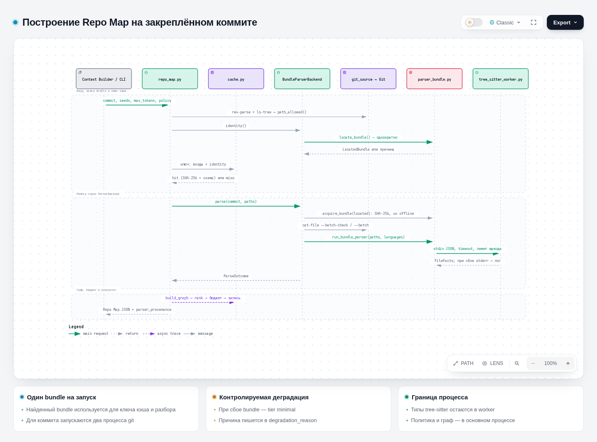
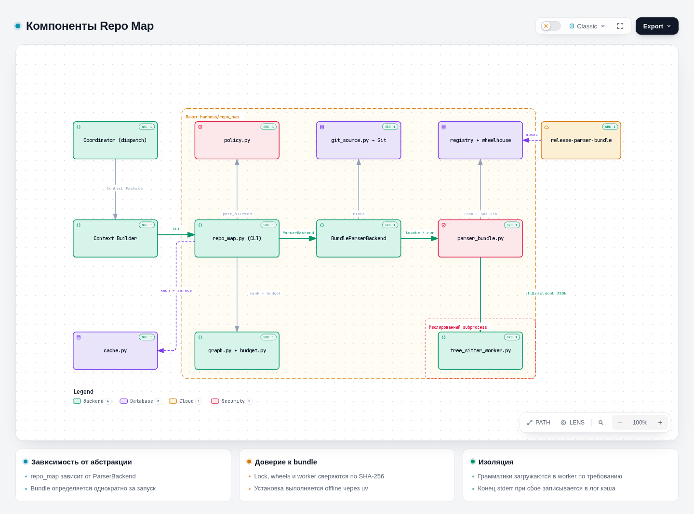

# Repo Map: интерфейс и архитектура

Repo Map строит детерминированную карту tracked-файлов, их сигнатур и связей на закреплённом коммите
Git. Карта помогает агенту выбрать, какие файлы читать, и даёт срез для Context Package. Ledger
хранит только снимок Context Package вместе с идентичностью парсера. Кэш карты — не авторитетный
источник.

## Бизнес-логика

1. **Вход.** Полный SHA коммита, необязательные `--seed`, бюджет токенов и политика проекта.
   Repo Map не читает рабочее дерево и untracked-файлы: все данные он берёт из объектов Git.
2. **Отбор путей.** `git ls-tree` возвращает tracked-пути. Их фильтруют встроенные исключения
   (зависимости, сборка, кэши, медиа, секреты, `.env`, ключи, `*.generated.*`) и политика:
   `allow_paths`, `deny_paths`, `redact_paths`, `max_path_length`. Если после фильтра путей больше
   `max_files`, CLI падает с рекомендацией и не обрезает список молча.
3. **Уровень качества.** При `tier: "full"` (по умолчанию) tree-sitter из проверенного offline
   bundle разбирает файлы. Любой сбой bundle переводит карту в `tier: "minimal"` без исключения.
   Такая карта содержит только пути и `degradation_reason`.
4. **Граф.** Worker возвращает факты: сигнатуры, импорты, определения и ссылки. Основной процесс
   применяет к ним политику символов и строит рёбра.
5. **Ранжирование и бюджет.** С seeds Repo Map сортирует файлы по расстоянию в графе через рёбра
   высокой и средней уверенности. Без seeds — по входящей степени, затем по пути. Файл входит в
   карту, если сериализованный JSON вместе с ним укладывается в `max_tokens`. Иначе Repo Map
   пропускает файл и проверяет следующие. Размер кандидата равен приращению длины JSON, поэтому
   отбор линеен по числу файлов, рёбер и диагностик.

## Запуск и API-контракт

```powershell
python .harness/repo_map/repo_map.py --repo . --commit (git rev-parse HEAD)
```

| Аргумент | Назначение |
| --- | --- |
| `--repo` | Целевой репозиторий (по умолчанию текущий каталог). |
| `--commit` | Обязателен; CLI разрешает его через `rev-parse --verify <commit>^{commit}`. |
| `--seed` | Повторяемый; приоритетные относительные пути. CLI отбрасывает несуществующие и отфильтрованные пути и удаляет повторы. |
| `--max-tokens` | Бюджет. Порядок выбора: CLI → `repo_map_policy.max_tokens` → 4000. CLI не может превысить значение из политики. |
| `--policy` | Файл политики. По умолчанию `.harness/orchestration.json`, если он существует. |
| `--cache-dir` | Каталог кэша вместо `.harness/.sandboxes/cache/repo_map/results`. |

Код выхода `0` означает, что CLI записал на stdout JSON [схемы версии 1](repo_map.schema.json).
Ошибка политики или ввода даёт ненулевой код и сообщение `HarnessError` с рекомендацией (`remedy`).
CLI не считает деградацию bundle ошибкой.

| Поле | Значение |
| --- | --- |
| `schema_version`, `commit` | `1` и полный SHA закреплённого коммита. |
| `tier`, `parser` | Допустимы только пары `full`/`bundle` и `minimal`/`path-only`. `contract.validation_error` проверяет это правило. |
| `degradation_reason` | При `full` — `parser bundle applied`. Иначе причина деградации (список ниже) или `policy requested minimal tier`. |
| `token_estimator_version`, `estimated_tokens` | Версия оценщика и консервативная оценка размера самого JSON, включая это поле. |
| `parser_provenance` | Режим политики (`enforced`/`portable`), её SHA-256 и лимиты. В полном режиме дополнительно: `bundle_mode`, `bundle_source`, теги Python и платформы, `lock_sha256`, `script_hash`, версия ядра, диапазон ABI и хеши грамматик для текущей пары. Поле не раскрывает шаблоны скрытых путей и символов. |
| `files[]` | `path`; в полном режиме также `signatures[]` и `parser_status` (`ok`, `syntax_error`, `invalid_encoding`, `too_large`). |
| `edges[]` | `source`, `target`, `kind` (`import`, `unique-name-ref`, `ambiguous-name-ref`), `confidence` (`high`, `medium`, `low`). |
| `diagnostics[]` | `code` (`syntax_error`, `invalid_encoding`, `file_too_large`) и `path`. |

Причины деградации (`parser_bundle.DegradationReason`): `offline parser bundle unavailable`,
`parser bundle hash mismatch`, `parser wheelhouse missing for interpreter/platform pair`,
`parser subprocess exceeded time limit`, `parser subprocess exceeded output size limit`,
`parser subprocess failed` (сбой или неверный ответ worker), `parser bundle install failed` (сбой
`uv pip install` или межпроцессной блокировки установки), `uv executable unavailable`.

### Протокол worker

`tree_sitter_worker.py <install_dir>` читает из stdin
`{"paths": {"<path>": "<base64>"}, "languages": {"<extension>": "<grammar>"}}` и пишет в stdout
`{"files": {"<path>": FileFacts}}`. Backend берёт таблицу `languages` из `grammars[].extensions`
lock, потому что только lock определяет, какая грамматика соответствует расширению. Если запрос
пришёл без `languages` (harness до этого изменения), worker использует совместимую таблицу по
умолчанию.

Структура `FileFacts`: `parser_status`, `signatures[{text, symbols[]}]`,
`imports[{module, level, names[]}]`, `definitions[]`, `references[]`. `bundle_worker._file_facts`
отклоняет любой лишний или неверно типизированный ключ. Тогда backend считает сбоем весь ответ
(`parser subprocess failed`). Worker загружает грамматики лениво. Если пакета грамматики нет в
bundle, worker пропускает только файлы этого языка. Worker автономен: он использует только stdlib и
пакеты `tree_sitter*` из `<install_dir>` и не импортирует harness.

## Поток вызовов

[](../../docs/diagrams/repo-map-build.sequence.html)

Интерактивная схема: [`docs/diagrams/repo-map-build.sequence.html`](../../docs/diagrams/repo-map-build.sequence.html),
спецификация Archify: [`repo-map-build.sequence.json`](../../docs/diagrams/repo-map-build.sequence.json).

Ключевые точки потока:

- Repo Map ищет bundle **один раз** за запуск (`locate_bundle`). Найденный bundle даёт и
  идентичность для ключа кэша (каталог, lock, worker и wheels пары), и установку для разбора.
  Поэтому ключ всегда соответствует тому bundle, которым разбирали файлы.
- Repo Map проверяет кэш до установки и разбора. Установка или замена bundle меняет ключ.
- Repo Map проверяет и устанавливает bundle **до** чтения содержимого файлов. Деградировавший
  запуск читает только пути.
- Один `git cat-file --batch-check` читает размеры всех файлов. Один `git cat-file --batch` читает
  содержимое файлов в пределах `max_file_bytes`. Файл больше лимита получает `too_large`, и
  Repo Map не передаёт его в worker.
- Бинарные blob'ы (с байтом `\0`), подмодули и файлы языков без грамматики остаются в карте без
  сигнатур. Поэтому набор путей в `full` совпадает с `minimal`.

## Компоненты

[](../../docs/diagrams/repo-map-components.architecture.html)

Интерактивная схема: [`docs/diagrams/repo-map-components.architecture.html`](../../docs/diagrams/repo-map-components.architecture.html),
спецификация: [`repo-map-components.architecture.json`](../../docs/diagrams/repo-map-components.architecture.json).

| Компонент | Ответственность |
| --- | --- |
| `repo_map.py` | CLI и сборка карты: бюджет запроса, отбор путей, выбор backend, кэш, итоговый payload. Публичный API: `build_map`, `load_policy`, `RepoMapPolicy`, `ParserBackend`. |
| `policy.py` | `RepoMapPolicy`, загрузка и проверка `repo_map_policy`, фильтр путей, видимость символов. |
| `git_source.py` | Разрешение коммита, tracked-пути и пакетное чтение blob'ов через `git cat-file`. |
| `backend.py` | Протокол `ParserBackend` и его реализация `BundleParserBackend` на offline bundle. |
| `graph.py` | Записи файлов, рёбра из фактов worker, семейства языков, ранжирование. |
| `budget.py` | Каноническая сериализация и линейный отбор файлов в бюджет токенов. |
| `cache.py` | Ключ кэша, проверенное чтение и атомарная запись результата. |
| `contract.py` + `repo_map.schema.json` | Проверка выходного JSON без runtime-зависимостей: схема и согласованность `tier`/`parser`. |
| `parser_bundle.py` | Фасад bundle: поиск (`locate_bundle`), проверка (`check_bundle`), установка (`acquire_bundle`), provenance; реэкспорт публичных имён трёх модулей ниже. |
| `bundle_lock.py` | Формат `parser_bundle.lock.json` и его строгая проверка. |
| `bundle_install.py` | Offline-установка через `uv` под межпроцессной блокировкой. |
| `bundle_worker.py` | Протокол `FileFacts`, ограниченный запуск worker и лог хвоста stderr при сбое. |
| `tree_sitter_worker.py` | Извлечение фактов для Python, TS/TSX, JS/JSX, Go, Java и C#. Работает только как subprocess. В CI его проверяет отдельный строгий mypy. |
| Context Builder | Вызывает CLI подпроцессом и встраивает срез карты в Context Package. |
| Coordinator | При `dispatch propose`/`create` сравнивает `tier` карты с `min_tier`/`min_tier_by_role`. |

## Правила связей

Repo Map создаёт `import/high` для разрешённых импортов Python и относительных статических импортов
TS/JS. Для TS/JS Repo Map проверяет точный tracked-путь, `.ts`, `.tsx`, `.js`, `.jsx` и
`index`-файлы с этими расширениями. Repo Map не разрешает bare packages, aliases и динамические
импорты. Для Go, Java и C# нет однозначного ребра «импорт → файл» без анализа `go.mod`, корней
пакетов и `.csproj`. Поэтому worker возвращает для них пустой список импортов.

Repo Map создаёт `unique-name-ref/medium`, если имя определено ровно в одном другом файле.
`ambiguous-name-ref/low` — если в двух–четырёх. Repo Map отбрасывает имена, определённые в пяти и
более файлах (`DEFINITION_FILE_FANOUT_THRESHOLD`). Ссылки не пересекают языковые семейства
(`python`, `js`, `go`, `java`, `csharp`). Repo Map выводит семейство из грамматики, которую lock
назначил расширению (`typescript`, `tsx` и `javascript` — одно семейство `js`). Файл без грамматики
образует своё семейство. Рёбра низкой уверенности попадают в вывод, но не влияют на ранжирование.

Repo Map выводит сигнатуру, только если каждый символ в ней проходит `redact_symbols` и
`max_symbol_length`, а длина текста не превышает `max_signature_length`. Синтаксическая ошибка
сохраняет факты целых узлов. Repo Map не сериализует тела функций, значения по умолчанию и
комментарии.

## Bundle, кэш и деградация

Полный режим ищет `parser_bundle.lock.json` сначала в `.harness/.sandboxes/cache/repo_map/parser_bundle/registry/`
(`bundle_source: local-cache`), затем в каталогах `parser_bundle_registry_paths`
(`internal-registry`). Repo Map проверяет SHA-256 worker и wheels для пары `cpXY-<platform>`. Эту
пару возвращает интерпретатор, который запускает worker. Установка:
`uv pip install --offline --no-config --no-cache --no-index --require-hashes --only-binary :all: --target`
в каталог `<lock-sha[:16]>-<pair>/install`. Repo Map удаляет из окружения переменные `UV_*` и
`PIP_*`. Установка не использует сеть, `pip` и окружение целевого проекта. Маркер
`.install-complete` с SHA lock исключает повторную установку. Перед запуском worker Repo Map
повторно проверяет его хеш, чтобы закрыть окно TOCTOU. При сбое worker Repo Map записывает причину
и последние 4 КБ его stderr в `<каталог установки>/../last-worker-error.log`. В JSON карты stderr
не попадает.

`harness cleanup` удаляет install-каталоги `<хеш lock>-<пара>`, которые не соответствуют текущему
lock локального registry. Команда не трогает registry и другие каталоги.

Кэш результатов лежит в `.harness/.sandboxes/cache/repo_map/results` основного checkout. Связанные
worktree используют общий каталог. Ключ включает коммит, нормализованные seeds, бюджет, всю
политику, байты всех модулей пакета `harness/repo_map` и схемы, версию оценщика токенов. В полном
режиме ключ включает ещё и идентичность backend (для bundle — каталог, lock, worker и wheels пары).
SHA-256 защищает полезную нагрузку, и Repo Map повторно проверяет её по схеме. Repo Map
пересчитывает повреждённую запись. Repo Map не кэширует деградировавший результат запроса `full`,
чтобы установка bundle могла перевести тот же коммит в `full`.

Деградация не блокирует dispatch, пока не заданы `repo_map_policy.min_tier` или `min_tier_by_role`.
Если минимум задан, `dispatch propose` и `dispatch create` отклоняют роль с картой ниже требуемого
уровня и подсказывают переустановить bundle.

## Локальная работа с полным режимом

Тесты реального parser-пути запускаются, только если `HARNESS_PARSER_BUNDLE_DIR` указывает на
каталог, собранный `scripts/build_parser_bundle.py`. Без переменной они пропускаются. Если переменная
задана, а lock в каталоге отсутствует, тест падает. Registry проекта должен содержать настоящий
bundle, а не тестовый stub. `harness health` распознаёт lock без поддерживаемых грамматик и сообщает
`tier=minimal (parser bundle has no supported grammars)` с рекомендацией заменить bundle.

Локальный bundle собирается из wheels своей пары, которые закреплены с SHA-256 в
`.github/parser-bundle-release-wheels.json` (например, `cp314-win_amd64`). Скачайте ровно эти файлы,
сверьте SHA-256 и выполните:

```powershell
.harness/.venv/Scripts/python.exe scripts/build_parser_bundle.py --wheelhouse <каталог wheels> --out .harness/.sandboxes/cache/repo_map/parser_bundle/registry
```

После изменения `tree_sitter_worker.py` пересоберите bundle: Registry хранит собственную копию
worker с её SHA-256 в lock, поэтому старый bundle продолжит запускать прежнюю копию.

Фокусный прогон при изменении Repo Map (Windows). Короткий `--basetemp` обязателен: иначе установка
bundle во временный репозиторий теста упирается в MAX_PATH и даёт `parser bundle install failed`.

```powershell
$env:HARNESS_PARSER_BUNDLE_DIR = (Resolve-Path .harness/.sandboxes/cache/repo_map/parser_bundle/registry).Path
$env:PYTHONPATH = "."
.harness/.venv/Scripts/python.exe -m pytest -q -n 4 --basetemp .harness/.sandboxes/scratch/pt tests/repo_map/test_repo_map.py tests/repo_map/test_parser_bundle.py tests/repo_map/test_repo_map_tree_sitter.py tests/repo_map/test_repo_map_tree_sitter_go.py tests/repo_map/test_repo_map_tree_sitter_java.py tests/repo_map/test_repo_map_tree_sitter_csharp.py tests/repo_map/test_repo_map_tree_sitter_unsupported.py tests/repo_map/test_repo_map_tree_sitter_determinism.py
```

Полный `scripts/verify.py` — это gate QA и CI, и для итераций разработчика он не нужен (см.
`developer_verification_commands` в `.harness/orchestration.json`).

## Политика проекта

CLI использует явно переданный `--policy` или `.harness/orchestration.json`, если файл существует;
без файла действуют переносимые значения по умолчанию. Пример:

```json
{
  "repo_map_policy": {
    "allow_paths": ["src/**", "tests/**"],
    "deny_paths": ["src/legacy/**"],
    "redact_paths": ["src/customer_data/**"],
    "redact_symbols": ["customer_*"],
    "max_files": 5000,
    "max_file_bytes": 262144,
    "max_path_length": 4096,
    "max_symbol_length": 256,
    "max_signature_length": 2048,
    "timeout_seconds": 10,
    "max_tokens": 8000,
    "tier": "full",
    "parser_bundle_registry_paths": [],
    "parser_bundle_timeout_seconds": 30,
    "parser_bundle_max_output_bytes": 10000000,
    "min_tier": "full",
    "min_tier_by_role": {"developer": "full"}
  }
}
```

Шаблоны путей и символов чувствительны к регистру. `redact_paths` полностью исключает путь, а
`redact_symbols` удаляет совпадающие определения и ссылки до построения графа. Неизвестные поля
отклоняются. Coordinator проверяет `min_tier` и `min_tier_by_role` при допуске dispatch, а на
генерацию карты они не влияют. Значения по умолчанию: `max_files` 10 000, `max_file_bytes`
2 000 000, `timeout_seconds` 10, `parser_bundle_timeout_seconds` 30,
`parser_bundle_max_output_bytes` 10 000 000.

## Поставка и проверки

`scripts/build_parser_bundle.py` собирает smoke-bundle для CI из заранее скачанных wheels. В
`.github/workflows/verify.yml` задача `parser-bundle` один раз скачивает wheels из
`.github/parser-bundle-wheels.txt` и сверяет SHA-256. Задача собирает bundle и публикует его
вместе с wheels как artifact. Недоступный или подменённый wheel проваливает эту задачу. Затем
матрица `repo-map-bundle` из четырёх ветвей (`python-ts-js`, `go`, `java`, `csharp`) скачивает этот
artifact и запускает свои тесты без `-k` и без пропусков. Поэтому все ветви проверяют побайтно один
и тот же bundle. Ветвь `python-ts-js` дополнительно запускает строгий mypy для worker
(`--strict --disallow-any-explicit`) в отдельном окружении из тех же wheels. Основной mypy worker не
проверяет.

Ручной workflow `release-parser-bundle` берёт `.github/parser-bundle-release-wheels.json` и строит
матрицу Python 3.12–3.14 × Windows x64, Linux x64, macOS arm64. Он проверяет хеши и создаёт общий
lock, CycloneDX 1.6 SBOM и результат `pip-audit` с пустым кэшем. Для запуска нужен `release_tag`
существующего GitHub Release, который указывает на коммит запуска. После проверок workflow
сохраняет artifact запуска и загружает архив bundle как Release asset, но существующий asset не
перезаписывает. Wheels в репозиторий не коммитятся. Контракт поставки описан в
[ADR 0008](../../docs/adr/0008-repo-map.md).

## Архитектурные решения и SOLID

| Решение | Почему так | Принцип |
| --- | --- | --- |
| Разбор вынесен в отдельный worker-процесс | Нативные grammars и их типы не попадают в Context Builder и Coordinator. Сбой или зависание worker ограничены таймаутом и лимитом вывода и превращаются в деградацию, а не в падение. | SRP, изоляция отказов |
| Worker отдаёт только факты, политику применяет основной процесс | Правило редактирования символов написано один раз и не копируется в каждый extractor. Содержимое политики не попадает в subprocess. | SRP, DRY |
| Потребители зависят от JSON-контракта, а не от кода | Context Builder вызывает CLI подпроцессом и проверяет схему. Реализацию парсера можно заменить, не трогая orchestration. | DIP на уровне процесса |
| `repo_map` получает парсер через протокол `ParserBackend` | Сборка карты не знает о bundle, uv и subprocess. Тесты и другие окружения передают свой backend в `build_map(..., backend=...)` без stub-bundle на диске. | DIP |
| Каждый модуль пакета отвечает за одно | Политика, чтение Git, граф, бюджет, кэш, формат lock, установка и протокол worker разнесены по модулям. `parser_bundle.py` — фасад с прежним публичным API. | SRP |
| Соответствие расширения грамматике задаёт только lock | Worker получает его в запросе и загружает грамматики лениво. Repo Map выводит семейство для ссылок из имени грамматики. Новый язык — грамматика в lock, extractor и пакет в worker, без правок графа. | OCP, DRY |
| Деградация вместо исключений | Отсутствие bundle — штатная ситуация для переносимого harness. Блокировать ли работу роли, решает политика на границе dispatch, а не генератор карты. | Разделение механизма и политики |
| Вычисляемая карта и неавторитетный кэш | Context Package остаётся единственным снимком в ledger. Кэш только ускоряет повторный запуск, и его удаление не меняет результат. | Детерминизм |

Две задачи закрыли ревью PR #296: #337 (первая очередь) и #339 (вторая очередь).
